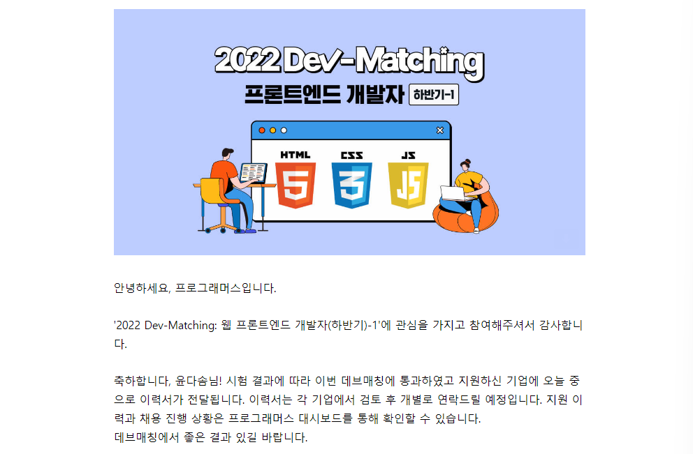

Dev-Matching 시험이 퇴사와 맞물려, 실력 테스트겸 시험삼아 신청했고 약 10일간의 준비를 했습니다. 저는 이 당시에 React의 지식도 없었고, JQuery나 Vanilla Javascript로 코드를 짜본 경험뿐이였습니다. 기술과제도 처음이였습니다. 해당 문제를 풀려면 상태관리를 Vanilla Javascript로 짤 수 있어야 합니다. (상태관리는 React에서 데이터를 관리하는 방법입니다.) 저는 [프론트앤드 개발을 위한 자바스크립트 코드리뷰](https://school.programmers.co.kr/learn/courses/15244)를 참여했었고, 이때 상태관리가 무엇인지를 배웠었습니다. 그래서 문제를 풀 수 있었습니다.

---

결과부터 말하자면 운이 좋게도, `통과`했습니다.

솔직히 통과를 기대하지도 않았어서 회사 지원에 그렇게 큰 노력을 쏟지 않았습니다. 시험 보는 도중에 카메라 각도 조절하고 갑자기 컴퓨터가 안되어서 재부팅하고 그랬었는데 다음번에는 조금 더 준비된 환경에서 시험에 응해야겠습니다.

---

## 준비 방법

미리 상태관리에 대한 코드리뷰나 강의를 듣는것을 추천합니다. 상태관리라는게 어떤 시스템으로 구현하는지는 배워야 알게됩니다. 그러고 나서, 저는 이미 진행되었던 [Dev-matching 시험](https://school.programmers.co.kr/skill_check_assignments)들을 전부 풀어보았습니다. 먼저 스스로 아무것도 참고하지 않고 코드를 짠 뒤, [문제 해설](https://prgms.tistory.com/53)과 비교해보고, 모범답안과 뭐가 다른지, 내가 뭘 놓쳤는지 스터디했습니다. 제 생각엔 한번씩만 기출문제를 풀어본다면 무난히 통과 할 것 같습니다. `local Storage, ajax(fetch), error handling, cache`기능 정도는 기본적으로 구현할 줄 알아야 합니다. 제가 위에 나열한 것 중 하나라도 잘 모른다면 깊게 공부하시고 한 문제 한 문제 풀면서 공부한 내용들을 검증하고 알아가면서 풀어가시면 좋을 것 같습니다. 요번 시험에서는 `animation`관련 요구사항도 나왔습니다. 숙지해두면 좋을 것 같습니다.

---

## 느낀점

- 풀면서 궁금했던 점은 보통 고수분들은 어디까지 요구사항을 분석하고 기획하고 코딩하는지 궁금했습니다. 무작정 손부터 올리고 코딩하면 당연히 좋지 않고, 어느정도는 만들어야할 기능들을 기획할텐데 어디서부터 어디까지 기획을 해야 하는지 궁금했습니다.
- 요 근래 과제전형의 중요성이 대두되고 있고 네카라가 아닌 이상 토스, 당근마켓, 컬리 등 스타트업에서는 과제 전형으로 1차를 거른 뒤, 그것을 토대로 기술 면접을 봅니다. 잘 준비해두면 좋을 것 같고, 깊게 공부하면 할수록 좋을 것 같습니다.
- 제 경우와 다른분들의 경우를 들어보니, Dev-Matching에 통과한다 해도 서류에서 탈락하는 케이스가 많고, 또 코테를 보거나 면접으로 검증을 해야한다고 합니다.

---

### + 위의 설계에 대한 궁금증에 대한 최근에 얻은 답변

상황에 따라 설계와 구현 방법이 다르므로 프로그래밍 설계와 구현에 정답은 없습니다. 그러므로 정답을 찾기보다 `요구 사항에 적합한` 최선의 설계와 구현 코드를 찾기 위해 노력해야 합니다. 또한 간단하고 명확한 구조가 나올 때 까지 계속 설계해야 합니다.
