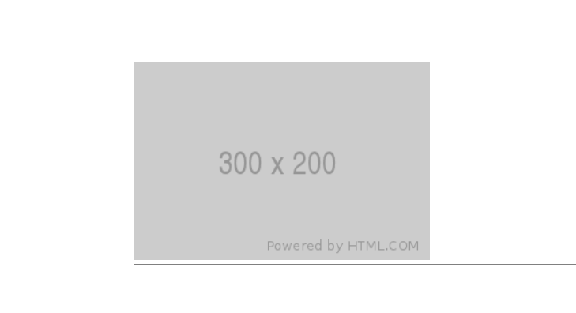
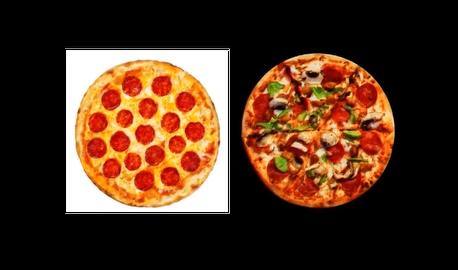

[부스트 코스 웹 UI 개발 강의](https://www.boostcourse.org/web344)를 듣다가 HTML과 CSS에 관련하여 몰랐던 점과 새로 알게된 점을 정리한 글입니다.

# HTML

## title Attribute

title 속성이란 요소에 대한 추가 정보를 제공하는 텍스트입니다. 사용자에게는 보통 툴팁으로서 보여집니다. `전역 속성`으로 모든 속성에 작성할 수 있습니다.

---

## a 태그 내부 링크

a태그는 내부 링크를 걸 수 있습니다. 보통 #을 붙여 해당 id를 가진 요소로 이동하게 구현합니다.

```html
<div id="top">top</div>
<div class="contents"></div>
<a href="#top">위로 올라가기</a>
```

a href에 #id값을 주었습니다.

```css
html {
  scroll-behavior: smooth;
}
body {
  margin: 0 auto;
  width: 500px;
}
.contents {
  height: 1000px;
  background: tomato;
}
```

scroll-behavior: smoth를 사용하면 부드럽게 스크롤이 가능합니다.

---

## div VS span

- div(division)태그와 span 태그는 `아무 의미없이 요소를 묶기 위한 태그`(container)입니다.
- div는 block level 이며 span은 inline level 입니다.

---

## 이미지 placeholder

```html

```



---

## PNG, JPG (투명 이미지)

- jpg는 투명이미지 표현이 가능하지 않지만 png는 투명 이미지 표현이 가능합니다.



왼쪽이 jpg, 오른쪽이 png

---

## HTML과 CSS의 속성

html은 attribute라는 명칭으로, css는 property라고 합니다. 그러나 한국어로는 그냥 속성이라 칭합니다.

---

# CSS

## CSS 부분 속성 값

- [class~="bar"] : class 속성의 값이 공백으로 구분한 "bar" 단어가 포함되는 요소 선택
- [class^="bar"] : class 속성의 값이 "bar"로 시작하는 요소 선택
- [class$="bar"] : class 속성의 값이 "bar"로 끝나는 요소 선택
- [class*="bar"] : class 속성의 값이 "bar" 문자가 포함되는 요소 선택

---

## 구체성

- 0, 1, 0, 0 : 선택자에 있는 모든 id 속성값
- 0, 0, 1, 0 : 선택자에 있는 모든 class 속성값, 기타 속성, 가상 클래스
- 0, 0, 0, 1 : 선택자에 있는 모든 요소, 가상 요소
- !important는 모든 구체성을 무시하고 우선권을 갖는다.

`!important > inline > id > class > 선택자 >>>>>>>>>> 전체선택자, 조합자`

---

## font-weight

- normal : 400 과 같음
- bold : 700과 같음
- lighter : 부모 요소보다 얇은 폰트 가중치(실무에서 안쓰임)
- bolder : 부모 요소보다 굵은 폰트 가중치(실무에서 안쓰임)

---

## 정렬

- 블록 - margin: 0 auto
- 인라인 : text-align : center

- inline은 보통 좌우만 조작합니다.
- inline-block은 배치는 lnline처럼 되지만 block처럼 box 속성을 갖습니다.
- 여백은 약 4px 입니다.
- 화면에 보이지 않지만 스크린 리더가 읽어주길 바라면 visibility : none 속성을 사용합니다.
- margin: 0 auto는 width가 무조건 선언되어있어야 합니다.
- css를 적용할 때 <link 를 권장. @import는 성능에 좋지 않습니다.
- 부모 z-index가 있는 경우, 부모끼리 값과 관련이 있습니다.
