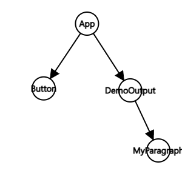

React useMomo, class, form을 학습하였습니다.

# useMemo

React는 `state, props, context가 변경시 재실행되고 재평가`됩니다. 그런데 컴포넌트가 재실행되면 그 컴포넌트의 모든 자식 컴포넌트 역시 재실행되고 재평가됩니다. 모든 자식의 재실행, 재평가는 성능의 낭비로 이어질 수 있는데, 그걸 예방하는게 `useMemo`입니다.

```jsx
// App.js

function App() {
  const [showParagraph, setShowParagraph] = useState();

  console.log('App Running');

  const toggleParagraphHandler = () => {
    setShowParagraph(preShowParagraph => !preShowParagraph);
  };

  return (
    <div className="app">
      <h1>Hi there!</h1>
      <DemoOutput show={false} />
      <Button onClick={toggleParagraphHandler}>Toggle Paragraph!</Button>
    </div>
  );
}
```

```jsx
// Button.js

const Button = props => {
  console.log('button running');

  return (
    <button
      type={props.type || 'button'}
      className={`${classes.button} ${props.className}`}
      onClick={props.onClick}
      disabled={props.disabled}
    >
      {props.children}
    </button>
  );
};
```

```jsx
// DemoOutput.js

const DemoOutput = props => {
  console.log('Demo output');
  return <MyParagraph>{props.show ? 'This is new!' : ''}</MyParagraph>;
};
```

```jsx
// MyParagraph.js

const MyParagraph = props => {
  console.log('MyParagraph output');
  return <p>{props.children}</p>;
};
```

현재 코드는 아래 트리처럼 구성되어 있는데 App.js에서 Toggle Paragraph!를 클릭하면 하면 Button, DemoOutput, MyParagraph 모두 update됩니다.



## useMemo 특징

- 지정된 컴포넌트만 랜더링 하고싶을 때 사용합니다.
- 함수형 컴포넌트에서만 사용이 가능합니다.

## useMemo 사용법

```jsx
import { useMemo } from 'react';
const { items } = props;

const sortedList = useMemo(() => {
  return items.sort((a, b) => a - b);
}, [items]);
```

- memo의 인자로 들어간 컴포넌트의 prop이 바뀌지 않았으면 재실행을 하지 않습니다.
- 주의할 점은 원시값은 useMemo를 사용할 수 있는데 참조값은 이전 값과 달라져서 useMemo가 적용되지않습니다. 이럴땐 useCallback을 혼합하여 사용하면 됩니다.

```jsx
const toggleParagraphHandler = useCallback(() => {
  setShowParagraph(preShowParagraph => !preShowParagraph);
}, []);
```

---

# Class

- 리엑트 훅이 나오기 전에 state나 effect, side effect를 통제할 수 없어서 class를 사용했었습니다. 그러나 리엑트 훅이 나오고나서 모두 함수형으로 바뀌었습니다.
- class-based 컴포넌트에서는 리엑트 훅을 사용할 수 없습니다.
- Class의 단점 : 에러 경계(Error Boundaries)(포착되지 않은 컴포넌트 내부의 에러가 react의 내부 상태를 훼손하고 에러를 방출하는 현상)

---

# Form

- ref : 입력된 값이 폼이 제출되는 시점에서 한번만 필요할 때 사용합니다.(모든 키보드 타이핑을 state로 업데이트 하는건 불필요하기 때문에)
- state: 키 입력마다 유효성 검사를 하고 싶을 때, 입력된 값을 초기화 하고 싶을 때 사용합니다.
