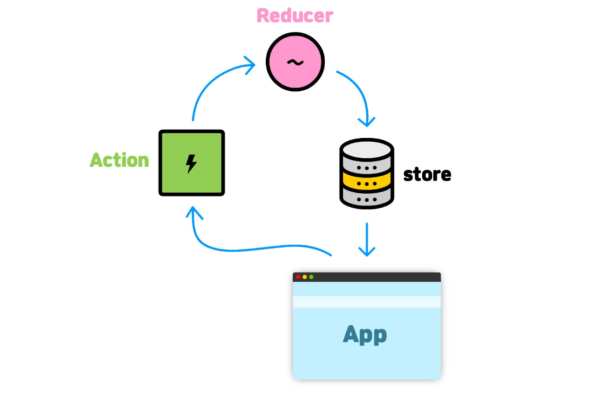

# Redux

Redux는 cross component state 또는 app wide state를 위한 상태 관리 시스템입니다.

## state의 종류

- **local state**
  - 데이터가 변경 되어서 `하나의 컴포넌트`에 속하는 UI에 영향을 미치는 state를 뜻합니다.
- **cross component state**
  - 하나의 컴포넌트가 아니라 `다수의 컴포넌트`에 영향을 미치는 state를 뜻합니다.
- **app wide state**
  - 애플리케이션 `모든 컴포넌트`에 영향을 미치는 state를 뜻합니다. (예: 인증(login))

앞서 리덕스는 cross component state 또는 app wide state를 위한 상태 관리 시스템이라고 했습니다. 그 이유는 cross component state 또는 app wide state에서는 `props chain/props drilling`이 일어나는데 그것을 `해결`해 주는게 redux의 역할이기 때문입니다. 그렇다면 props chain을 해결해주는 react context가 있는데 왜 redux를 사용해야만 할까요?

React context는 잠재적인 단점이 있습니다.

- 큰 앱을 구현할 때 설정과 관리가 아주 복잡해질 수 있습니다.
- 변경의 빈도가 적으면 성능이 괜찮지만, 변경이 빈번하다면 성능적인 측면에서 좋지 않습니다. → 모든 부분을 react context가 redux를 대체할 순 없습니다.

따라서 상황에 따라 리덕스를 사용해야만 합니다.

---

## Redux 작동 방식



- state는 하나의 저장소에 저장됩니다.
- 그 저장소를 컴포넌트들은 구독(subscription)을 합니다.
- Reducer function은 데이터 변경(update)을 담당합니다.
- components (그림에서 App)은 action 함수를 통해 Reducer 함수에게 해야할 것들을 보냅니다.
- `component는 절대로 저장된 데이터를 직접 조작하지 않습니다.` 즉, 사진에서 app → store로 흐르지 않습니다. 반드시 구독을 하고 action 함수를 전달함으로써 reducer를 통해 데이터를 변경합니다.

아래 코드는 위의 설명을 토대로 구현한 redux 동작 원리 예시입니다. 1씩 증가, 감소하는 앱입니다.

```jsx
const redux = require('redux');

const counterReducer = (state = { counter: 0 }, action) => {
  if (action.type === 'increment') {
    return {
      counter: state.counter + 1,
    };
  }
  if (action.type === 'decrement') {
    return {
      counter: state.counter - 1,
    };
  }

  return state;
};

const store = redux.createStore(counterReducer); // 저장소 생성 (reducer 바인딩)

const coutnerSubscriber = () => {
  const latestState = store.getState(); // getState는 redux 내부 함수
  console.log(latestState);
};

store.subscribe(coutnerSubscriber); // 구독
store.dispatch({ type: 'increment' }); // 액션(js 객체) 발송
store.dispatch({ type: 'decrement' });
```

---

## react에서 redux 사용 예제

```jsx
// src/store/index.js
import { createStore } from 'redux';

const countReducer = (state = { counter: 0 }, action) => {
  if (action.type === 'increment') {
    return {
      counter: state.counter + 1,
    };
  }
  if (action.type === 'decrement') {
    return { counter: state.counter - 1 };
  }
  return state;
};

const store = createStore(countReducer);
```

```jsx
// src/index.js

import { Provider } from 'react-redux';
import store from './store/index';

const root = ReactDOM.createRoot(document.getElementById('root'));
root.render(
  <Provider store={store}>
    <App />
  </Provider>,
);
```

```jsx
// src/components/Counter.js
import { useSelector, useDispatch } from 'react-redux';

const Counter = () => {
  const dispatch = useDispatch(); // redux store의 action 호출
  const counter = useSelector(state => state.counter); // 자동으로 subscribe 해주는 react custom hook

  const incrementHandler = () => {
    dispatch({ type: 'increment' });
  };

  const decrementHandler = () => {
    dispatch({ type: 'decrement' });
  };

  return (
    <main>
      <div>{counter}</div>
      <div>
        <button onClick={incrementHandler}>Increment</button>
        <button onClick={decrementHandler}>Decrement</button>
      </div>
    </main>
  );
};

export default Counter;
```

### 주의할 점

store/index.js에서 state를 직접 조작하면 안됩니다.

```jsx
// ❌
if (action.type === 'increment') {
  state.counter++;
  return state;
}
// ⭕
if (action.type === 'increment') {
  return {
    counter: state.counter + 1,
  };
}
```

`절대 기존의 state를 변형해서는 안됩니다.` 항상 state 값을 오버라이딩 해서 사용해야 하고 새로운 값으로 반환해야 합니다.

---

## redux toolkit 사용 예제

```jsx
// store/counter.js
import { createSlice, configureStore } from '@reduxjs/toolkit';

const initialState = { counter: 0, showCounter: true };

const counterSlice = createSlice({
  name: 'counter',
  initialState,
  reducers: {
    increment(state) {
      state.counter++;
    },
    decrement(state) {
      state.counter--;
    },
    increase(state, action) {
      state.counter = state.counter + action.payload;
    },
    toggleCounter(state) {
      state.showCounter = !state.showCounter;
    },
  },
});

const store = configureStore({ reducer: counterSlice.reducer });
export const counterActions = counterSlice.actions;

export default store;
```

```jsx
// src/components/Counter.js

import classes from './Counter.module.css';
import { useSelector, useDispatch } from 'react-redux';
import { counterActions } from '../store';

const Counter = () => {
  const dispatch = useDispatch();
  const counter = useSelector(state => state.counter);
  const show = useSelector(state => state.showCounter);

  const toggleCounterHandler = () => {
    dispatch(counterActions.toggleCounter());
  };

  const incrementHandler = () => {
    dispatch(counterActions.increment());
  };

  const increaseHandler = () => {
    dispatch(counterActions.increase(5)); // { type: SOME_UNIQUE_IDENTIFIER, payload: 10}
  };

  const decrementHandler = () => {
    dispatch(counterActions.decrement());
  };

  return (
    <main className={classes.counter}>
      <h1>Redux Counter</h1>
      {show && <div className={classes.value}>{counter}</div>}
      <div>
        <button onClick={incrementHandler}>Increment</button>
        <button onClick={increaseHandler}>Increse by 5</button>
        <button onClick={decrementHandler}>Decrement</button>
      </div>
      <button onClick={toggleCounterHandler}>Toggle Counter</button>
    </main>
  );
};

export default Counter;
```

훨씬 간결하고 직관적입니다. store/index.js에서 action.type의 값을 선언할 때 중복값을 선언할 위험도 없어졌습니다.
