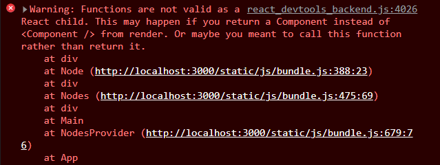

React.js의 관련 강의들을 완강하고, 직접 구현해보는 시간을 가졌습니다. 전에 기술 과제를 대비하며 vanilla javascript로 구현해뒀던 [프로그래머스의 dev-matching](https://school.programmers.co.kr/skill_check_assignments) 문제들을 React로 마이그레이션 할 계획을 세웠습니다. 또한 배운 contextAPI와 Reducer, Redux를 모두 사용해보고 싶어서 몇가지 단계를 수립했습니다.

1. useContext + useState를 이용하여 상태관리 구현

2. useContext + useReducer를 이용하여 상태관리 구현

3. redux를 이용하여 상태관리 구현

[고양이 사진첩](https://school.programmers.co.kr/skill_check_assignments/100) 먼저 구현을 완료했습니다. 거의 일주일이 걸렸습니다. 강의를 들을 때 열심히 따라 치고 학습했다고 생각했는데, 막상 혼자 구현하려 하니 수업들을 때는 자연스레 안다고 넘어갔었던 작은 개념들부터 흔들렸습니다. 그래서 찾아보고 또 모르는 게 있으면 찾아보고 적용해보고 익히고.. 이런 시간들 덕에 생각보다 오래 걸렸습니다. 역시 강의 따라치는 것만으로 제 것이 되지 않는다는 것을 다시한번 느꼈습니다.🤓

고양이 사진첩을 구현하면서 제일 애먹었던 점은,

1. 렌더링이 일어나는 시점을 컨트롤하는 것이 어려웠고 (일어나는 시점을 잘 몰라 무한루프에 빠지기도 했습니다.)

2. useEffect, useCallback, useMemo의 의존성도 잘 모르겠고 어느 시점에서 어떻게 구현해야 최적의 방법일지도 잘 모르겠습니다.

3. 비동기 처리가 굉장히 힘들었습니다. 오히려 redux에서는 사용하기 더 쉬웠던 것 같은데 useContext, useReducer에서는 꽤나 까다로워서 시간을 많이 소비했습니다.

아래는 마이그레이션 하면서 알게된 점을 정리했습니다.

---

- useEffect는 **뭔가 변하면 어떤 동작을 자동으로 실행하기 위해**,
  useCallback은 **원하는 타이밍에 호출시킬 함수를 만들기 위해** 사용합니다. (함수 반환)

## 비동기 통신구현 방법 (useEffect, useCallback)

- fetch를 이용하여 promise를 호출하고 반환했습니다. 그럴때는 useEffect안에서 선언하고 호출하면 됩니다.

```jsx
useEffect(() => {
  // 선언
  const fetchData = async () => {
    const data = await fetch('https://yourapi.com');
    const json = await response.json();
    setData(json);
  };

  // 호출
  fetchData().catch(console.error);
}, []);
```

- 만약에 외부에서 호출해야 하는 상황이라면? → useCallback을 사용하여 비동기 함수를 랩핑해줍니다.

```jsx
// useCallback으로 랩핑 후 선언
const fetchData = useCallback(async () => {
  const data = await fetch('https://yourapi.com');
  setData(data);
}, []);

// 호출
useEffect(() => {
  fetchData().catch(console.error);
}, [fetchData]);
```

---

### fetch가 되기전에 Rendering이 된다면?

데이터가 있는지 없는지 여부를 통해 rendering을 하면 됩니다. ([참고](https://gomgomkim.tistory.com/12))

---

## Error

말 그대로 function이 컴포넌트 안에 들어가면 안된다는 경고문.



```jsx

  const imgElement = () => {
    let image;
    if (props.type === "DIRECTORY") {
      image = directoryImage;
    } else if (props.type === "FILE") {
      image = fileImage;
    } else if (props.type === "PREV") {
      image = prevImage;
    }
    return ;
  };

  return (
    <div className={classes.Node} onClick={onClickHandler}>
      {imgElement}
      <div>{props.name}</div>
    </div>
  );
};

export default Node;
```

return 문 안의 {imgElement}를 {imgElement()}로 호출해줌으로써 해결

보통 handler 함수를 사용할때는 호출안하고 선언만 해 두어서 자연스럽게 그렇게 했지만 이 함수의 경우는 무조건 호출해야 하는 상황입니다. (생각하면서 코딩 하기)

---

이렇게 고양이 앨범을 끝냈습니다. 뿌듯하기도 하고 점점 react에 친숙해져 가는 느낌입니다. 역시 직접 코딩해보고 프로젝트 해보고 하는게 언어나 프레임워크를 습득하는 가장 빠른 길 같습니다. 나머지 것들도 얼른 끝내고 저만의 프로젝트를 얼른 하고싶습니다.
