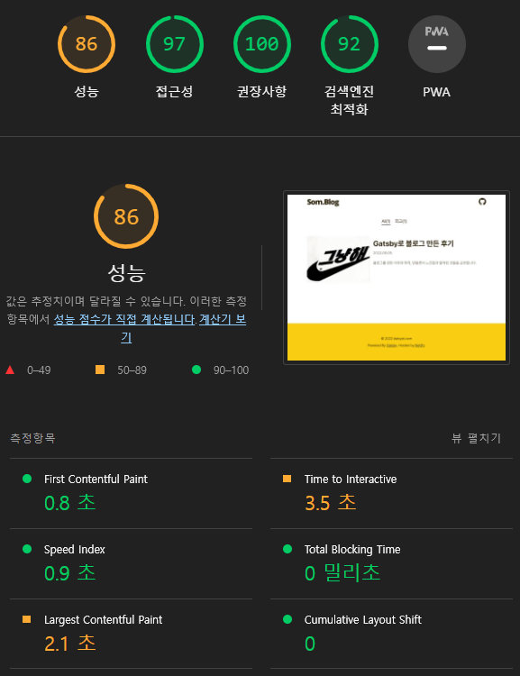
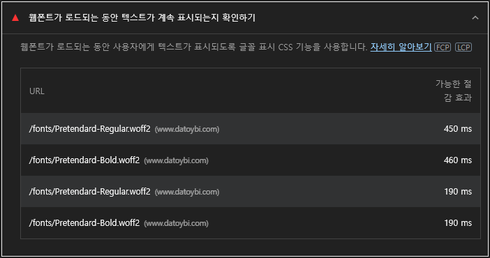
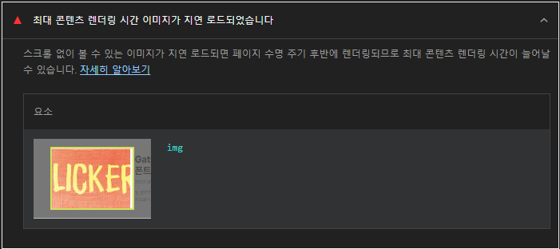
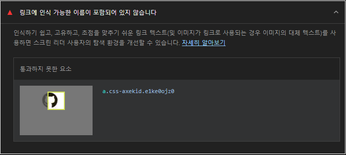
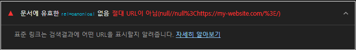
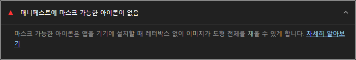

블로그의 성능을 개선하고 싶었습니다. 성능 향상의 기준은 Lighthouse의 점수로 측정할 것이고 목표 기준은 `95점 이상`으로 설정하였습니다.

크롬에서 F12를 누르고 Lighthouse 탭으로 가서 성능 측정을 해보았습니다.



성능 점수는 86%가 나왔습니다. 퀘스트 깨듯 진단된 사항들을 하나씩 해결해 보았습니다.

---

## 웹 폰트가 로드되는 동안 텍스트가 계속 표시되는지 확인하기



위 항목에 대응하기 위해 FOUT 설정 및 웹 폰트 최적화를 진행해보겠습니다. FOUT 및 웹 폰트 최적화를 알고싶다면 [이 게시글](https://www.datoybi.com/web-font-optimization)을 참조하세요.

최적화 전 코드 입니다.

```css
@font-face {
  font-family: 'Pretendard';
  src: url('/fonts/Pretendard-Regular.woff2') format('woff2'), url('/fonts/Pretendard-Regular.woff')
      format('woff');
}

@font-face {
  font-family: 'Pretendard-bold';
  src: url('/fonts/Pretendard-Bold.woff2') format('woff2'), url('/fonts/Pretendard-Bold.woff')
      format('woff');
  font-weight: bold;
}
```

아래처럼 수정하였습니다.

```css
@font-face {
  font-family: 'Lato';
  src: local('Lato');
  src: url('/fonts/Lato-Black.woff2') format('woff2');
  src: url('/fonts/Lato-Black.woff') format('woff');
  font-weight: normal;
  font-display: swap;
}

@font-face {
  font-family: 'Pretendard';
  src: local('Pretendard');
  src: url('/fonts/Pretendard-Regular.subset.woff2') format('woff2');
  src: url('/fonts/Pretendard-Regular.subset.woff') format('woff');
  font-weight: normal;
  font-display: swap;
}

@font-face {
  font-family: 'Pretendard';
  src: local('Pretendard');
  src: url('/fonts/Pretendard-Bold.subset.woff2') format('woff2');
  src: url('/fonts/Pretendard-Bold.subset.woff') format('woff');
  font-weight: bold;
  font-display: swap;
}
```

- subset 폰트를 사용하여 폰트의 용량을 줄였습니다.
- FOUT 방식을 사용하기 위해 font-display를 swap으로 설정하였습니다.
- local 속성을 사용하여 혹시 local 환경에 해당 폰트가 있을 시, 불필요한 리소스를 요청하지 않았습니다.
- 굵기가 다른 같은 폰트일 경우 font-weight을 설정해주었습니다.
- 보통의 브라우저 버전을 커버 가능한 WOFF2와 WOFF까지 지원해주기로 결정했습니다.

[관련 trouble shooting 글 보러가기](https://www.datoybi.com/fonts-flicker-on-load-in-gatsby/)

---

## 최대 콘텐츠 렌더링 시간 이미지가 지연 로드되었습니다.



찾아보니 이미지가 lazy loading이 되어 쓸데없이 지연이 되니 lazy loading이 필요하지 않는 곳에는 사용하지 말라는 경고 같습니다. 지금은 게시물이 몇개 없지만, 무한 스크롤로 구현을 했기 때문에 lazy loading이 불가피 합니다. 그래서 이미지의 크기를 최적화하여 로드가 빨리 되게 하는 것으로 해결해볼까 합니다.

[https://www.resizepixel.com/](https://www.resizepixel.com/) 저는 이 사이트에서 이미지들을 압축하고 썸네일에 맞게 가로 세로 길이를 최적화 시켰습니다.

---

## 링크에 인식 가능한 이름이 포함되어 있지 않습니다.



```jsx
const GithubIcon = styled.a`
 ...
`;

const Header: FunctionComponent = function () {
  return (
				...
        <GithubIcon title="github" href="https://github.com/datoybi">
				...
  );
};
```

title 속성을 추가했습니다.

---

## 문서에 유효한 rel=canonical 없음



```jsx
// gatsby-config.js

{
      resolve: 'gatsby-plugin-canonical-urls',
      options: {
        siteUrl: 'https://my-website.com/',
        stripQueryString: true,
      },
    },
```

siteUrl을 [https://www.datoybi.com/](https://www.datoybi.com/)로 업데이트 했습니다. 아마도 배포 전에 해당 코드를 작성해서 배포하려면 바꾸려고 저렇게 둔것 같습니다.🙄

---

## 메니페스트에 마스크 가능한 아이콘이 없음



```jsx
// gatsby-config.js

// 전
options: {
        icon: 'src/images/favicon.png',
      },

// 후
options: {
        icon: 'src/images/icons/favicon.png',
        icons: [
          {
            src: './src/images/icons/icon-57x57.png',
            sizes: '57x57',
            type: 'image/png',
          },
          {
            src: './src/images/icons/icon-60x60.png',
            sizes: '60x60',
            type: 'image/png',
          },
          {
            src: './src/images/icons/icon-72x72.png',
            sizes: '72x72',
            type: 'image/png',
          },
          {
            src: './src/images/icons/icon-76x76.png',
            sizes: '76x76',
            type: 'image/png',
          },
          {
            src: './src/images/icons/icon-114x114.png',
            sizes: '114x114',
            type: 'image/png',
          },
          {
            src: './src/images/icons/icon-120x120.png',
            sizes: '120x120',
            type: 'image/png',
          },
          {
            src: './src/images/icons/icon-144x144.png',
            sizes: '144x144',
            type: 'image/png',
          },
          {
            src: './src/images/icons/icon-152x152.png',
            sizes: '152x152',
            type: 'image/png',
          },
          {
            src: './src/images/icons/favicon.png',
            sizes: '64x64',
            type: 'image/icon',
            purpose: 'any maskable',
          },
        ],
}
```

[https://www.favicon-generator.org/](https://www.favicon-generator.org/) 위 사이트에서 아이콘을 만든 뒤 설정을 update 해주었습니다. [gatsby-plugin-manifest](https://www.gatsbyjs.com/plugins/gatsby-plugin-manifest/)를 사용하여 아이콘을 하이브리드 형식으로 세팅했습니다. (icon일때는 상대경로로, icons는 절대경로로 세팅합니다.)

---

## 그 결과…


100점을 달성했습니다! 🎉

---

# 느낀점

- 처음 성능 개선을 해보았습니다. 성능의 측정 기준도 몰랐었어서 무심결에 작성했던 코드들이 랜더링 속도에 나쁜 기여를 할 수 있다는 것을 알게 되었습니다. 앞으로 코드를 작성할 때 이러한 부분들까지 고려하며 작성을 해야겠습니다.

- 성능 개선에는 전반적인 프로세스와 흐름을 알고 있어야 함을 느꼈습니다. 브라우저 랜더링이나 어느 시점에서 어떤 파일이 실행되는지 어떻게 동작하는지와 같은 것들을 조금 더 공부해야 겠네요.
