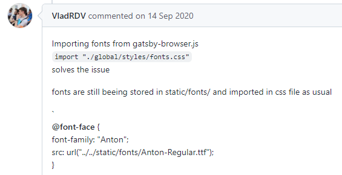

# 개선하고 싶었던 점


웹 폰트가 적용되기 전에 시스템 폰트의 깜빡임때문에 레이아웃이 움직였습니다. 최대한 웹폰트와 맞춰 깜빡임을 최소화시키고 싶었습니다. 제가 하려는 것은 심플했습니다. 그저 웹 폰트의 로딩이 끝나는 시점을 알고 그 전과 후의 폰트를 스타일링 해주는 것이었습니다.

---

## 해결책 1. 플러그인 사용하기

폰트와 관련된 여러 플러그인을 다운받고 이래저래 만져보았습니다.

```
gatsby-plugin-subfont
gatsby-plugin-preload-fonts
gatsby-omni-font-loader
```

위의 것들을 다운받고 이래저래 config를 적용해보았는데.. readme.md에 있는 내용만 숙지하고 따라해서 제가 원하는 기능을 구현할 수가 없었습니다. 이래저래 만져봤지만 좋은 사용 예를 찾지 못했고 처음 해보기도 하고 어떻게 사용하는지 잘 몰랐기에…Pass😢

---

## 해결책 2. font face observer 사용하기

[이 글](https://d2.naver.com/helloworld/4969726)에서 해결방안으로 제시했던 방식인 [font face obsever](https://fontfaceobserver.com/)를 사용해보기로 했습니다. 저는 header 폰트와 body 폰트 두가지를 사용하기 때문에 두가지의 폰트를 모두 가져오는지를 체크 한 뒤, 모두 가져온다면 해당 class를 추가했습니다.

```jsx
import FontFaceObserver from 'fontfaceobserver';

var bodyFont = new FontFaceObserver('Pretendard');
var headerFont = new FontFaceObserver('Lato');

headerFont.load(null, 5000).then(() => {
  document.documentElement.classList.add('lato');
});

bodyFont.load(null, 5000).then(() => {
  document.documentElement.classList.add('pretendard');
});
```

```css
header a[class*='Logo'] {
  font-family: Roboto, arial, sans-serif;
  font-size: 2rem;
  font-weight: 700;
  letter-spacing: -3.95px;
}

.lato header a[class*='Logo'] {
  font-family: 'Lato', arial;
  font-size: 2rem;
  letter-spacing: -2px;
}

main div[class*='Title'] {
  font-family: sans-serif, arial;
  letter-spacing: -2.5px;
  font-size: 2em;
  font-weight: 900;
}

.pretendard main div[class*='Title'] {
  letter-spacing: -0.3px;
  font-weight: bold;
  font-size: 2em;
  font-family: 'Pretendard', sans-serif;
}

.pretendard body {
  font-family: 'Pretendard', sans-serif;
}
```

css 파일에는 해당 클래스가 있으면 웹 폰트 레아이웃을, 그렇지 않다면 시스템 폰트 레아이웃을 적용했습니다. 적용하니 develop 환경에서는 잘 적용되는 것을 볼 수 있었습니다. 해결했다 믿으며 배포를 했는데..

배포환경에서는 적용이 안되었습니다! 이때 처음 알았습니다. `배포환경과 개발환경은 다르다`는 것을.. 그리고 관련해서 더 찾아보니 gatsby build와 gatsby serve라는 명령어로 배포 환경을 만들고 서버를 켤 수 있다고 합니다. 그러나 아직 font face observer가 배포환경에서 되지 않는 이유는 찾지 못했습니다.

---

## 해결책 3. 좀 더 빠르게 웹 폰트를 로딩하기

이건 해결책이라기 보다는 대안입니다. 시스템 폰트가 웹 폰트로 바뀌는 과정이 너무 흉하기 때문에 어떻게든 빠르게라도 만들자! 생각했습니다. 물론 느린 인터넷 환경에서는 쓸모없는 대안이겠지요.
또 다시 인터넷을 돌아다니다 [이 글](https://github.com/gatsbyjs/gatsby/issues/19400)을 보게되었습니다. 그리고 몇개의 하트를 받은 해결책을 발견했습니다.



적용해보겠습니다.

```jsx
// gatsby-browser.js
import './static/fonts/fonts.css';
```

```css
/* static/fonts/fonts.css */

@font-face {
  font-family: 'Lato';
  src: local('Lato');
  src: url('/fonts/Lato-Black.woff2') format('woff2');
  src: url('/fonts/Lato-Black.woff') format('woff');
  font-weight: normal;
  font-display: swap;
}

@font-face {
  font-family: 'Pretendard';
  src: local('Pretendard');
  src: url('/fonts/Pretendard-Regular.subset.woff2') format('woff2');
  src: url('/fonts/Pretendard-Regular.subset.woff') format('woff');
  font-weight: normal;
  font-display: swap;
}

@font-face {
  font-family: 'Pretendard';
  src: local('Pretendard');
  src: url('/fonts/Pretendard-Bold.subset.woff2') format('woff2');
  src: url('/fonts/Pretendard-Bold.subset.woff') format('woff');
  font-weight: bold;
  font-display: swap;
}
```

이 방식을 사용하고 배포를 해보니 훨씬 빠르게 로딩이 됩니다. <helmet> 태그 안에 preload로도 넣어봤었는데 해결이 안됐었는데 말이죠.

첫 페이지 로딩할때 단 한번 깜빡이고 다른 페이지로 이동할 때에는 깜빡임이 더이상 생기지 않습니다. Yay!🎉

---

# 느낀점

이틀 정도를 이 문제 하나 때문에 붙들고 있었습니다. 결론적으로 근본적인 부분을 해결하지 못해서 좀 아쉽습니다. 생각보다 관련 정보들이 많지 않았던 것 같습니다. 아니면 제가 키워드를 잘못 입력했을 수도 있었겠죠. (나중에 안 사실인데 저는 flash라고 검색을 했는데 flicker가 정보가 훨씬 많이 검색되네요.)

또한 gatsby-browser.js가 어느 시점에서 실행되는지 아직 잘 모릅니다. 따라서 React의 흐름과 구동 방식에 대한 이해가 필요하다는 것을 느꼈습니다. 다음에 한번 더 개선하고싶은 이슈였습니다.
