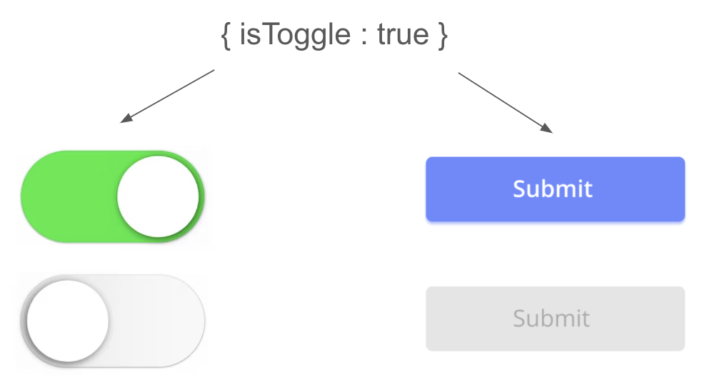
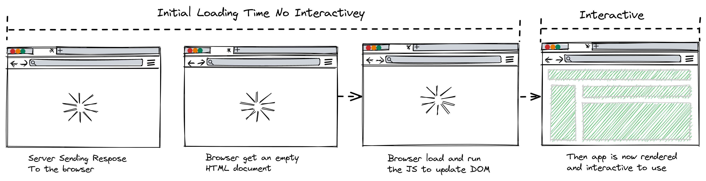
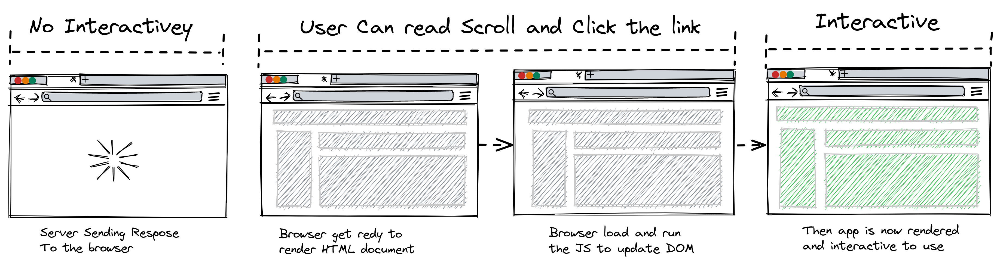

# 왜 facebook은 ReactJS를 만들었을까?

2011년 facebook은 코드 유지보수를 하는데 문제를 직면하게 되었습니다. 앱이 점점 커짐에 따라 유지보수 하기위해 더 많은 인력이 필요해졌고, 다른 대안이 필요했습니다.

<br/>

facebook에서 일하던 Jordan Walke는 이렇게 유지보수가 어려워진 이유는 `변이(Mutation)` 때문이라고 생각했습니다. 그리고 프론트엔드에서 가장 어려운 일은 바로 `데이터를 업데이트 하는 일`이라고 생각했습니다. View는 데이터가 변하면 UI를 변경해주어야 합니다. UI를 변경하는 방법은 변경할 DOM노드를 찾고 이벤트 리스너를 등록하고 이벤트가 발생하면 DOM을 조작하여 UI를 업데이트 합니다. 그리고 앱이 커지면 커질수록 점점 더 많은 UI를 조작해야합니다. 만약 10개의 로직이 한개의 tag element를 조작해야 한다고 생각해봅시다. 나도 모르는 변이(mutation)가 일어나기 쉽습니다. 이러한 점을 어떻게 해결하면 좋을까? 라는 의문이 들었고, 정말 간단하게 **데이터가 바뀌면 UI를 다시 그려주면 변이에서 자유로워지지 않을까?** 라는 생각을 했습니다. 그렇게 탄생한 라이브러리가 ReactJS입니다.

<br/>

잠깐, 상태가 변할때마다 UI를 다시 그려주면 그 비용은 어떡하나요? 라는 생각이 들었을 것입니다. DOM을 조작하는 작업은 비싸지 않으나 DOM을 브라우저에 그리는 작업이 비싼 작업이니까요. 이 문제는 가상 DOM(Virtual DOM)으로 해결을 합니다. 즉, ReactJS의 목적을 한줄로 설명하면 아래와 같습니다.

<br/>

<center><h3>❌ <del>변이(Mutation)</del> ❌　　 ✨ 재조정(reconciliation) ✨</h3></center>

---

# ReactJS의 특징

## 선언형(declarative) 라이브러리

선언형 프로그래밍이란 어떤 방법으로 해야하는지를 나타내기보다는 `무엇과 같은지`를 설명하는 것입니다.

예를 들어, 우리집을 소개할 때 “오른쪽으로 코너를 돌고 한블럭을 지나서 우회전해서 직진하다가 첫번째 신호등 앞이 우리집이에요.” 라고 말하는 것을 명령형이라고 하고, “우리집은 천호대로 11 102-3303 입니다.” 라고 말하는 걸 선언적이라고 합니다.

코드로써는 어떻게 표현할까요? 아래는 명령형으로 UI를 구현해보았습니다.

```jsx
function addText() {
  const bodyTag = document.querySelector('body');
  const divTag = document.createElement('div');
  let h1Tag = document.createElement('h1');
  h1Tag.innerText = 'hi world!';
  divTag.append(h1Tag);
  bodyTag.append(divTag);
}
```

이걸 선언적 라이브러리인 ReactJS로 구현하면 아래와 같습니다.

```jsx
function RenderText() {
  return (
    <div>
      <h1>hi world!</h1>
    </div>
  );
}
```

[공식 문서](https://react.dev/learn/reacting-to-input-with-state#how-declarative-ui-compares-to-imperative)에서는 다음과 같이 말합니다.

> UI를 조작하는 것은 단순 예제에서는 충분히 잘 동작하지만, 더 복잡한 시스템에서는 관리하기가 기하급수적으로 어려워집니다. 다양한 form 양식의 페이지를 업데이트 해야 한다고 생각해봅시다. 새로운 UI 요소나 새로운 인터랙션을 추가하려면 기존의 모든 코드를 주의 깊게 살펴 버그의 발생 여부(예를 들어, 무언가를 표시하거나 숨기는 것을 잊는 등)를 확인해야 합니다.<br/><br/>
> React는 이런 문제를 해결하기 위해 만들어졌습니다.<br/><br/>
> React에서는 직접 UI를 조작하지 않습니다. 즉, 컴포넌트를 직접 활성화하거나 비활성화 하지도, 보여주거나 숨기지도 않습니다. 대신 **표시할 내용을 선언하면** React가 UI를 업데이트할 방법을 알아냅니다.

React는 어플리케이션 UI의 구현 세부 정보를 숨김으로써 추상화를 가능하게 하고 React UI 업데이트를 책임짐으로써 개발자의 책임을 덜어줍니다. 갑자기 이짤이 생각나네요.


---

## 단방향 데이터 바인딩(One-way data binding)

React는 최상위 컴포넌트에서 트리 하단에 있는 컴포넌트로 흘러갑니다. 단방향 데이터 바인딩인 이유는 어떤 데이터가 어디서 오는지 알 수 있으므로 디버깅이 쉽고, 데이터에 대한 통제가 가능하므로 변이(mutation)의 가능성을 없앨 수 있습니다.

---

## JSX

JavaScript XML을 사용합니다. ReactJS를 처음 발표했을 때 이걸 사용하는것에 대해 엄청난 반발심이 있었다고 합니다. React에서 JSX를 사용하는 이유는 HTML tag를 마치 변수처럼 전달하기 위해서입니다. 아래는 그 예시입니다.

```jsx
const helloWorld = <h1>Hello, World!</h1>;

function Hello() {
  return <h1>Hello, World!</h1>;
} // JSX
function Hello() {
  return React.createElement('h1', {}, 'Hello, World!');
} // js
```

JSX를 사용하는 것은 선택사항이나, 사용하게 되면 훨씬 간결하고 우아하게 React를 작성할 수 있습니다.

JSX로 작성한 코드들은 바벨(Babel)이라는 code complier가 브라우저가 읽을 수 있도록 컴파일합니다.

---

## Component based

React는 component 기반의 라이브러리입니다. 전통적인 웹은 index.html, index.css, index.js 즉 html, css, js별로 파일을 나누는 것이 best practice였으나, React는 이 모든 것들을 컴포넌트 기반으로 한꺼번에 작성합니다.

---

## 상태 관리(State management)

제가 처음 React를 학습할 때 기존과 가장 다르다라고 체감했던 부분은 상태 관리였습니다. 상태란 변할 수 있는 데이터, `렌더링에 영향을 끼치는 데이터`이고 상태관리란 이런 데이터를 관리하는 방법을 뜻합니다.

### 상태가 왜 필요하고 중요할까?

상태가 필요한 이유는 변경이 일어날 때 UI를 한번에 촥- 뿌려주려면 그에 맞는 데이터를 가지고 있어야 하기 때문입니다.



예를 들어, toggle 버튼의 클릭 유무에 대한 정보인 isToggle을 저장하고 있어야 클릭 이벤트가 발생하고 UI를 다시 그릴 때 어떻게 그려줄지를 알 수 있습니다. 또한, isToggle에 따라 button의 disable 속성을 설정해야 한다면 button에서도 isToggle 값이 필요하겠죠. 즉, state값을 기반으로 UI를 그려주기 때문에 state를 잘 가지고 있어야 올바르게 UI에 그러줄 수 있습니다.

상태는 다양한 값이 될 수 있습니다. 위의 예시는 간단한 예시지만 더 복잡하게는 login의 유무에 따라 다른 정보를 보여줘야 할 때입니다. 이렇듯 상태란 UI 클릭 유무에서 중요한 login 정보나 api data가 될 수 있기에 상태를 잘 관리함은 점점 중요해졌습니다.

초기의 React는 단순한 View로써 상태를 구성하거나 관리하는 방법에 대한 솔루션은 제공하지 않았습니다. 그러나 점점 상태는 고도화되고, 다이나믹해지고 중요해지면서 상태를 잘 관리하는 방법에 대한 hook과 같은 솔루션을 제시하기 시작합니다.

### 상태관리의 흐름

- React는 2014년에 Flux 패턴을 발표하고 2015년에 Redux를 발표하면서 단방향으로 데이터를 관리하는 것의 중요성을 말하며, Redux라는 전역 상태관리 라이브러리가 나오게 됩니다. 기존에 state를 관리하며 문제가 되었던 prop drilling을 해결하기 위해서 입니다.
- Redux에도 단점이 존재했습니다. 많은 boilerplate가 높은 학습곡선이 그 단점입니다. 이것을 해결하기 위한 여러 라이브러리(recoil, jotai, zustand..)가 나왔습니다.
- api data를 관리하고 캐싱하는 것에 대한 니즈가 생겼고 react query나 SWR같은 라이브러리가 등장하였습니다.

이렇게 다양한 React의 상태관리 라이브러리가 나오며 발전해 나가고 있습니다.

---

# 앞으로의 React

### CSR(Client Side Rendering)에서 CSR + SSR

**CSR(Client Side Rendering)**



**SSR(Server Side Rendering)**



기본적인 리엑트 어플리케이션은 클라이언트 사이드 렌더링으로 동작합니다. CSR은 페이지에 진입시 HTML과 JS, 모든 데이터가 로드되고, 렌더링이 끝나기 전까지는 빈 화면만 보여주게 됩니다. 모든 데이터가 빠르게 로딩이 되어야 하기 때문에 코드를 축소히고 성능을 최적화하는 번들링(bundling)이 중요하게 되었고 이때 Webpack을 사용합니다.

그런데 첫 진입시 빈 화면만 보이는 것은 좋은 사용자 경험을 제공하지 못합니다. 서버에서 처리할 수 있는 부분은 서버에서 처리하고, 즉, SSR이 필요한 부분은 SSR로, CSR가 필요한 부분만 CSR로 표출하는것이 좋다는 판단과 CSR은 처음 빈 HTML이기 때문에 SEO에 적합하지 않은 문제를 해결하는 Next.js가 나오게 되었습니다.

---

### 클라이언트 컴포넌트에서 클라이언트 컴포넌트 + 서버 컴포넌트

서버 컴포넌트란 서버에서 컴포넌트를 미리 렌더링하여 마크업을 생성한 후, 클라이언트에게 전달하는 컴포넌트를 뜻합니다. 서버 컴포넌트를 사용하는 이유는 번들 사이즈를 줄일 수 있고, 클라이언트 서버의 waterfall 문제를 해결할 수 있습니다. 관련해서는 나중에 더 자세히 스터디한 뒤 글을 작성하고 싶습니다.

<br/>

현재 [Next.js](https://nextjs.org/)의 14버전은 RSC(React Server Component)가 적용되어 있으므로 [리엑트 공식문서](https://react.dev/learn/start-a-new-react-project#nextjs)에서도 강하게 사용하길 권장합니다.

---

# 요약

DOM 조작 어려워😞 (스파게티 코드, 유지보수 난이도 헬🔥) →

DOM조작은 React가 해줄게 대신 `UI 구현`과 `state 관리`를 해줘 →

state를 어떻게 잘 관리하지? (redux, react-query, recoil, jotai, zustand..) →

CSR보다 CSR + SSR이 맞는 것 같아(Nextjs, Server component) → ❓

---

# 느낀점

왜 React가 발생했는지 그 이유를 알게되니 지금까지도 왜 수많은 사람들에게 사랑받는지 알 것 같습니다. DOM 조작과 데이터의 변이를 해결하기 위해 나왔고, 그 역할은 톡톡히 하여 고도화된 어플리케이션의 유지보수 비용이 과거보다는 크게 생기지 않습니다. 물론 아직까지 완벽하진 않습니다. “어떻게 하면 state 관리를 더 잘할까?”에 대한 고민과 “어떻게 하면 더 좋은 사용자 경험으로 보여주지?” 라는 최적화 단계에 초점을 맞춰 나가며 점점 더 완성도가 높아지는 라이브러리가 되는 것 같습니다. 앞으로도 더 흥미롭게 React의 발전을 지켜보고 싶습니다.

<br/>
<br/>

피드백 대환영입니다! 👍

---

# Reference

https://www.youtube.com/watch?v=8pDqJVdNa44&ab_channel=Honeypot

https://www.youtube.com/watch?v=GW0rj4sNH2w&ab_channel=JSConf

https://tech.kakaopay.com/post/react-server-components/
