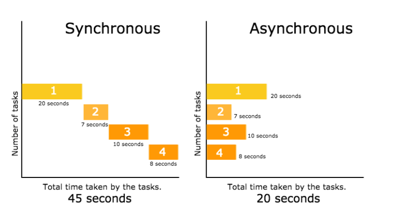

## 동기? 비동기?

### 동기(Synchronous)

순서대로 실행하는 것을 의미합니다.

### 비동기(Asynchronous)

실행이 끝날 때까지 기다려주지 않고 나머지 코드를 동시에 실행하는 것을 의미합니다.



---

## 왜 javascript에서는 `비동기`가 필요한 걸까요?

이러한 경우를 생각해 봅시다. 서버로 어떤 요청을 보냈는데 그 요청이 만약 10초가 걸린다면 10초동안 빈 화면을 띄우며 유저를 기다리게 할 수는 없습니다. 그럴때 서버에 요청을 보냄과 동시에 화면을 띄워주거나 로딩화면을 띄워주는 비동기 실행을 해야 합니다.

비동기 함수의 예시로는 타이머 함수인 setTimeout, setInterval, HTTP 요청, 이벤트 핸들러가 있습니다.

---

## Javascript는 동기일까? 비동기일까?

```jsx
console.log(1);
console.log(2);
console.log(3);
// 순서대로 1 2 3이 출력된다.
```

Javascript는 동기식 언어일까요? 비동기식 언어일까요?

자바스크립트는 동기식 언어입니다. 위 코드는 위에서 아래로 순차적으로 해석되어 순서대로 1, 2, 3이 출력됩니다.

그렇다면 자바스크립트에서는 왜 `비동기 코드를 "처리"`해야 하는 걸까요? 동기 코드처럼 순차적으로 비동기 함수를 작성하면 되는게 아닌가요? 아래의 코드를 봅시다.

---

## Javascript에서 비동기 처리의 문제점

### 비동기 함수의 동작 순서

```jsx
console.log('1');

setTimeout(function () {
  console.log('2');
}, 3000);

console.log('3');
```

```
'1'
3초 지나고 '2'
'3'
```

자바스크립트에서의 비동기 처리를 알지 못하면 위와 같은 결과값을 예상했을 것입니다. 하지만 실제로 아래와 같은 실행결과가 나타나게 됩니다.

```
'1'
'3'
3초 지나고 '2'
```

그 이유는 무엇일까요?

비동기 함수는 테스크 큐에 push 되어 대기하다가 콜스택이 비게 되면, 즉, 전역 코드 및 명시적으로 호출된 함수가 모두 종료하면 비로소 콜스택에 push되어 실행됩니다.

위의 예시를 참고하자면 console.log()들이 실행되고 모두 종료하면 setTimeout()이 비로소 실행된다는 뜻입니다.

이것의 문제점은 비동기 함수는 나중에 실행되기 때문에 **비동기 함수 내부의 코드에서 처리 결과를 외부로 반환하거나 상위 스코프의 변수에 할당하면 기대한대로 동작하지 않는다는 것입니다.**

---

### 비동기 함수의 반환값 처리

앞서 비동기 함수의 내부의 코드는 다른 함수가 종료된 이후에 완료되기 때문에 반환값을 외부로 반환하거나 상위 스코프의 변수에 할당할 수 없다고 했습니다. 아래는 그 예시입니다.

```jsx
let g = 0;

setTimeout(() => {
  g = 100;
}, 0);

console.log(g); // 0
```

console.log()가 실행된 이후 setTimeout이 실행되기 때문에 출력값은 0이 됩니다. 아래는 조금 더 실용적인 예제입니다.

```jsx
const get = () => {
  const xhr = new XMLHttpRequest(); // XMLHttpRequest 객체 생성
  xhr.open('GET', 'https://jsonplaceholder.typicode.com/todos/1'); // HTTP 요청 초기화
  xhr.send(); // HTTP 요청 전송
  xhr.onload = () => {
    // 비동기 구간
    if (xhr.status === 200) {
      console.log(xhr.response); // 2️⃣
      return JSON.parse(xhr.response);
    } else {
      console.error('Error', xhr.status, xhr.statusText);
    }
  };
};

const response = get();
console.log(response); // 1️⃣ undefined
```

HTTP 요청을 보내는 코드입니다. 1️⃣과 2️⃣의 출력값은 아래와 같습니다.

요청에 대한 응답 값이 필요한 상황인데, 여전히 반환 값을 외부로 반환하지 못하고 있습니다.

```
undefined
{
  'userId': 1,
  'id': 1,
  'title': 'delectus aut autem',
  'completed': false
}
```

이러한 문제점을 해결하기 위해 콜백 함수를 사용하게 되었습니다. 그렇다면 콜백 함수는 무엇이고 어떻게 이 문제점을 해결해주는지 알아봅시다.

[Callback함수와 Promise, async/await에 대해 정리한 게시글 보러가기](https://www.datoybi.com/callback-promise/)

---

## 콜백 함수(Callback Function)

`함수의 매개 변수를 통해 다른 함수의 내부로 전달되는 함수`를 콜백 함수라고 합니다.

```jsx
let result;

function func(param) {
  // 고차 함수
  return param();
}

function callback() {
  // 콜백 함수
  return 1;
}

result = func(callback1);
console.log(result); // 1
```

위의 예시는 콜백함수의 반환값인 1을 고차 함수에서 전달 받을 수 있음을 나타냅니다. 즉 callback()에서 1이라는 값을 리턴하면 func()에서는 그 값을 result라는 전역 변수에 넣는 것이 가능해 집니다.

즉, 콜백함수를 이용하면 `콜백 함수의 호출 시점을 결정`할 수 있고, 콜백함수의 `반환 값을 외부에 전달`할 수 있습니다.

앞서 비동기 통신의 문제점은 비동기 함수 내부의 값을 외부로 반환하지 못하는 점이라고 했습니다. 콜백 함수를 이용하게 되면 이것을 해결할 수 있게 됩니다.

```jsx
const get = callback => {
  const xhr = new XMLHttpRequest();
  xhr.open('GET', 'https://jsonplaceholder.typicode.com/todos/1');
  xhr.send();
  xhr.onload = () => {
    if (xhr.status === 200) {
      callback(JSON.parse(xhr.response)); // callback으로 response 전달
    } else {
      console.error('Error', xhr.status, xhr.statusText);
    }
  };
};

get(function (data) {
  console.log(data);
});
```

callback을 이용하여 익명함수 안에서 response를 인자로 전달하여 출력했습니다. 그러나 콜백에도 문제점이 있습니다.

---

## 콜백의 문제점

콜백은 순차척으로 실행하지 않아 가독성이 좋지 않다는 문제점들을 가지고 있습니다. 아래는 가독성을 해치는 콜백 지옥의 예시입니다.

### 콜백 지옥

```jsx
const url = 'http://localhost:3001/memo';

get(`${url}/posts/1`, ({ userId }) => {
  get(`${url}/users/${userId}`, userInfo => {
    get(`${url}/${userInfo}`, info => {
      // ...
    });
  });
});
```

위 예제를 보면 GET 요청을 통해 서버로부터 응답을 받고 이 데이터를 사용하여 또다시 GET 요청을 합니다. 콜백 지옥은 가독성을 나쁘게 하며 실수를 유발하는 원인이 됩니다.

또한 콜백을 사용하면 제어권이 역전되고 에러처리가 어려워지는 등 여러 문제점이 발생합니다. 그 대안으로 Promise가 등장하게 됩니다.

---

## Promise

Promise는 `비동기 처리 상태와 처리 결과를 관리`하는 객체입니다.

```jsx
const get = () => {
  return new Promise((resolve, reject) => {
    const xhr = new XMLHttpRequest();
    xhr.open('GET', 'https://jsonplaceholder.typicode.com/todos/1');
    xhr.send();
    xhr.onload = () => {
      if (xhr.status === 200) {
        resolve(JSON.parse(xhr.response));
      } else {
        reject(new Error(xhr.status));
      }
    };
  });
};

get().then(data => console.log(data));
```

앞서 작성했었던 비동기 코드를 promise를 이용하여 작성했습니다. 비동기 로직에 성공했으면 resolve 콜백 함수 안에 결과를 인수로 넣고, 에러가 발생했다면 reject 콜백함수에 에러를 인수로 넣어 호출하여 사용합니다.

그러다 Promise보다 간단하고 가독성 좋게 비동기 처리를 동기처럼 동작하도록 구현할 수 있는 async/await이 도입되었습니다.

---

## async/await

- async/await는 프로미스를 기반으로 동작합니다.
- 프로미스의 then/catch/finally 후속 처리 메서드에 콜백 함수를 전달해서 비동기 처리 결과를 후속 처리 할 필요 없이 마치 동기 처리처럼 프로미스를 사용할 수 있습니다.

```jsx
const get = async () => {
  const response = await fetch('https://jsonplaceholder.typicode.com/todos/1');
  const data = await response.json();
  console.log(data);
};

get();
```

async 키워드는 함수 앞에 선언하며 언제나 프로미스를 반환합니다.

await 키워드는 반드시 프로미스 앞에 사용해야 하며 비동기 처리가 수행될 때까지 대기하다가 settled 상태가 되면 프로미스가 resolve한 처리 결과를 반환합니다.

---

## 정리

스터디에서 발표한 내용을 토대로 Javascript에서 비동기 처리가 왜 필요한지부터 비동기 처리를 하기 위해 개발자들이 어떤 노력을 해왔고 어떤 함수를 사용했는지 알아보았습니다.

---

# Reference

- You don’t know JS
- 코어 자바스크립트
- 모던 자바스크립트 Deep Dive
