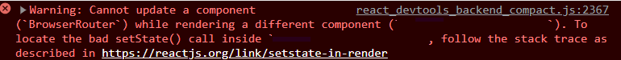
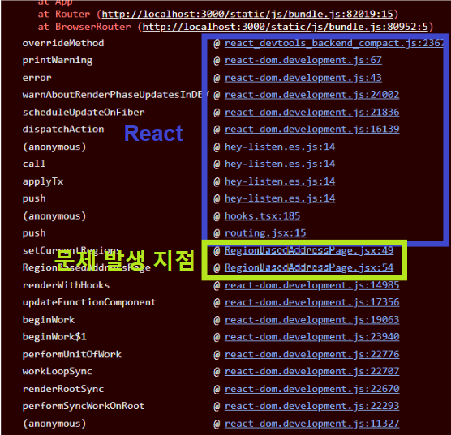

코드 카타를 하는 중 만난 에러입니다. 에러를 해석하자면 `다른 컴포넌트를 랜더링하는 도중에 컴포넌트를 업데이트 할 수 없다`는 경고입니다.

# ⚠️ 발생 원인

재귀함수를 써서 꼬였나 싶었는데 결론적으로는 그게 아니었습니다. 정말 경고 문구 그대로 랜더링하는 도중에 라우팅을 호출하면서 다른 컴포넌트가 렌더링이 되어 발생한 경고였습니다. 경고가 발생한 코드는 이러합니다.

```jsx
export function RegionPage() {
	const getRegion = () => {...}

  const setCurrentRegions = () => {
    // ...
    const newRegions = getRegion();
		if (newRegions.length === 0) {
			router.push('/confirmation'); // 2️⃣
		}
		return newRegions;
  };

  const currentRegion = setCurrentRegions(); // 1️⃣

 	const listHtml = currentRegion.map(item => (
    <li
      key={item.name}
      name={item.name}
      onClick={handleOnClick}
    />
  ));
  return <ul>{listHtml}</ul>;
}
```

RegionPage 컴포넌트가 렌더링 되면서 setCurrentRegions 메서드가 실행(1️⃣)되고 newRegions의 length가 0이라는 조건을 만족할 때 /confirmation으로 라우팅이 됩니다(2️⃣). 그런데 라우팅이 되는 시점은 RegionPage 컴포넌트를 다 랜더링하기 전입니다. (setCurrentRegions 메서드를 실행하고 라우팅이 되어버립니다.) 즉, RegionPage 컴포넌트는 랜더링 도중에 라우팅이 되면서 다른 컴포넌트를 랜더링을 하였던 것입니다.

---

# 💫 해결 방안

### 1. 어느 컴포넌트에서 경고를 유발했는지 찾기

https://github.com/facebook/react/issues/18178#issuecomment-595846312

위의 링크를 참고하면 gaearon은 Javascript stack을 살펴보며 어디서 문제가 발생했는지 찾아야 한다고 합니다.



그리고 디버깅을하며 어디서 문제가 발생하는지 찾습니다.

### 2. useEffect 사용

해결 방법은 컴포넌트 랜더링을 끝낸 후에 다른 컴포넌트를 업데이트를 하면 됩니다. 많은 해결 방법이 있겠지만 저는 useEffect를 사용하여 해결하였습니다.

useEffect는 `컴포넌트의 렌더링 이후`에 실행됩니다. 따라서 useEffect안에 router를 넣어 컴포넌트가 렌더링이 된 이후에 라우팅이 되도록 구현하였습니다.

```jsx
export function RegionPage() {
	const getRegion = () => {...}

  const setCurrentRegions = () => {
    // ...
    const newRegions = getRegion();
    return newRegions;
  };

  const currentRegion = setCurrentRegions();

  useEffect(() => {
    if (currentRegion.length === 0) {
      router.push('/confirmation');
    }
  }, [currentRegion]);

  const listHtml = currentRegion.map(item => (
    <li
      key={item.name}
      name={item.name}
      onClick={handleOnClick}
    />
  ));
  return <ul>{listHtml}</ul>;
}
```
