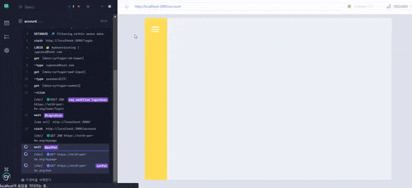
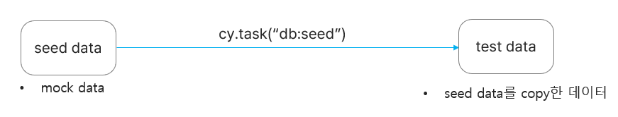

위 글은 cypress의 기본 지식을 전제합니다.



---

# DB in cypress

React project에 cypress 테스트를 붙이기 위해 구글링을 하다가 실제 에플리케이션에 cypress 테스팅을 적용하게 되면 API 처리에 대해 약간 까다로운 점이 있다는 것을 느꼈습니다. 간단한 todo list를 생각해봅시다. 오늘 할일을 작성하고 확인 버튼을 누르면 CREATE /todo라는 api를 호출하며 db에 추가됩니다. 만약 테스트를 할때도 버튼을 클릭하면 실제 db에 테스팅 데이터가 쌓이는 문제가 발생하게 됩니다. 이러한 문제를 해결하기 위해 cypress는 api를 중간에서 가로채서 응답이나, 요청을 바꿀 수 있습니다.


이때 사용하는 테스트용 DB는 실제 서버와는 완전히 독립적인 db를 사용하여야 합니다.

# DB Seeding

실제 production하는 database를 사용하지 않고 가상의 테스트용 data를 다루는 database를 세팅해야 합니다. 이것을 DB Seeding이라고 합니다. seed data는 다른 파일로 복사하여 사용합니다. 테스트가 시작될 때마다 원본 데이터(seed data)는 수정되면 안되기 때문입니다. 이 작업은 [cy.task()](https://docs.cypress.io/guides/tooling/plugins-guide#cytask)를 주로 사용합니다. cy.task()는 브라우저에서 작성할 수 없는 node코드를 작성할 수 있기 때문입니다.



이렇게 복사한 test data는 [cy.intercept()](https://docs.cypress.io/api/commands/intercept#docusaurus_skipToContent_fallback)를 통해 실제 api를 가로채어 테스트용 서버 api로 테스팅을 진행합니다.

---

# 구현해보자👩‍💻

## DB seeding

저는 seeding을 위한 데이터베이스로 [lowdb](https://github.com/typicode/lowdb)를 이용하였습니다. 주의할 점은 `1.0버전으로 다운그레이드하여 설치`를 해야한다는 것입니다. 그렇지 않으면 cypress와 함께 사용할 때 **ERR_REQUIRE_ESM**라는 에러를 맞닥뜨리게 됩니다.

참고 : [https://github.com/typicode/lowdb/issues/480](https://github.com/typicode/lowdb/issues/480)

lowdb v1.0.0 reference : [https://www.npmjs.com/package/lowdb/v/1.0.0](https://www.npmjs.com/package/lowdb/v/1.0.0)

<br/>
db seeding을 세팅해보겠습니다. 먼저 seed data를 작성합니다. 매번 복사될 데이터입니다.

src/lib/test-data/database-seed.json

```jsx
{
  "users": [
    {
      "id": "cypress@test.com",
      "password": "password123!",
      "profileImg": "https://with-pet-test.s3.ap-northeast-2.amazonaws.com/111113.jpg",
      "nickname": "cypress!"
    },
  ],

  "accounts": [
    {
      "id": 1,
      "petId": 1,
      "toy": 2000,
      "hospital": 3000,
      "beauty": 4000,
      "etc": 5000,
      "feed": 1000,
      "day": 1
    },
    {
      "id": 2,
      "petId": 1,
      "toy": 0,
      "hospital": 0,
      "beauty": 0,
      "etc": 0,
      "feed": 5000,
      "day": 2
    },
    {
      "id": 3,
      "petId": 2,
      "toy": 0,
      "hospital": 0,
      "beauty": 50000,
      "etc": 0,
      "feed": 0,
      "day": 3
    }
  ],

  "pet": [
    {
      "id": 1,
      "name": "단비",
      "init_weight": 3,
      "birthday": "2020-20-20"
    },

    { "id": 2, "name": "코코", "init_weight": 5, "birthday": "2023-03-02" }
  ]
}
```

test용 json 파일도 <b>src/lib/test-data/database.json</b> 이 경로에 생성만 해둡니다.
<br/>
<br/>
cypress.config.js

```jsx
const { seed } = require('./db-seeder');

module.exports = defineConfig({
// ...
  e2e: {
    setupNodeEvents(on, config) {
      on('task', {
        'db:seed': () => {
          seed();
          return null;
        },
      });
      return config;
    },
  },
```

seed()라는 함수를 호출합니다.
<br/>
<br/>

db-seeder.js

```jsx
const low = require('lowdb');
const FileSync = require('lowdb/adapters/FileSync');
const fs = require('fs');
const path = require('path');

const databaseFile = path.join(
  process.cwd(),
  'src/lib/test-data',
  'database.json',
);
const adapter = new FileSync(databaseFile);
const db = low(adapter);

module.exports = {
  seed: () => {
    const testSeed = JSON.parse(
      fs.readFileSync(
        path.join(process.cwd(), 'src/lib/test-data', 'database-seed.json'),
        'utf-8',
      ),
    );
    db.setState(testSeed).write();
  },
};
```

src/lib/test-data에 위치한 database-seed.json을 database.json으로 복사하는 lowdb의 문법입니다.

현재 database.json은 비어있고, database-seed.json만 데이터가 있는 상태입니다.
<br/>
<br/>

test.cy.js

```jsx
describe('테스트', () => {
  beforeEach(() => {
    cy.task('db:seed');
  });

  it('seeding test', () => {
    cy.log('db seeding!');
  });
});
```

이 test를 실행하면 성공적으로 database.json에 seed data가 추가되는 것을 볼 수 있습니다.

---

# Testing

api testing을 위해서 seed 데이터를 조회 할 수 있는 custom command를 생성했습니다.

cypress/suport/commands.js

```jsx
Cypress.Commands.add('$', selector => {
  return cy.get(`[data-cy=${selector}]`);
});

Cypress.Commands.add(
  'database',
  (operation, entity, query, logTask = false) => {
    const params = {
      entity,
      query,
    };

    const log = Cypress.log({
      name: 'database',
      displayName: 'DATABASE',
      message: [`🔎 ${operation}ing within ${entity} data`],
      autoEnd: false,
      consoleProps() {
        return params;
      },
    });

    return cy
      .task(`${operation}:database`, params, { log: logTask })
      .then(data => {
        log.snapshot();
        log.end();
        return data;
      });
  },
);
```

<br/>

cypress.config.js

```jsx
const { seed, filter } = require('./db-seeder');

module.exports = defineConfig({
// ...
  e2e: {
    setupNodeEvents(on, config) {
      on('task', {
        'db:seed': () => {
          seed();
          return null;
        },
        'filter:database': queryPayload => {
          const { entity } = queryPayload;
          const filteredData = filter(entity);
          return filteredData || null;
        },
      });
      return config;
    },
  },
```

<br/>

db-seeder.js

```jsx
module.exports = {
  seed: () => {
    const testSeed = JSON.parse(
      fs.readFileSync(
        path.join(process.cwd(), 'src/lib/test-data', 'database-seed.json'),
        'utf-8',
      ),
    );

    db.setState(testSeed).write();
  },

  filter: value => {
    const users = db.get(value).value();
    return users;
  },
};
```

filter를 추가했습니다. 이 부분은 lowdb 문법입니다.

---

이제 seed data로 api CRUD testing을 구현해보겠습니다. 이러한 순서를 따릅니다.

1. DB를 seeding 합니다.
2. test data를 ctx라는 전역 객체에 할당합니다.
3. cy.intercept로 api를 가로채고 필요한 응답이나 요청을 보냅니다. 그에 따라 ctx를 업데이트 해주어 변경된 UI를 테스팅합니다.

```jsx
describe('테스트', () => {
  const ctx = {}; // 전역 데이터 객체

  beforeEach(() => {
    cy.task('db:seed'); // db seeding

		// accounts, pets 데이터 ctx에 저장
    cy.database('filter', 'accounts').then(accounts => {
      ctx.accounts = accounts;
    });
    cy.database('filter', 'pet').then(pets => {
      ctx.pets = pets;
    });

		// GET API 가로채기, 응답을 ctx.pet으로 변경
    cy.intercept('GET', `${url}/pet`, req => {
      req.continue(res => {
        res.body.data = ctx.pets;
      });
    }).as('setPet');

    cy.intercept(
      'GET',`${url}/account`, req => {
        req.continue(res => {
          res.body.data = ctx.accounts;
        });
      },
    ).as('setAccount');

		// POST, PUT, DELETE를 가로치어 status을 201로 변경
    cy.intercept('POST', `${url}`, { statusCode: 201 }).as(
      'addAccount',
    );

    cy.intercept('PUT', `${url}`, { statusCode: 201 }).as(
      'updateAccount',
    );

    cy.intercept('DELETE', `${url}`, { statusCode: 201 }).as(
      'deleteAccount',
    );
  });

  it('추가한다', () =>
    cy.$('add-submit').click();
		// 호출되는 시점에서 wait
    cy.wait('@addAccount');
		// 전역객체인 ctx.accounts에 해당 데이터 추가
    ctx.accounts = [
      ...ctx.accounts,
      {
        id: 6,
        petId: 1,
        toy: 1000,
        hospital: 1000,
        beauty: 1000,
        etc: 1000,
        feed: 1000,
        day: 10,
      },
    ];
  });

  it('수정한다', () => {
    cy.wait('@updateAccount');
    ctx.accounts[0] = {
      id: 1,
      petId: 1,
      toy: 1000,
      hospital: 1000,
      beauty: 1000,
      etc: 1000,
      feed: 1000,
      day: 1,
    };
  });

  it('삭제한다', () => {
    cy.wait('@deleteAccount');
    ctx.accounts.splice(0, 1);
  });
});
```

---

# 정리

- 대규모 프로젝트에서는 실제 가상 서버를 켜고 진행하기도 하고 어떤 프로젝트에서는 seeding을 하지 않고 fixture를 사용하여 테스팅을 하는 경우도 있고 프로젝트에 따라 다른 것 같습니다. 추후에 더 공부해보고 싶은 주제입니다.

- cypress 테스팅하면서 굉장히 좋았던 점은 cypress측에 예시 코드와 reference가 굉장히 잘 정리되어 있었고 자료도 풍부했습니다.
  - [Cypress Reference](https://docs.cypress.io/guides/overview/why-cypress)
  - [cypress-realworld-app](https://github.com/cypress-io/cypress-realworld-app)
  - [cypress-example-recipes](https://github.com/cypress-io/cypress-example-recipes)

---

이렇게 react 프로젝트에 cypres를 적용시켜보았습니다. 처음 해보는 e2e 테스팅이고 적용시키면서 seeding이 대체 뭐지? intercept는 왜 하는거지? 전반적으로 어떻게 테스팅을 해야하는 거지? 이런 궁금증에 대해 정확히 설명한 자료를 찾기 힘들어서 부족하지만 제가 공부한 것들을 공유했습니다. 혹시 잘못된 정보가 있거나 의견이 있다면 피드백 부탁드립니다.👍
