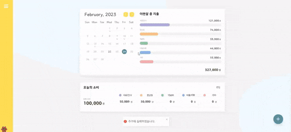

이번에 팀 프로젝트를 하다가 사용성에 대해 고민해보니 에러 핸들링의 필요성을 느끼게되었습니다. 에러를 언제, 왜 그리고 어떻게 보여줘야 할지와 실질적으로 어떻게 구현할지 스터디한 내용들을 공유합니다.

# 에러 핸들링 시나리오

에러가 발생하면 유저와 개발자에게 어떤 방식으로 표출할지 고민했습니다. 또한 에러가 발생할법한 상황들을 생각해보고 유저에게 에러 발생을 알리는 것 뿐만 아니라 가능하다면 어떻게 대응할지 가이드를 제시하는게 사용성 측면에서 좋다고 판단하였습니다.

## 누구에게 어떻게?

- **유저**
  - toast UI 표출
  - 다시시도 버튼이나 로그인 버튼을 제공
- **개발자**
  - 개발 환경에서 에러 발생시 console.error()로 알려주고,
  - 배포 환경에서 에러 발생시 [Sentry](https://sentry.io/welcome/?utm_source=google&utm_medium=cpc&utm_campaign=9575834316&utm_content=g&utm_term=sentry&device=c&gclid=Cj0KCQiAxbefBhDfARIsAL4XLRoa7WISYecdiHtA0auBFALUCPqp29d7QFIanmmqWccdM_UD9YCBsy8aAlTgEALw_wcB&gclid=Cj0KCQiAxbefBhDfARIsAL4XLRoa7WISYecdiHtA0auBFALUCPqp29d7QFIanmmqWccdM_UD9YCBsy8aAlTgEALw_wcB)로 알려주어 대응한다

## 에러가 발생할법한 상황?

1. get이 실패한 상황
   - 페이지에 “서비스에 접속할 수 없습니다. 새로고침을 하거나 잠시 후 다시 접속해 주시기 바랍니다.”라는 문구와 새로고침 버튼 표출하기
2. 데이터 변경 HTTP 메서드가 실패한 상황 (post, patch, delete)
   - 페이지는 유지하되, 다시 시도해달라고 toast UI 표출하기
3. 그 외 api 에러(500대 서버 에러)
   - 페이지에 “예상치 못한 에러가 발생했습니다. 잠시후 다시 시도해주세요.”라는 문구와 새로고침 버튼 표출하기
4. 요청 권한이 없는 상황 (Unauthorized)
   - “접근 권한이 없습니다.” 라는 문구와 로그인 버튼 표출하기
5. 없는 페이지를 접근했을 때
   - 404 페이지를 보여주기

## 어떻게 구현하면 좋을까?

저는 [TkDodo님이 제안한 방법](https://tkdodo.eu/blog/react-query-error-handling)을 따르기로 했습니다.

> React Query에서는 에러를 핸들링할 수 있는 세개의 방법이 있습니다.
>
> - useQuery로부터 반환한 error property
> - onError 콜백 (query에서 직접 선언하거나 global QueryCache / MutationCache)
> - Error bounderies 사용
>
> 개인적으로 제가 좋아하는 방법은 손상되지않은 stale UI를 유지하기 위해 백그라운드에서 toast로 에러를 표출하고, Error boundery나 query에 직접 onError 콜백을 사용하여 에러를 핸들링합니다.

React-query에서 제공하는 global callbacks를 이용하여 에러가 발생할 때마다 toast를 표출하고, Error Boundary를 이용하여 에러가 발생할 경우 대체 페이지(fallback UI)를 보여주는 것을 처리해보려 합니다.

또한, API의 에러 응답 코드 별로 나눠서 유의미한 메세지를 주어 에러를 핸들링하겠습니다.

---

## 용어

### fallback?

어떤 기능이 제대로 동작하지 않을 때, 이에 대처하는 기능 또는 동작을 말합니다. 실패에 대해서 후처리를 위해 설정해 두는 것을 의미합니다.

### Suspend?

loading과 비슷한 의미를 지닙니다.

---

# Error Boundary

Error Boundary란 React v16에 도입된 에러를 핸들링할 수있는 React 합성 컴포넌트입니다. Error Boundary는 하위 컴포넌트 트리의 어디에서든 자바스크립트 에러를 기록하고, 에러가 발생한 컴포넌트 트리 대신 fallback UI를 보여줍니다.

참고 : [Error Boundary 리엑트 공식문서](https://reactjs.org/docs/error-boundaries.html)

Error Boundary는 에러를 핸들링 하는 방법입니다. 기존에 우리는 try-catch문을 이용하여 에러를 핸들링하곤 했습니다. 이 둘의 차이점은 무엇일까요?

```jsx
try {
  showButton();
} catch (error) {
  // ...
}
```

try-catch는 명령적으로 어떻게 에러를 핸들링할지 집중하는 방법입니다. try로 감싼 곳에서 에러가 발생하면 catch에서 에러를 잡아 핸들링해줍니다. 그러나 Error Boundary는 선언적으로 핸들링할 수 있습니다.

직접 Error boundary class를 만들고 커스터마이징하는 방법도 있지만 저는 [react-error-boundary](https://github.com/bvaughn/react-error-boundary)라는 모듈을 이용하겠습니다.

## Error Boundary 기본적인 사용방법

```jsx
<ErrorBoundary FallbackComponent={ErrorFallback}>
  <Login />
</ErrorBoundary>
```

에러가 생길 가능성이 있는 Login이라는 컴포넌트를 ErrorBoundary 컴포넌트로 감쌉니다. 그리고 에러가 발생하면 ErrorFallback 컴포넌트를 보여줍니다. Error Boundary는 트리에서 그 아래에 있는 구성요소의 오류만 포착합니다. 쉽게 생각하자면 ErrorBoundary 컴포넌트로 감싼 부분은 try 블록이고, fallbackComponent는 catch 블록 부분이라고 생각하면 됩니다.

---

## React Query 전역 에러 세팅

```jsx
import { QueryClient } from 'react-query';

export const queryErrorHandler = error => {
  // toast(`데이터를 가져오지 못했습니다! ${error.message}`);
};

export const queryClient = new QueryClient({
  defaultOptions: {
    queries: {
      onError: queryErrorHandler,
      retry: 0,
      suspense: true,
    },
  },
});
```

suspense: true를 작성하여 error boundary를 사용할 것을 알려줍니다. suspense를 true로 작성하게되면 useErrorBoundaries가 true로 세팅됩니다. react query는 기본적으로 요청이 실패하면 3번의 재시도를 거치기 때문에 retry는 0으로 세팅하였습니다.

---

# 구현해보자👩‍💻

## **HTTP 상태 코드**

나타날 수 있는 HTTP 상태코드입니다.

참고 : [HTTP 상태코드](https://developer.mozilla.org/ko/docs/Web/HTTP/Status)

아직 모든 api가 구현되지 않아 발생할법한 HTTP 에러만 명시하였습니다. 401, 402는 접근 권한 관련 에러로, 나머지는 서비스에 접속할 수 없다는 에러 문구를 표출했습니다.

```jsx
const getErrorMessage = () => {
  switch (status) {
    case 401:
    case 402:
      return {
        title: '접근 권한이 없습니다.',
        content: '로그인을 해주세요.',
      };
    case 409:
    case 500:
    default:
      return {
        title: '서비스에 접속할 수 없습니다.',
        content: '새로고침을 하거나 잠시 후 다시 접속해 주시기 바랍니다.',
      };
  }
};
```

## 데이터를 가져오지 못했을 때 fallback UI 띄워주기

한 페이지의 데이터를 가져오지 못한 상황인데 모든 페이지가 보이지 않는다면 사용자 측면에서 불편할 수 있다고 생각했습니다. 그래서 각각의 페이지에 Error Boundary를 적용하여 데이터를 가져오지 못했을 때, 해당 페이지만 에러 페이지를 보여주고, 나머지 페이지에는 접근할 수 있게끔 구현하였습니다.

```jsx
function Page() {
  const { reset } = useQueryErrorResetBoundary();
  return (
    <Article>
      <Suspense>
        <ErrorBoundary FallbackComponent={ErrorFallback} onReset={reset}>
          <AccountMain />
        </ErrorBoundary>
      </Suspense>
    </Article>
  );
}
```

[useQueryErrorResetBoundary](https://tanstack.com/query/v4/docs/react/reference/useQueryErrorResetBoundary)는 react query에서 제공하는 훅으로 발생된 가장 가까운 에러를 reset하는 함수입니다. FallbackComponent로 ErrorFallback이라는 컴포넌트를 만들었습니다. 아래와 같습니다.

새로고침 버튼을 누르면 api가 재호출되고, 접근 권한이 없을때는 로그인 버튼이 표출되게끔 구현했습니다.

```jsx
import { useNavigate } from 'react-router-dom';
import './ErrorFallback.scss';

function ErrorFallback({ error, resetErrorBoundary }) {
  const { status } = error.response;
  const navigate = useNavigate();
  const { title, content } = getErrorMessage();
  const isNotAuthorized = status === 401 || status === 403;
  const buttonMessage = isNotAuthorized ? '로그인' : '새로고침';

  const onClickHandler = () => {
    if (isNotAuthorized) {
      navigate('/login');
    } else {
      resetErrorBoundary();
    }
  };

  return (
    <div className="error-fallback-wrapper">
      <div className="inner">
        <h2 className="title">{title}</h2>
        <p className="content">{content}</p>
        <button type="button" onClick={onClickHandler}>
          {buttonMessage}
        </button>
      </div>
    </div>
  );
}

export default ErrorFallback;
```


---

## UPDATE 했을 때 toast로 실패/성공 여부 표시하기

POST, PATCH, DELETE API를 호출할 경우 toast를 이용하여 실패, 성공여부를 표출했습니다. 실패한 경우, 페이지 이동이 없이 토스트를 표출하여 실패를 알려주고 재실행 하게끔 유도했습니다. toast는 [React-toastify](https://fkhadra.github.io/react-toastify/introduction)를 사용하였습니다.

```jsx
export const useAddTodo = () => {
  const queryClient = useQueryClient();
  const { mutate } = useMutation(todo => addTodo(todo), {
    useErrorBoundary: false,
    retry: 0,
    onSuccess: () => {
      queryClient.invalidateQueries([queryKeys.account]);
      toast.success(TOAST_MESSAGE.Add_SUCCESS, TOAST_OPTION);
    },
    onError: () => {
      toast.error(TOAST_MESSAGE.ADD_FAIL, TOAST_OPTION);
    },
  });
  return mutate;
};
```

저는 react query를 사용하고 있기 때문에 onSuccess와 onError일 때 toast를 설정해주었습니다.



---

# 정리

이렇게 에러를 핸들링 해보았습니다. 구현할 때 생각보다 많은 것들을 고려해야했습니다. react router에서도 에러를 핸들링하는 방법을 제공하고 있고, react 자체에서도, react query에서도 제공합니다. 이 모든 것들을 숙지하고 제 프로젝트의 특성과 유저의 사용성을 고려하여 이 도구들을 잘 취합하여 사용했냐고 묻는다면 그건 아닌 것 같습니다. 또한 뭔가 더 나은 방법이 있지 않을까?라는 생각이 듭니다. 아직 수정할 여지가 많은 코드인 것 같습니다. 다음번에 한번 더 고민해보고 싶은 주제였습니다.

---

## Reference

[https://happysisyphe.tistory.com/52](https://happysisyphe.tistory.com/52)

[https://fe-developers.kakaoent.com/2022/221110-error-boundary/](https://fe-developers.kakaoent.com/2022/221110-error-boundary/)

[https://blog.hwahae.co.kr/all/tech/tech-tech/7867](https://blog.hwahae.co.kr/all/tech/tech-tech/7867)
