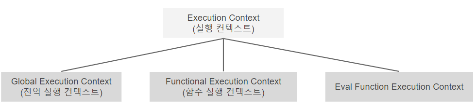
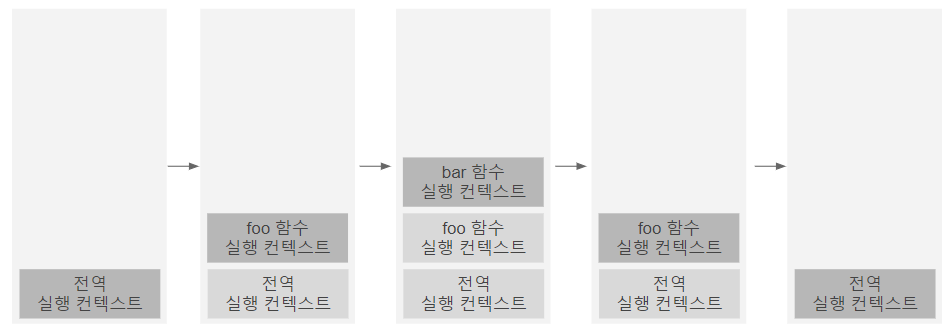
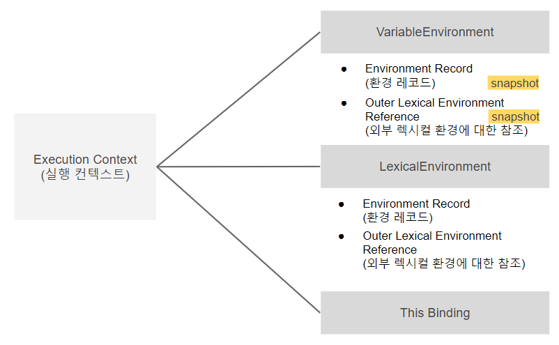

자바스크립트 엔진은 코드를 해석하고 실행하는 복잡성을 관리하기 위해 실행 컨텍스트를 사용합니다. 코드가 잘 실행되려면 스코프, 식별자, 코드 실행 순서등의 관리가 필요합니다. 실행 컨텍스트는 이러한 것들을 관리합니다. 즉, 실행 컨텍스트란 `자바스크립트 코드가 내부적으로 실행되는 환경`입니다. 또한 코드를 평가하고 실행할 때 필요한 정보들을 모아두기 때문에 `실행할 코드에 제공할 환경 정보들을 모아놓은 객체`라고도 합니다.

실행 컨텍스트를 바르게 이해하면 자바스크립트가 내부적으로 어떻게 실행되는지 알 수 있습니다. 이는 자바스크립트가 식별자와 식별자 바인딩을 관리하는 방식과 호이스팅이 발생하는 이유, 클로저의 동작 방식을 이해하는 데 도움을 줍니다.

먼저 실행 컨텍스트가 무엇인지 알아보고, 앞서 나열한 개념들이 실행 컨텍스트와 어떤 연관이 있는지 알아보겠습니다.

---

자바스크립트 엔진은 코드를 읽기 시작하면 코드 타입에 따라 각기다른 실행 컨텍스트를 생성합니다. 아래는 소스코드 타입에 따라 생성되는 실행 컨텍스트 종류입니다.

# 소스코드의 타입과 실행 컨텍스트 종류



| 타입                      | 설명                                                                       | 실행 컨텍스트 종류                                |
| ------------------------- | -------------------------------------------------------------------------- | ------------------------------------------------- |
| 전역 코드 (global code)   | 전역에 존재하는 소스코드를 말한다.                                         | Global Execution Context (전역 실행 컨텍스트)     |
| 함수 코드 (function code) | 함수 내부에 존재하는 소스코드를 말한다.                                    | Functional Execution Context (함수 실행 컨텍스트) |
| eval 코드 (eval code)     | 빌트인 전역 함수인 eval 함수에 인수로 전달되어 실행되는 소스코드를 말한다. | Eval Function Execution Context                   |

## Global Execution Context (전역 실행 컨텍스트)

- 브라우저의 경우, window 객체
- Node.js경우, global 객체

## Functional Execution Context (함수 실행 컨텍스트)

- 함수가 실행될 때마다 만들어지는 실행 컨텍스트입니다. 각 함수는 고유의 실행 컨텍스트를 가지며, 함수가 실행되거나 호출될때 생성됩니다.

## Eval Function Execution Context

- eval 함수로 실행되는 코드입니다.

## 실행 컨텍스트 실행 시점

자동으로 생성되는 전역공간과 eval을 제외하면 `실행 컨텍스트가 생성되는 시점은 곧 함수를 실행하는 시점`입니다.

---

# 소스코드의 평가와 실행

자바스크립트 앤진은 소스 코드를 `소스코드의 평가`와 `소스코드의 실행`과정으로 나누어 처리합니다.

## 소스코드의 평가 (**Creation phase**)

- 실행 컨텍스트를 생성합니다.
- 변수, 함수 등의 선언문만 먼저 실행하여 생성된 변수나 함수 식별자를 키로 실행 컨텍스트가 관리하는 스코프(렉시컬 환경의 환경 레코드)에 등록합니다.

## 소스코드의 실행 (**Execution phase**)

- 소스코드를 순차적으로 실행합니다. 즉, `런타임`이 실행됩니다.
- 실행에 필요한 정보(변수, 함수의 참조)를 스코프에 검색해서 얻습니다. 그리고 변수 값의 변경 등 소스코드의 실행 결과는 다시 실행 컨텍스트가 관리하는 스코프에 등록됩니다.

---

# 실행 컨텍스트 동작과정

## 실행 컨텍스트 스택(call stack)

실행 컨텍스트는 실행 컨텍스트 스택(콜 스택)이라는 자료구조에 관리됩니다. 콜스택은 자바스크립트 엔진이 가지고 있습니다. 코드가 실행하면 코드가 실행되는 시간의 흐름에 따라 실행 컨텍스트 스택에는 다음과 같이 실행 컨텍스트가 추가되고 제거됩니다.



자바스크립트 엔진은 함수가 실행되면 해당 함수에 대한 실행 컨택스트를 생성한 뒤, 콜스택에 담습니다. 그리고 소스코드의 평가와 실행과정을 반복하며 코드를 실행해 나갑니다.

아래 코드의 동작 과정을 살펴봅시다.

```jsx
const x = 1;

function foo() {
  const y = 2;

  function bar() {
    const z = 3;
    console.log(x + y + z);
  }
  bar();
}

foo(); // 6
```

1. 전역 코드의 평가
   - 전역 실행 컨텍스트 생성
   - 전역 변수 x, 전역 함수 foo를 실행 컨텍스트에 등록
2. 전역 코드의 실행
   - 전역 변수 x에 값 할당, 전역 함수 foo 호출
3. foo 함수 코드의 평가
   - foo가 호출되면서 전역 코드의 실행은 일시중단되고 코드의 제어권이 foo 함수 내부로 이동
   - foo 함수 실행 컨텍스트 생성
   - 지역변수 y, 중첩함수 bar가 foo 함수 실행 컨텍스트에 등록
4. foo 함수 코드의 실행
   - 지역 변수 y에 값이 할당
   - 중첩 함수 bar 호출
5. bar 함수 코드의 평가
   - 중첩 함수 bar가 호출되면 foo 함수 코드의 실행은 일시 중단되고 코드의 제어권이 bar 함수 내부로 이동
   - bar 함수 실행 컨텍스트 생성
   - 지역변수 z가 bar 함수 실행 컨텍스트에 등록
6. bar 함수 코드의 실행
   - 지역 변수 z에 값 할당
   - console.log() 호출
   - bar 함수 종료
7. foo 함수 코드로 복귀
   - bar 함수가 종료되면 자바스크립트 엔진은 bar 함수 실행 컨텍스트를 실행 컨텍스트 스택에서 팝하여 제거한다.
   - foo 함수는 더이상 실행할 코드가 없으므로 종료
8. 전역 코드로 복귀
   - foo 함수 실행 컨텍스트 제거
   - 전역 실행 컨텍스트도 제거

실행 컨텍스트의 `최상위에 존재하는 실행 컨텍스트는 언제나 현재 실행중인 코드의 실행 컨텍스트`입니다.

---

# 실행 컨텍스트의 내부 구조



실행 컨텍스트 내부엔 `Variable Environment`, `Lexical Environment`, `this binding`이 있습니다.

## VariableEnvironment

- LexicalEnvironment와 같지만 최초 실행시의 스냅샷을 유지합니다.
- 현재 컨텍스트 내의 식별자들에 대한 정보와 외부 렉시컬 환경에 대한 참조를 담습니다.
- 실행 컨텍스트를 생성할 때 VariableEnvironment에 정보를 먼저 담은 다음, 이를 그대로 복사해서 LexicalEnvironment를 만들고, 이후에는 LexicalEnvironment를 주로 활용하게 됩니다.

## `LexicalEnvironment`

- 식별자와 식별자에 바인딩된 값, 상위 스코프에 대한 참조를 기록하는 자료구조입니다.
- **실행 컨텍스트 스택이 `실행 순서`를 관리한다면, 렉시컬 환경은 `스코프와 식별자`를 관리합니다.**
- 처음에는 VariableEnvironment와 같지만 `변경사항이 실시간으로 반영`됩니다. 즉, VariableEnvironment는 초기 상태를 기억하고, LexicalEnvironment는 `최신 상태를 저장`하고 있습니다.

## 환경 레코드(Environment Record)

- 현재 컨텍스트와 관련된 코드의 식별자 정보들이 저장되고 관리되는 저장소입니다.
- 코드가 실행되기 전에 현재 컨텍스트와 관련된 코드의 식별자 정보가 저장됩니다. 컨텍스트 내부 전체를 훑으며 순서대로 수집합니다. 즉, 코드가 실행되기 전에 자바스크립트 엔진은 이미 해당 환경에 속한 코드의 변수명 등을 모두 알고 있게 됩니다. (호이스팅)

## 외부 렉시컬 환경에 대한 참조(Outer Lexical Environment Reference)

- 상위 코드의 렉시컬 환경을 말합니다.
- `상위 스코프`를 가리킵니다. 즉, 현재 environmentRecord보다 바깥에 있는 environmentRecord를 참고한다는 뜻이며 해당 실행 컨텍스트를 생성한 함수의 바깥 환경을 가리킵니다. 만약 상위 스코프에서도 해당 식별자를 찾을 수 없다면 참조 에러(uncaught reference error)를 발생시킵니다.

## this bining

- this는 현재 컨텍스트를 가리킵니다. method에서 사용시 해당 method가 담겨있는 instance나 object를 가르키며, 함수 표현식에서 사용시 this를 바인딩 하지 않는 이상 전역 객체를 가르킵니다.

---

# 실행 컨텍스트의 생성과 식별자 검색 과정

```jsx
const x = 1;

function foo() {
  const y = 2;

  function bar() {
    const z = 3;
    console.log(x + y + z);
  }
  bar();
}

foo(); // 6
```

1. 전역 객체 생성
   - 전역 코드가 평가되기 전에 전역 객체를 생성
   - 표준 빌트인 객체, Web API(DOM, BOM, Canvas, XMLHttpRequest, fetch, requestAnimationFrame, SVG, Web Storage, Web Component) 객체가 포함된다.
2. 전역 코드 평가

   - 전역 코드 평가는 다음과 같은 순서로 진행된다.

     1. 전역 실행 컨텍스트 생성
     2. 전역 렉시컬 환경 생성

        - 전역 렉시컬 환경을 생성하고 전역 실행 컨텍스트에 바인딩한다.

          2.1. 전역 환경 레코드 생성

          2.1.1. 객체 환경 레코드 생성

        - var 키워드로 선언한 전역 변수와 함수 선언문으로 정의한 전역 함수, 빌트인 전역 프로퍼티와 표준 빌트인 객체 관리
        - var 키워드는 선언 단계와 초기화 단계를 동시에 진행한다. 단, 변수 선언문 이전에 참조한 변수의 값은 언제나 undefined다.
        - 함수 선언문으로 정의한 함수가 평가되면 생성된 함수 객체를 즉시 할당한다.

          2.1.2. 선언적 환경 레코드 생성

        - let, const로 선언한 전역변수 관리
        - 선언 단계와 초기화 단계가 분리되어 진행한다.

          2.2. this 바인딩

        - 전역 환경 레코드와 함수 환경 레코드에만 존재한다.

          2.3. 외부 렉시컬 환경에 대한 참조 결정

        - 현재 평가중인 소스코드를 포함하는 외부 소스코드의 렉시컬 환경, 즉 상위 스코프를 가리킨다.

3. 전역 코드 실행
   - 식별자 결정이 이루어진다. 식별자 결정이란 동일한 이름의 식별자가 다른 스코프에 여러 개 존재할 수 있는데, 어느 스코프의 식별자를 참조하면 되는지 결정하는 것을 의미한다.
   - 식별자 결정을 위해 식별자를 검색할 때는 실행중인 실행 컨텍스트에서 식별자를 검색하기 시작한다. 만약 실행 중인 실행 컨텍스트의 렉시컬 환경에서 식별자를 검색할 수 없으면 외부 렉시컬 환경에 대한 참조가 가리키는 렉시컬 환경, 즉 상위 스코프로 이동하여 식별자를 검색한다.(스코프 체인)
4. foo 함수 코드 평가

   전역 코드를 실행하며 foo 함수 호출을 하게되면 전역 코드의 실행을 일시 중단하고 foo 함수 내부로 코드의 제어권이 이동한다. 그리고 함수 코드를 평가하기 시작한다.

   1. 함수 실행 컨텍스트 생성

   - foo 함수 실행 컨텍스트를 생성하고 실행 컨텍스트 스택에 푸쉬된다. 이때 foo 함수 실행 컨텍스트는 최상위, 즉 실행 중인 실행 컨텍스트가 된다.

   1. 함수 렉시컬 환경 생성

   2.1 함수 환경 레코드 생성

   - 매개변수, arguments 객체, 함수 내부에서 선언한 지역 변수와 중첩 함수 등록, 관리

     2.2 this 바인딩

   - this가 바인딩 된다. this는 함수 호출 방식에 따라 결정된다.

     2.3 외부 렉시컬 환경에 대한 참조 결정

   - 전역 렉시컬 환경의 참조가 할당된다.
   - 자바스크립트는 함수를 어디서 호출했는지가 아니라 어디에 정의했는지에 따라 상위 스코프를 결정한다.

5. foo 함수 코드 실행
   - 런타임이 시작되어 foo 함수의 소스코드가 순차적으로 실행되기 시작한다. 매개변수가 인수에 할당되고, 변수 할당문이 실행되어 지역 변수 x, y에 값이 할당된다. 그리고 함수 bar 가 호출된다.
   - 또한 식별자 결정을 위해 실행 중인 실행 컨텍스트의 렉시컬 환경에서 식별자를 검색한다.
6. bar 함수 코드 평가
7. bar 함수 코드 실행
8. bar 함수 코드 실행 종료
9. foo 함수 코드 실행 종료

---

## 실행 컨텍스트와 호이스팅(hoisting)

호이스팅이 일어나는 이유를 실행 컨텍스트와 연관지어 생각해봅시다.

실행 컨텍스트는 코드 평가 단계(creation phase)에서 컨텍스트와 관련된 코드의 식별자 정보들을 `EnvironmentRecord`에 수집하게 됩니다. 그래서 실제로 코드를 실행하기 이전에 식별자에 접근할 수 있는 것이 마치 코드가 끌어올려진 것 처럼 느껴지게 되어 호이스팅 현상이 발생하게 됩니다.

---

## 실행 컨텍스트와 스코프, 스코프 체인

스코프란 식별자에 대한 유효범위 입니다. 스코프 체인이란 식별자의 유효범위 안에서부터 바깥으로 차례로 검색해나가는 것을 말합니다. 이를 가능하게 하는 것은 바로 `outerEnvironmentReference`입니다. outerEnvironmentReference는 상위 스코프를 저장하고 있으며 현재 스코프에 값이 없으면 outerEnvironmentReference에 저장되어 있는 상위 스코프를 참고하여 차례대로 검색을 해나가게 됩니다.

---

# 정리

- 자바스크립트의 코드를 실행하는데 스코프, 식별자, 코드 실행 순서 등의 관리가 필요합니다. 이것을 관리해주는 객체가 실행 컨텍스트 입니다.
- 실행 컨텍스트 스택은 코드 실행 순서를 관리해 주고, 렉시컬 환경(LexicalEnvironment)은 식별자와 식별자에 바인딩 된 값, 상위 스코프에 대한 참조를 관리합니다.

---

# Reference

- https://www.youtube.com/watch?v=EWfujNzSUmw&t=3s
- https://velog.io/@edie_ko/js-execution-context
- 코어 자바스크립트
- 모던 자바스크립트 Deep Dive
