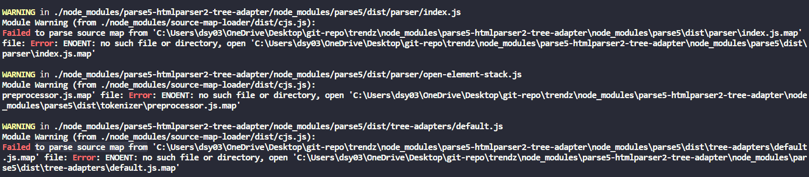

```
WARNING in ./node_modules/parse5-htmlparser2-tree-adapter/node_modules/parse5/dist/tree-adapters/default.js
Module Warning (from ./node_modules/source-map-loader/dist/cjs.js):
Failed to parse source map from '...\node_modules\parse5-htmlparser2-tree-adapter\node_modules\parse5\dist\tree-adapters\default.js.map' file: Error: ENOENT: no such file or directory, open '..\node_modules\parse5-htmlparser2-tree-adapter\node_modules\parse5\dist\tree-adapters\default.js.map'
```

개발을 하다가 갑자기 이런 경고문들이 여러개 떴습니다. 로컬에 있는 제 node_modules에서 해당하는 파일들을 찾을 수 없어서 뜨는 경고문들입니다. 해당 파일들을 node_modules에 있는데 왜 접근을 하지 못하는 걸까요..?

#

조금 찾아보니 `webpack5와 CRA5의 문제`라고 합니다.

---

# 해결법

폴더 최상위에 환경변수를 설정할 수 있는 .env 파일을 추가합니다.

```bash
// .env
GENERATE_SOURCEMAP=false
```

재실행 해주면 더이상 WARNING이 뜨지 않는 것을 볼 수 있습니다.

---

# Reference

[https://stackoverflow.com/questions/70986875/failed-to-parse-source-map-error-enoent-no-such-file-or-directory/71837923#71837923](https://stackoverflow.com/questions/70986875/failed-to-parse-source-map-error-enoent-no-such-file-or-directory/71837923#71837923)
