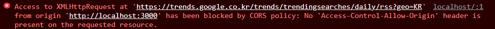
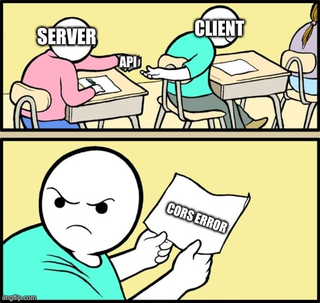
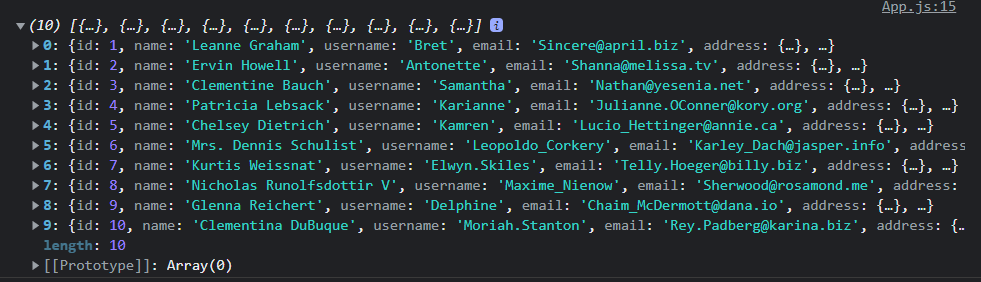
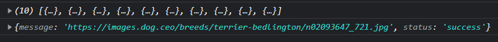
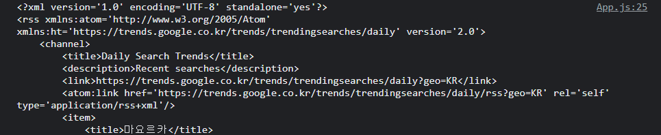

토이 프로젝트를 하고 있던 어느 날, [https://trends.google.co.kr/trends/trendingsearches/daily/rss?geo=KR](https://trends.google.co.kr/trends/trendingsearches/daily/rss?geo=KR)의 자원을 가져오는 axios를 작성하는 와중에 맞닥뜨린 에러입니다.



```
Access to XMLHttpRequest at 'https://trends.google.co.kr/trends/trendingsearches/daily/rss?geo=KR'
from origin 'http://localhost:3000' has been blocked by CORS
policy: No 'Access-Control-Allow-Origin'
header is present on the requested resource.
```

`CORS error` 입니다. 딱 이 상황 같네요.



이 에러를 핸들링하기 위해 CORS에 대해 스터디하고, 에러를 해결하는 방법에 대해 알아보겠습니다.

---

# SOP?

자바스크립트 엔진 표준 스펙의 보안 규칙 중, 하나의 출처(Origin)에서 로드된 자원(문서나 스크립트)이 일치하지 않는 자원과 상호작용 하지 못하도록 요청 발생을 제한하는 정책이 있습니다. 그것이 바로 `SOP` (Same Origin Policy, `동일 출처 정책`)입니다.

즉, **http://<hi1>localhost:8000**와 **http://<hi1>localhost:8000/posts**는 같은 출처라서 상호작용이 가능한데, **http://<hi1>google.com**에서 **http://<hi1>localhost:8000**를 호출하면 SOP에 위배됩니다. 그렇다면 동일한 출처의 기준은 무엇일까요?

## 동일 출처의 기준

```
 http://example.com:8042/over/there?name=ferret&page=1#nose
 \__/  \__________/\___/ \________/ \________________/\___/
   |         |       |       |               |          |
protocol    host    port    path       query string  Fragment
```

`protocol, host, port`가 같아야 동일한 출처 입니다.

---

Quiz. 이 중, http://<hi1>localhost와 동일 출처인 것은?

- http://<hi1>localhost:80 // ⭕
- http://<hi1>localhost/api/cors // ⭕
- http://<hi1>127.0.0.1 // ❌ 해당 주소는 localhost가 맞긴 하지만, 브라우저 입장에서는 string value로 비교를 합니다. 따라서 localhost와 127.0.0.1이 서로 다르기 떄문에 다른 출처라고 판단합니다.

---

## Why SOP?

그렇다면 왜 SOP를 지켜야 할까요? 이런 경우를 생각해봅시다. 사용자가 스팸메일을 열었습니다. 그 메일을 오픈하면 은행에 돈을 출금하는 request를 전송합니다. 요청은 **http://<hi1>hacker.com**라는 출처로 전송이 됩니다. 그렇다면, request 출처는 **http://<hi1>hacker.com**이고, 은행의 출처인 response는 **https://<hi1>bank.com**이기 때문에 서로 출처가 다르기에 브라우저는 CORS 에러를 뿜고, 돈이 빠져나가지 않습니다.

그렇다면, 다른 출처의 리소스가 필요하다면 어떻게 할까요?

### `→ CORS를 사용하면 됩니다.`

---

# CORS

Cross Origin Resource Sharing, 교차 출처 리소스 공유

CORS는 다른 출처의 자원의 공유를 가능하게 만듭니다. 또한, 추가 HTTP 헤더를 사용하여, 한 출처에서 실행 중인 웹 에플리케이션이 다른 출처의 선택한 자원에 접근할 수 있는 권한을 부여하도록 `브라우저`에 알려주는 체제입니다. CORS 에러는 브라우저가 뿜어내는 것입니다. Server↔Server는 CORS 에러가 나지 않습니다.

자 이제 CORS를 어떻게 해결해야 할까요?

---

## CORS 해결하기

CORS 에러는 언제 나타날까요? 클라이언트에서 Server(api)에 접근하여 리소스를 가져올때, 출처가 같지 않으면 브라우저는 CORS 에러를 뿜습니다. CORS Error는 Server에서 해결할 수도 있고, Client에서 해결할 수도 있습니다.

#

Server에서 해결하는 방법은 CORS 미들웨어를 사용하거나, Server에서 Access-access-control-allow-origin 헤더를 세팅해주면 해결됩니다. 그런데 만약, `Server를 수정할 수 없거나 Open API를 사용하는 경우`에는 클라이언트에서 처리를 해주어야 합니다. 클라이언트에서 CORS 에러를 해결하는 방법은 `프록시 서버를 이용`하는 것입니다.

#

프록시 서버란, 다른 네트워크 서비스에 간접적으로 접속할 수 있게 해 주는 서버를 가리킵니다. 즉, Front에서 CORS 에러를 핸들링 하는 것은 서버로 가기 전에 프록시 서버를 거쳐서 출처를 response와 같게 수정하고, Server에 접근하도록 하는 것입니다.

#

React에서 Proxy Server를 구축하는 방법 은 2가지가 있습니다.

참고 : [공식문서 - 프록시 API 요청](https://create-react-app.dev/docs/proxying-api-requests-in-development/)

저는 공식 문서에서 소개한 방법 중 한가지인 http-proxy-middleware를 사용하겠습니다. 첫번째 방법인 Webpack DevServer Proxy보다 세세하게 세팅이 가능하기 때문입니다. 그러나 이러한 방법들 모두 `로컬서버 즉, 개발할때만 사용`이 가능합니다. (관련하여 아래에 추가 설명이 있습니다.)

---

## React에서 CORS 해결하기 - http-proxy-middleware

먼저, src/App.js에서 api를 호출해보겠습니다. 호출할 open api는 [https://jsonplaceholder.typicode.com/users](https://jsonplaceholder.typicode.com/users)입니다.

```jsx
// src/App.js
useEffect(() => {
  async function fetchdata() {
    const { data } = await axios.get(
      'https://jsonplaceholder.typicode.com/users',
    );
    console.log(data);
  }
  fetchdata();
}, []);
```

일반적으로 호출해보았습니다. 이제 proxy를 사용해보겠습니다.

### 선행지식

api의 endpoint가 뭔지 알고 있어야 합니다.

**[What is an Endpoint?](https://stackoverflow.com/questions/2122604/what-is-an-endpoint)**

### 설치

http-proxy-middleware를 설치합니다.

```
npm i http-proxy-middleware
```

### setupProxy.js 세팅

src/setupProxy.js를 생성합니다. 프록시를 세팅할 파일입니다.

```jsx
// src/setupProxy.js
const { createProxyMiddleware } = require('http-proxy-middleware');

module.exports = function (app) {
  app.use(
    createProxyMiddleware('/users', {
      target: 'https://jsonplaceholder.typicode.com',
      changeOrigin: true,
    }),
  );
};
```

- createProxyMiddleware (’/users’, {…}) 의 ‘/users’는 ‘/users’로 시작하는 endpoint를 가진 api와 모두 매칭시킵니다.
- target에는 url의 endpoint를 제외한 출처만 명시합니다. **https://<hi1>jsonplaceholder.typicode.com/users**의 경우, endpoint인 /users를 제외한 **https://<hi1>jsonplaceholder.typicode.com**를 명시합니다.
- changeOrigin :호스트 헤더의 출처를 대상 URL로 변경 하는지 여부입니다. CORS 처리를 위해 출처를 수정해주어야 합니다. 기본값은 false입니다.

참고 : **[http-proxy-middleware readme](https://github.com/chimurai/http-proxy-middleware)**

```jsx
// src/App.js
useEffect(() => {
  async function fetchdata() {
    const { data } = await axios.get('/users');
    console.log(data);
  }
  fetchdata();
}, []);
```

App.js에서 url의 endpoint인 **/users**로 api를 호출합니다. proxy를 세팅하면 `서버를 재시작` 해주어야 합니다.

### 결과화면



데이터가 잘 출력됨을 확인 할 수 있습니다.

---

이번에는 조금 더 복잡한 [https://dog.ceo/api/breeds/image/random](https://dog.ceo/api/breeds/image/random)의 리소스를 가져오겠습니다.

위 api에서 origin은 **https://<hi1>dog.ceo**, endpoint는 **/api/breeds/image/random**임을 알 수 있습니다.

```jsx
// setupProxy.js
const { createProxyMiddleware } = require('http-proxy-middleware');

module.exports = function (app) {
  app.use(
    createProxyMiddleware('/users', {
      target: 'https://jsonplaceholder.typicode.com',
      changeOrigin: true,
    }),
  );

  app.use(
    createProxyMiddleware('/api/breeds', {
      target: 'https://dog.ceo',
      changeOrigin: true,
    }),
  );
};
```

**/api/breeds**로 시작하는 endpoint를 가진 api와 매칭하였습니다.

```jsx
// src/App.js
useEffect(() => {
  async function fetchdata() {
    const API_URL = '/users';
    const { data } = await axios.get(API_URL);
    console.log(data);
  }
  fetchdata();

  async function fetchdogs() {
    const API_URL = '/api/breeds/image/random';
    const { data } = await axios.get(API_URL);
    console.log(data);
  }
  fetchdogs();
}, []);
```

호출할 때는 endpoint를 모두 적어줘야 합니다. 서버를 재시작 하면 결과가 잘 출력되는 것을 알 수 있습니다.

### 결과화면



---

마지막으로 제가 호출하려고 했던 api를 프록시 서버를 이용하여 접근해보겠습니다.

api는 [https://trends.google.co.kr/trends/trendingsearches/daily/rss?geo=KR](https://trends.google.co.kr/trends/trendingsearches/daily/rss?geo=KR)로써,

origin은 **https://<hi1>trends.google.co.kr**, endpoint는 **/trends/trendingsearches/daily/rss?geo=KR**입니다.

```jsx
// setupProxy.js
const { createProxyMiddleware } = require('http-proxy-middleware');

module.exports = function (app) {
  app.use(
    createProxyMiddleware('/users', {
      target: 'https://jsonplaceholder.typicode.com',
      changeOrigin: true,
    }),
  );

  app.use(
    createProxyMiddleware('/api/breeds', {
      target: 'https://dog.ceo',
      changeOrigin: true,
    }),
  );

  app.use(
    createProxyMiddleware('/trends/trendingsearches', {
      target: 'https://trends.google.co.kr',
      changeOrigin: true,
    }),
  );
};
```

```jsx
// src/App.js
useEffect(() => {
  async function fetchdata() {
    const API_URL = '/users';
    const { data } = await axios.get(API_URL);
    console.log(data);
  }
  fetchdata();

  async function fetchDogs() {
    const API_URL = '/api/breeds/image/random';
    const { data } = await axios.get(API_URL);
    console.log(data);
  }
  fetchDogs();

  async function fetchTrends() {
    const API_URL = '/trends/trendingsearches/daily/rss?geo=KR';
    const { data } = await axios.get(API_URL);
    console.log(data);
  }
  fetchTrends();
}, []);
```

### 결과화면



---

## 느낀점

이것으로 Client에서 CORS Error를 해결하는 방법을 알아보았습니다. 전에도 몇번 마주친 적이 있던 애증의 CORS 에러.. 처음에는 문서를 읽어도 무슨 말인지 잘 이해가 가지 않아, 어찌저찌 해결만 했었습니다. 그래도 지금은 이렇게나마 정리하고 이해할 수 있는 수준이 된것 같네요. 나중에는 서버에서 CORS 에러를 해결하는 것도 공부해 보아야 겠습니다.

---

# 추가사항✨

해당 프로젝트를 github pages로 배포하고 신나는 마음으로 새로고침을 했는데 404에러가 뜨더니 proxy server가 먹히지 않았습니다.


조금 찾아보니 `프록시 서버는 개발 환경에서만 사용`할 수 있다고 합니다. 검색 끝에 Netlify에서 proxy server를 세팅할 수 있는 방법을 찾았습니다.

참고자료 : [https://docs.netlify.com/routing/redirects/rewrites-proxies/#proxy-to-another-service](https://docs.netlify.com/routing/redirects/rewrites-proxies/#proxy-to-another-service)

## Netlify proxy server 세팅

### 1. netlify에 빌드 및 배포

### 2. 최상위 폴더에 netlify.toml라는 파일을 생성

### 3. netlify.toml 세팅

netlify.toml

```
[[redirects]]
from = '/trend_proxy/*'
to = 'https://trends.google.co.kr/:splat'
status = 200
force = true

[[redirects]]
from = '/news_proxy/*'
to = 'https://www.bbc.com/korean/:splat'
status = 200
force = true
```

리다이렉트를 설정해줍니다. splat은 \*의 의미와 동일합니다.

### 4. API 요청 URL 설정

```jsx
const trend_proxy =
  window.location.hostname === 'localhost' ? '' : '/trend_proxy';
const news_proxy =
  window.location.hostname === 'localhost' ? '' : '/news_proxy';

const response = await axios.get(`${trend_proxy}${GOOGLE_TRENDS_URL}`);
const response = await axios.get(`${news_proxy}${TOP_NEWS_URL}`);
```

로컬에서도 원활하게 사용하기 위해 변수를 추가합니다.

### 참고

setupProxy.js

```jsx
const { createProxyMiddleware } = require('http-proxy-middleware');

module.exports = function (app) {
  app.use(
    createProxyMiddleware('/trends/trendingsearches', {
      target: 'https://trends.google.co.kr',
      secure: false,
      changeOrigin: true,
    }),
  );

  app.use(
    createProxyMiddleware('/mostread.json', {
      target: 'https://www.bbc.com/korean',
      changeOrigin: true,
    }),
  );
};
```

#

이제 로컬에서도 배포환경에서도 프록시 서버를 이용하여 CORS에러 없이 API에 접근할 수 있게 되었습니다!🎉

---

## reference

[https://xiubindev.tistory.com/115](https://xiubindev.tistory.com/115)

[https://www.youtube.com/watch?v=-2TgkKYmJt4](https://www.youtube.com/watch?v=-2TgkKYmJt4)

[https://www.youtube.com/watch?v=hxyp_LkKDdk](https://www.youtube.com/watch?v=hxyp_LkKDdk)

[https://velog.io/@hinyc/배포-Netlify-proxy-설정-9gmuvrr8](https://velog.io/@hinyc/%EB%B0%B0%ED%8F%AC-Netlify-proxy-%EC%84%A4%EC%A0%95-9gmuvrr8)
