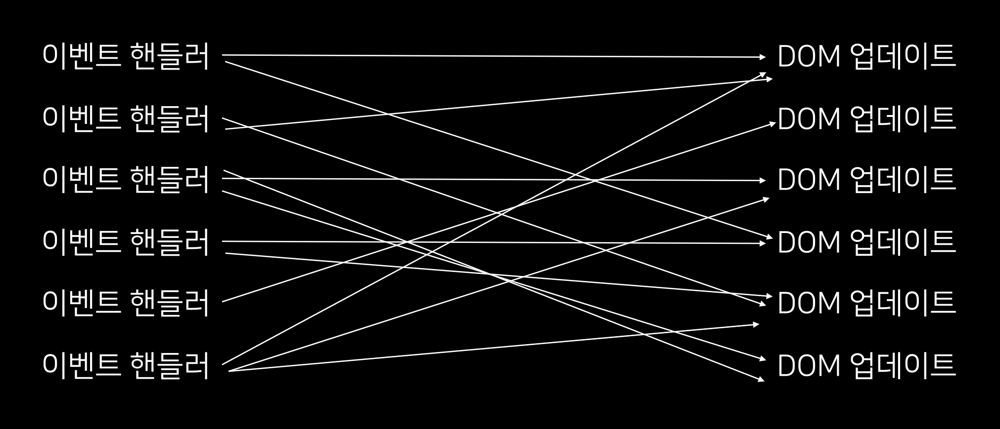

jQuery가 왜 유명해졌고, 왜 지금은 사용하지 않는지, 제 나름대로 고찰해보았습니다.

# jQuery

먼저, jQuery란 무엇일까요? jQuery는 2006년에 John Resig에 의해 처음 출시되었고, [초기 웹사이트](https://web.archive.org/web/20060203025710/http://jquery.com/)에 의하면 아래와 같이 jQuery를 설명합니다.

> jQuery는 javascript 라이브러리 입니다. jQuery는 용량이 크지 않고 AJAX에 최적화 되어있습니다. jQuery는 javascript를 변경하여 작성하도록 설계되었습니다.

---

그렇다면 jQuery는 왜 만들어졌을까요?

마찬가지로 [초기 웹사이트](https://web.archive.org/web/20060203025710/http://jquery.com/)에서 jQuery를 만든 이유를 다음과 같이 말했습니다.

> jQuery는 `자바스크립트를 작성하는건 재미있어야 한다!`는 모토를 가진 javascript 라이브러리입니다. jQuery는 일반적이고 반복적인 작업을 수행하고, 불필요한 마크업을 모두 제거하고, 짧고 스마트하며 이해하기 쉽습니다.

---

즉, jQuery를 한 문장으로 묘사하면 아래와 같습니다.

> `적게 쓰고 많은 일`을 하는 하게 도와주는 javascript 라이브러리 (write less, do more)

잠깐.. 실제로 jQuery는 Javascript 코드를 적게 쓰고 많은 일을 하게 해줄까요? 🤔

제가 생각한 정답은 `예전엔 그랬지만 지금은 그렇지 않다!` 입니다. AJAX로 예를 들어보겠습니다. 아래는 jQuery의 ajax입니다.

```jsx
$.ajax({
  type: 'post',
  url: '/test',
  async: true,
  headers: {
    'Content-Type': 'application/json',
  },
  dataType: 'text',
  data: JSON.stringify({
    id: id,
    name: name,
  }),
  success: function (result) {
    console.log(result);
  },
  error: function (request, status, error) {
    console.error(error);
  },
});
```

간단해 보이시나요? 아마 모던 javascript를 접해본 분이라면 [fetch API](https://developer.mozilla.org/en-US/docs/Web/API/Fetch_API)를 사용하는게 더 간단하지 않나? 라는 생각을 할 것입니다. 아래는 같은 api 호출을 fetch로 작성해보았습니다.

<br/>

```jsx
fetch('/test', {
  method: 'POST',
  headers: {
    'Content-Type': 'application/json',
  },
  body: JSON.stringify({
    id: id,
    name: name,
  }),
})
  .then(response => console.log(response))
  .catch(error => console.error(error));
```

하지만 한가지 간과한 점은 fetch API나 Promise는 2015년에 나왔다는 점입니다. jQuery가 나오기 이전의 ajax 통신을 하기 위해선 [XMLHttpRequest](https://developer.mozilla.org/ko/docs/Web/API/XMLHttpRequest)를 이용하여 아래와 같은 코드를 작성했어야만 했습니다.

<br/>

```jsx
let xhr = new XMLHttpRequest();
xhr.open('POST', '/test');
xhr.send();
xhr.onload = function () {
  if (xhr.status != 200) {
    console.error(`${xhr.status}: ${xhr.statusText}`);
  } else {
    console.log(xhr.response);
  }
};
xhr.onprogress = function (event) {
  if (event.lengthComputable) {
    console.error(`Received ${event.loaded} of ${event.total} bytes`);
  } else {
    console.error(`Received ${event.loaded} bytes`);
  }
};
xhr.onerror = function () {
  console.error('Request failed');
};
```

이제야 왜 그 당시 많은 사람들이 jQuery에 열광했는지 알 것 같습니다. 간편한 ajax 통신, 크로스 브라우징 대응, DOM 조작의 편의성 등등.. 굉장히 많은 장점으로 사랑을 받았습니다.

---

그러나 여러 단점들도 존재합니다.

첫번째로 스파게티🍝 코드가 된다는 점입니다. 저 또한 이전 회사에서 경험해보았습니다. 강하게 결합되어있던 코드들은 한 가지를 수정해도 적용되지 않거나 의도치 않게 적용이 되어 유지보수 난이도가 높았습니다.



또한 jQuery는 명령형 코드여서 가독성 측면에서도 좋지 않았습니다. [이 트위터](https://twitter.com/AdamRackis/status/844289020372901888)를 참고해보세요.

또, DOM을 직접 조작하면 여러가지 부작용이 따릅니다. 일단 DOM을 다시 그리는 비용이 굉장히 비싸고, 변이가 발생할 가능성이 큽니다.

---

이런 단점에도 불구하고 사랑받던 jQuery는 왜 인기가 시들해졌을까요?

앞선 ajax의 비교로 왜 지금은 jQuery가 더이상 필요하지 않은지 설명이 가능할 것 같습니다. 첫번째로 웹 표준이 개선되어 여러 브라우저는 표준을 지키는 방향으로 나아가고 있습니다. 이런 노력으로 [WEB API](https://developer.mozilla.org/ko/docs/Web/API)가 발전하였습니다.
fetch API, DOM API(classList, querySelector, querySelectorAll)과 같이 jQuery를 대체할 수 있는 많은 대체제가 생겼습니다. [모던 javascript가 jQuery를 어떻게 대체하는지 보여주는 사이트](https://youmightnotneedjquery.com/#ajax)도 생겼습니다.
<br/><br/>
두번째로 예전에는 브라우저를 재설치하여 업데이트를 했어야 했는데, 웹의 발전함으로써 별도의 재설치를 요구하지 않아도 자동적으로 브라우저가 업데이트(evergreen browser) 되었습니다. 이렇게 됨으로써 브라우저가 과거보다 더 빠르게 업데이트 되고, jQuery가 업데이트 되기를 기다리는 것보다 유저들이 더 빠르게 버그 픽스를 하게 되었습니다.
<br/><br/>
그러면서 웹 프론트는 점점 더 진화를 하게 되었고, 단순히 화면의 인터렉션이 아니라 데이터가 굉장히 중요해졌습니다. Facebook은 2011년도부터 코드 유지관리가 점점 힘들어졌고, 자체적으로 [React 프로토타입](https://github.com/jordwalke/FaxJs)을 만들어 성공적으로 Facebook에 적용하게됩니다. 그리고 Facebook은 instagram을 인수하게 되는데 instagram에도 React를 적용하고 싶어서 오픈소스로 ReactJS를 세상에 내어놓게 됩니다.

---

# ReactJS

Facebook이 고민했던 것은 어떠한 이벤트가 발생하면 그 이벤트의 결과를 보여주는 가장 쉬운 방법은 부분 부분 고치는게 아니라 다시 처음부터 그 결과를 그려주는 방법이라고 생각했다고 합니다. 그 고민 끝에 나온 라이브러리가 React입니다.
<br/><br/>
ReactJS는 jQuery와는 다르게 UI를 컴포넌트로 쉽게 나누고 재사용 할 수 있습니다. 그래서 큰 규모의 프로젝트에도 안정적으로 사용할 수 있습니다. 또한 선언적인 패러다임을 따르기 때문에 버그가 없고 유지보수가 편합니다. 또한 가상 DOM을 이용하여 DOM 업데이트를 최적화 할 수 있습니다.
<br/><br/>
음.. React에 대해서는 나중에 더 자세히 글을 쓰고 싶어서 이 글에서는 jQuery와의 비교점만 작성하겠습니다. 사실 React도 jQuery도 둘다 javascript 라이브러리라는 점만 공통점인것 같습니다. 이 두 라이브러리가 왜 만들어졌는지와 추구하는 방향이 너무나 상이하기 때문에 비교라 할 것도 없다고 생각합니다.
<br/><br/>
그리고 저는 jQuery는 더이상 사용할 이유가 없다고 생각합니다. jQuery의 장점이 이제 모두 사라졌다고 생각하기 때문입니다. jQuery를 사용했던 회사에 재직할 당시, jQuery를 더이상 사용하지 않는 방향으로 제안을 하였고, 떼어내는 리펙토링을 진행하였습니다. 또한 스파게티 코드를 어떻게 처리할 것인지에 대한 고민을 굉장히 많이 했었는데요. 제 결론은 [이 글](https://medium.com/javascript-in-plain-english/working-with-the-dom-in-vanilla-js-apps-part-1-bf8ccc0faaed)을 참고하여 기능별로 최대한 작게 모듈화를 하여 개발을 하는 방식을 도입했었습니다. 하지만 이마저도 뭔가 부족하다는 생각을 했습니다.
<br/><br/>
앞으로 프론트의 복잡성은 더해질테고 그 복잡성을 단순히 화면 인터렉션을 편하게 해주는 라이브러리인 jQuery로 감당하기엔 버겁고, 그보다 더 고도화된 무언가가 필요하다는 생각을 하였습니다. 어떤 정형화된 틀이나 패턴이 필요할 것 같았습니다. 그 패턴 안에서 개발을 하게 될 것 같았구요. 그래서 리엑트로 눈을 돌렸습니다.

---

# Reference

https://blog.logrocket.com/the-history-and-legacy-of-jquery/
