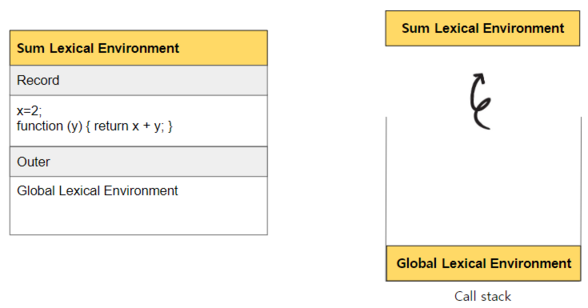

이 글은 [실행 컨텍스트의 이해](https://www.datoybi.com/execution-context/)를 전제합니다.

## 정의

- 함수와 그 함수가 선언된 렉시컬 환경과의 조합입니다.
- 자바스크립트의 모든 함수는 상위 스코프를 기억하므로 이론적으로 모든 함수는 클로저입니다. 그러나 보통 상위 스코프의 식별자를 참조하고 중첩함수가 외부 함수보다 더 오래 유지되는 경우에만 클로저라 합니다.
- 어떤 함수 A에서 선언한 변수 a를 참조하는 내부 함수 B를 외부로 전달할 경우 A의 실행 컨텍스트가 종료된 이후에도 변수 a가 사라지지 않는 현상입니다.

  ```jsx
  function doSomething() {
    const x = 10;
    function sum(y) {
      return x + y;
    }
    return sum;
  }

  const something = doSomething();
  console.log(something(3)); // 13
  ```

  앞서 언급한 클로저의 정의를 위 코드에 대입하자면, doSomething 함수에서 선언한 x변수를 참조하는 내부함수 sum을 외부로 전달할 경우 x변수가 사라지지 않는 현상입니다.

---

## 클로저가 발생하는 이유?

자바스크립트 엔진은 소스 코드를 평가, 실행 과정으로 나누어 처리합니다.

소스 코드의 평가가 이루어질 때 실행 컨텍스트를 생성하고, 변수와 함수 등의 선언문을 먼저 실행하여 Environment Record에 저장하고, Outer Lexical Environment Reference에는 참조할 외부 렉시컬 환경을 저장합니다.

소스 코드의 실행 단계에서는 소스 코드가 순차적으로 실행되고, 변수 값의 변경 등 소스 코드의 실행 결과가 실행 컨텍스트에 등록됩니다.

따라서 자바스크립트 엔진은 함수를 어디서 호출했는지가 아니라 함수를 `어디에 정의했는지`에 따라 상위 스코프를 결정합니다. 즉, `선언되는 시점`에 따라 외부 렉시컬 환경의 참조가 저장되기 때문에 클로저가 발생합니다.
<br/>
<br/>

글로써는 완벽히 이해하기 힘드니, 동작원리를 살펴봅시다.

편의상 Environment Record는 Record, Outer Lexical Environment Reference는 Outer로 명명하겠습니다.

---

## 동작 원리

아래 코드의 동작 원리를 살펴보겠습니다.

```jsx
function sum(x) {
  return function (y) {
    return x + y;
  };
}

const add = sum(2);
console.log(add(7)); // 9
```

1. 전역 코드의 평가

   - sum 함수와 add 변수가 record에 기록됩니다.
   - 외부 참조를 나타내는 Outer에는 Null이 기록됩니다.
   - call stack에 global LexicalEnvironment를 push합니다.
     

---

2. 전역 코드 실행 - `const add = sum(2)`

   - sum 함수의 평가

     - sum(2) 호출됩니다. 함수가 호출되면 실행 컨텍스트가 생성됩니다.
     - 매개변수 x와 return 문이 있는 익명 함수를 호이스팅해 record에 기록합니다.
     - Outer에는 상위 스코프인 Global Lexical Environment를 가리킵니다.
     - sum의 lexicalEnvironment를 push 합니다.

     

   - sum(2) 실행

     - x에는 2가 할당되고 레코드 안에 x변수에 2가 기록됩니다.
     - 이후 실행할 함수가 없으니 콜스택에서 sum lexical environment가 pop됩니다.

     

   - Global Environment로 돌아와 add 변수에 sum 함수의 리턴값인 익명함수를 할당합니다.

     

---

3. 전역 코드 실행 - `console.log(add(7))`

- add()에 호출이 일어나면 add의 LexicalEnvironment가 생성되고 소스코드 평가가 이뤄집니다.
- add LexicalEnvironment는 콜스택에 push 됩니다.
  

---

### 🌈 sum Lexical Environment?

왜 sum Lexical Environment를 참조할까요? 그 이유는 sum 함수 안에 익명함수의 outer가 가리키는 lexical Environment의 결정은 `익명함수가 선언되는 시점`에 결정되기 때문입니다. **익명함수는 sum의 내부에 선언**되었기 때문에 Sum Lexical Environment를 Outer로 참조합니다.

### 🌈 sum Lexical Environment는 아까 Call stack에서 제거되지 않았나요?

실행 컨텍스트가 스택에서 제거된다고 해서 함수의 렉시컬 환경까지 소멸되는 것은 아닙니다. 참조되고 있다면 가비지 컬렉션의 대상에서 제외됩니다.

---

- add(7) 실행을 하면
- 매개변수 y에 7이 할당되고 record안에 기록합니다.
  
  <br/>
- return문을 실행하면 이때 add Lexical Environment에 존재하지 않는 변수 x를 만나게 됩니다.
  자바스크립트는 본인의 record에 저장되어 있는 변수를 확인하고 해당하는 변수가 없으면 outer lexical environment의 record를 확인하게 됩니다. 최종적으로 Global Lexical Environment record에도 존재하지 않는다면 `Reference Error`가 발생하게 됩니다.
- x를 만나 add Lexical Environment record를 탐색합니다. 하지만 add의 LexicalEnvironment Record안에 x변수가 선언되어 있지 않기 때문에 다음으로 add LexicalEnvironment Outer가 가리키고 있는 sum의 LexicalEnvironment를 확인하게 된다. sum의 lexical Environment Record를 확인하니 x=2라고 선언되어 있습니다.
  <br/>
  
  즉, sum의 Lexical Environment는 콜스텍에 존재하지 않지만 add의 LexicalEnvironment의 Outer가 가리키고 있는 sum의 LexicalEnvironment가 가지고 있는 변수 x가 사라지지 않는 현상을 `클로저 현상`이라고 말할 수 있습니다.
  그리고 이처럼 클로저에 의해 참조되는 x변수는 `자유변수`라고도 부릅니다.
  <br/>

- 예제 코드로 돌아와, x + 7이니 9가 리턴이 되고 add의 LexicalEnvironemnt는 콜스택에서 pop 됩니다.
  

- 다시 global의 LexicalEnvironment의 코드가 실행된다. console.log 실행하여 9를 출력하고 스택에서 팝 됩니다.
  

---

## 메모리 낭비?

이론적으로 클로저는 상위 스코프를 기억해야 하므로 불필요한 메모리의 점유를 걱정할 수도 있겠습니다. 하지만, 모던 자바스크립트 엔진은 최적화가 잘 되어 있어서 클로저가 참조하고 있지 않는 식별자는 기억하지 않습니다.

즉, 상위 스코프의 식별자 중에서 기억해야 할 식별자만 기억하므로 메모리 낭비가 크게 발생하지 않습니다.

---

## Reference

https://www.youtube.com/watch?v=PJjPVfQO61o&t=179s

모던 자바스크립트 Deep Dive
