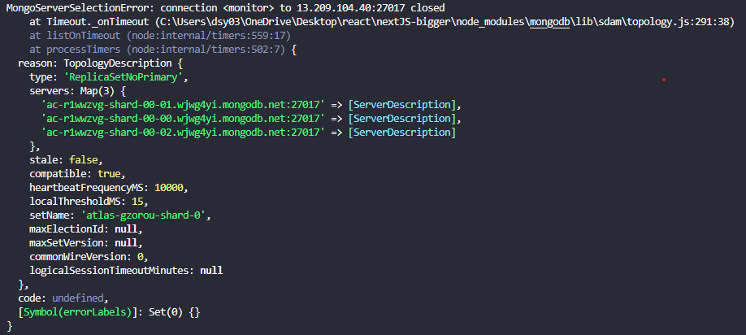
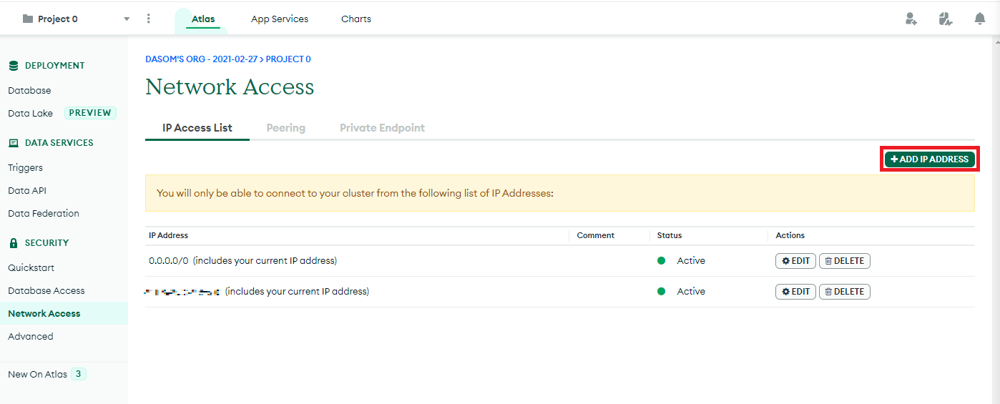
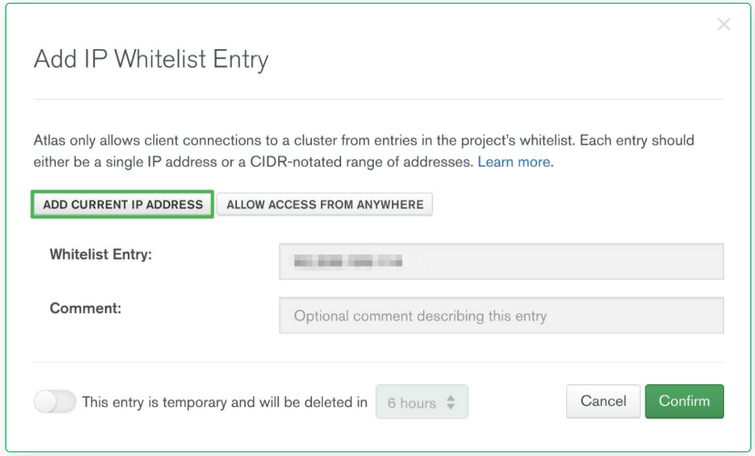
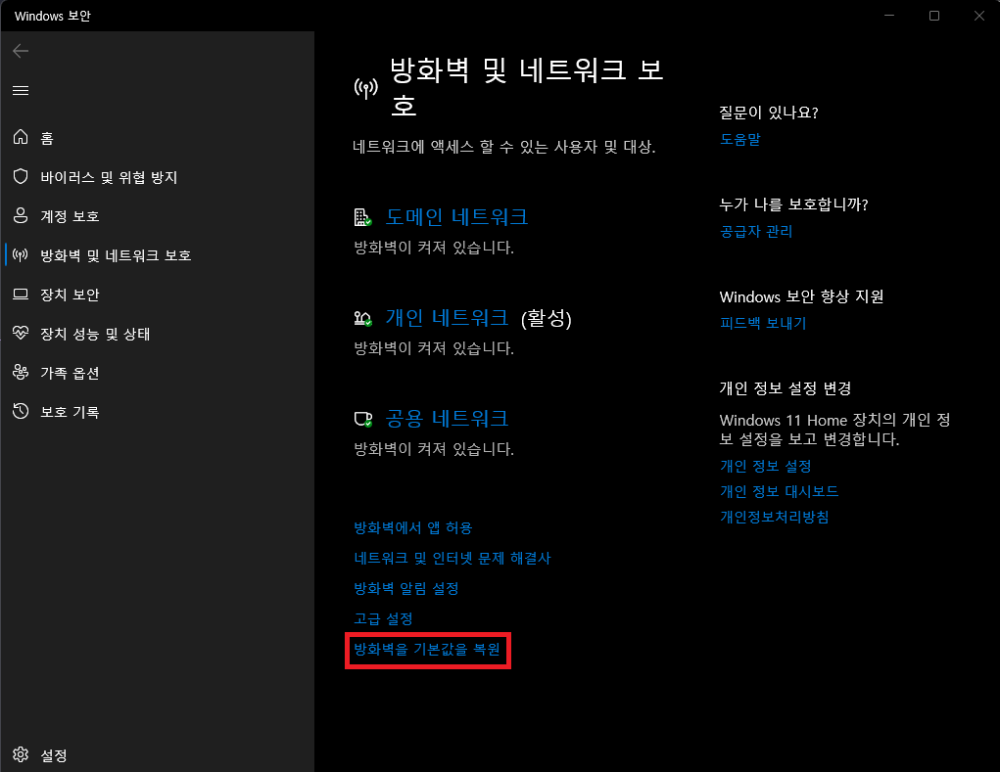

React강의를 듣다가 MongoDB를 연결할때, 
```
name: 'MongoServerSelectionError',
reason: TopologyDescription { type: 'ReplicaSetNoPrimary'}
```
위와 같은 에러가 발생하였습니다.



연결에 오타가 있나 확인하고 잘못된 점이 없는 것 같아 구글링을 해보니 해당 에러(reason: TopologyDescription , type: 'ReplicaSetNoPrimary')는 `Connection`과 관련된 에러라고 합니다. 따라서 두가지 해결책에 의해 해결했습니다.

---

## 해결책 1. 네트워크 접근에서 Whitelist에 추가하기

1. MongoDB Atlas 로그인을 한 뒤 Network Access 탭으로 접근합니다.

   [MongoDB Site](https://cloud.mongodb.com/)

2. Add IP Address 버튼 클릭합니다.

   

3. 현재 IP 주소를 Whitelist에 추가합니다.

   

변경사항이 적용되는데 몇분정도 걸립니다. 저는 이 방식으로 해결했습니다. 그래도 해결이 안된다면, 방화벽 문제일 수 있습니다.

---

## 해결책 2. 방화벽을 기본 값으로 복원하기



---

### Reference

[https://baraksaidoff.medium.com/fixing-mongoserverselectionerror-while-connecting-mongodb-with-node-js-213aaf0bf596](https://baraksaidoff.medium.com/fixing-mongoserverselectionerror-while-connecting-mongodb-with-node-js-213aaf0bf596)

[https://www.mongodb.com/community/forums/t/replicasetnoprimary-when-attempting-to-connect-from-node/143013](https://www.mongodb.com/community/forums/t/replicasetnoprimary-when-attempting-to-connect-from-node/143013)