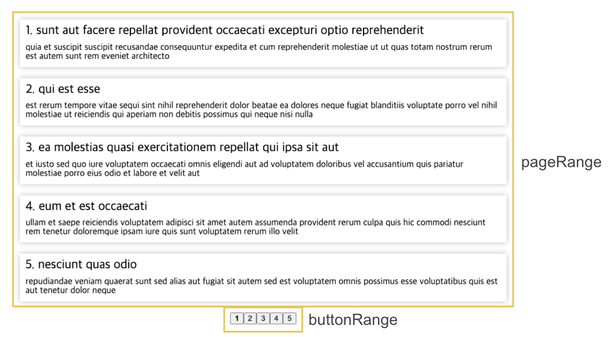
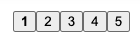
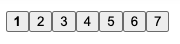
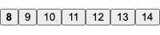
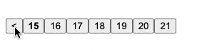

커스텀 페이지네이션을 구현해 봅시다!

---

# 전제조건

## 데이터 가져오기

먼저, 페이지에 뿌려줄 데이터를 가져와야 합니다. 저는 오픈 api인 [jsonplaceholder](https://jsonplaceholder.typicode.com/)를 이용하여 가져왔습니다.

```jsx
import { useState, useEffect } from 'react';
import axios, { AxiosResponse } from 'axios';

const URL = 'https://jsonplaceholder.typicode.com/posts';

export type Post = {
  userId: number;
  id: number;
  title: string;
  body: string;
};

const App = () => {
  const [posts, setPosts] = useState<Post[]>([]);

  useEffect(() => {
    axios
      .get(URL)
      .then((res: AxiosResponse<Post[]>) => setPosts(res.data))
      .catch(error => console.error(error));
  }, []);
};

export default App;
```

가져온 데이터는 posts state에 세팅해두었습니다.

## 설정해줄 것



### pageRange

`페이지당 보여줄 게시물 수`입니다. 저는 5개씩 표출하는걸로 설정하였습니다. 만약, 6으로 설정하면 한 페이지당 게시물이 6개씩 보이게 됩니다.

### btnRange

`보여질 버튼의 개수` 입니다. 저는 5개씩 표출하였습니다. 6으로 설정하면 1-6, 7-12 보여질 것입니다.

### totalPost

`총 게시물 개수`입니다. 저는 api의 응답으로 100개의 게시물 데이터를 받아왔기 때문에 100으로 설정하였습니다.

### page

`현재 보여지는 페이지`입니다.

<br/>

이제 실제로 구현해봅시다.

---

# 숫자버튼 구현하기





btnRange에 따라 보여질 숫자 버튼을 계산해야 합니다. 계산을 할때 두개의 변수가 필요합니다.

### currentSet

`현재 버튼이 몇 번째 세트`인지 나타내는 수입니다. 예를 들어, 총 게시물 개수(totalPost)가 100이고, 보여질 버튼의 개수(buttonRange)가 5라면 1-5, 6-10, 11-15… 총 20개의 버튼 세트가 만들어 집니다. 여기에서 현재 버튼이 1-5라면 currentSet = 1이 되고, 6-10이라면 currentSet = 2가 됩니다.

currentSet는 아래와 같이 구현할 수 있습니다.

```jsx
const currentSet = Math.ceil(page / btnRange);
// 현재 페이지가 1이고 5개씩 표출된다면 2/5 = 0 올림하여 1
// 현재 페이지가 6이고 5개씩 표출된다면 6/5 = 1 올림하여 2
```

### startPage

startPage는 `현재 페이지에 보여지는 버튼의 첫번째 수` 입니다. 예를 들어,


위와 같은 경우에 startPage는 1이되고,



이 경우에는 8이 됩니다.

아래와 같이 구현할 수 있습니다.

```jsx
const startPage = (currentSet - 1) * btnRange + 1;
```

이제 리엑트에서 버튼들을 생성합니다.

```tsx
import { useState, useEffect } from 'react';
import { styled } from 'styled-components';
import axios, { AxiosResponse } from 'axios';

const URL = 'https://jsonplaceholder.typicode.com/posts';

export type Post = {
  userId: number;
  id: number;
  title: string;
  body: string;
};

const App = () => {
  const [posts, setPosts] = useState<Post[]>([]);
  const [page, setPage] = useState<number>(1); // 현재 페이지 수
  const totalPost = 100; // 총 게시물 수
  const pageRange = 5; // 페이지당 보여줄 게시물 수
  const btnRange = 7; // 보여질 페이지 버튼의 개수

  const currentSet = Math.ceil(page / btnRange); // 현재 버튼이 몇번째 세트인지 나타내는 수
  const startPage = (currentSet - 1) * btnRange + 1; // 현재 보여질 버튼의 첫번째 수

  useEffect(() => {
    axios
      .get(URL)
      .then((res: AxiosResponse<Post[]>) => setPosts(res.data))
      .catch(error => console.error(error));
  }, []);

  return (
    <>
      <Container>
        <Nav>
          {Array(btnRange)
            .fill(startPage)
            .map((_, i) => {
              return (
                <Button
                  key={i}
                  onClick={() => setPage(startPage + i)}
                  $active={page === startPage + i}
                >
                  {startPage + i}
                </Button>
              );
            })}
        </Nav>
      </Container>
    </>
  );
};

export default App;

const Container = styled.div`
  background: white;
  box-shadow: 0.25rem 0.25rem 0.75rem rgba(0, 0, 0, 0.15);
  padding: 50px;
  margin: 0;
  border-radius: 0.1rem;
`;

const Nav = styled.nav`
  display: flex;
  justify-content: center;
`;

const Button = styled.button<{ $active: boolean }>`
  font-weight: ${props => (props.$active ? 'bold' : 'normal')};
`;
```

---

# 뒤로가기, 앞으로가기 버튼 구현하기

## 뒤로가기



뒤로가기 버튼을 누르면 다음 페이지의 끝 버튼으로 페이지 설정을 해주어야 합니다. 그렇다면 현재 보여지는 화면의 첫번째 버튼(startPage)에서 -1을 해주면다음 페이지의 끝 버튼으로 세팅이 됩니다.

예를 들어, 움짤에서 15-21버튼이 표출될 때, 뒤로가기 버튼을 누르면 14페이지로 가게 만들어야 합니다. 8-14일때 뒤로가기 버튼을 누르면 7로 가야합니다.

또한, 현재 버튼의 세트의 수(currentSet)가 1이면 뒤로가기 버튼을 표출하지 않아도 됩니다.

```jsx
{
  currentSet > 1 && (
    <Button onClick={() => setPage(startPage - 1)} $active={false}>
      &lt;
    </Button>
  );
}
```

---

## 앞으로 가기

앞으로 가기는 현재 보여지는 버튼의 끝 페이지 수에서 1을 더한 값을 세팅하면 됩니다. 즉, 1-7인 경우 앞으로가기를 눌렀다면, 다음에 보여질 페이지는 8이고 8-14에서 앞으로가기 버튼을 누르면 15입니다.

또한, 현재 버튼의 세트 수(currentSet)보다 총 버튼의 세트가 클때 표출됩니다.

### endPage

현재 보여질 마지막 버튼은 처음 버튼을 토대로 구할 수 있습니다.

```jsx
const endPage = startPage + btnRange - 1;
```

### totalSet

버튼의 총 세트 수 입니다. 총 게시물(totalPost)이 100개이고, 5개의 게시물로 보여주다면(pageRange) 총 20개의 페이지들이 나옵니다.

이 20개의 페이지를 5개의 버튼 세트로 보여줄 거라면(btnRange) 1-5, 6-10, 11-15, 16-20으로 총4개의 버튼의 세트가 생성됩니다.

```jsx
const totalSet = Math.ceil(Math.ceil(totalPost / pageRange) / btnRange); // 전체 벼튼 세트 수
```

앞으로가기 버튼은 총 세트보다 현재 세트가 작아야 표출합니다.

```jsx
{
  totalSet > currentSet && (
    <Button onClick={() => setPage(endPage + 1)} $active={false}>
      &gt;
    </Button>
  );
}
```

리엑트에 적용해 보겠습니다.

```jsx
import { useState, useEffect } from 'react';
import { styled } from 'styled-components';
import axios, { AxiosResponse } from 'axios';

const URL = 'https://jsonplaceholder.typicode.com/posts';

export type Post = {
  userId: number;
  id: number;
  title: string;
  body: string;
};

const App = () => {
  const [posts, setPosts] = useState<Post[]>([]);
  const [page, setPage] = useState<number>(1); // 현재 페이지 수

	const totalPost = 100; // 총 게시물 수
  const pageRange = 5; // 페이지당 보여줄 게시물 수
  const btnRange = 5; // 보여질 페이지 버튼의 개수

  const currentSet = Math.ceil(page / btnRange); // 현재 버튼이 몇번째 세트인지 나타내는 수
  const startPage = (currentSet - 1) * btnRange + 1; // 현재 보여질 버튼의 첫번째 수

  const endPage = startPage + btnRange - 1; // 현재 보여질 끝 버튼의 수
  const totalSet = Math.ceil(Math.ceil(totalPost / pageRange) / btnRange); // 전체 벼튼 세트 수

  useEffect(() => {
    axios
      .get(URL)
      .then((res: AxiosResponse<Post[]>) => setPosts(res.data))
      .catch(error => console.error(error));
  }, []);

  return (
    <>
      <Container>
        <Nav>
          {currentSet > 1 && (
            <Button onClick={() => setPage(startPage - 1)} $active={false}>
              &lt;
            </Button>
          )}
          {Array(btnRange)
            .fill(startPage)
            .map((_, i) => {
              return (
                <Button
                  key={i}
                  onClick={() => setPage(startPage + i)}
                  $active={page === startPage + i}
                >
                  {startPage + i}
                </Button>
              );
            })}
          {totalSet > currentSet && (
            <Button onClick={() => setPage(endPage + 1)} $active={false}>
              &gt;
            </Button>
          )}
        </Nav>
      </Container>
    </>
  );
};

export default App;

const Container = styled.div`
  background: white;
  box-shadow: 0.25rem 0.25rem 0.75rem rgba(0, 0, 0, 0.15);
  padding: 50px;
  margin: 0;
  border-radius: 0.1rem;
`;

const Nav = styled.nav`
  display: flex;
  justify-content: center;
`;

const Button = styled.button<{ $active: boolean }>`
  font-weight: ${props => (props.$active ? 'bold' : 'normal')};
`;
```

---

# 게시물 보여주기

마지막으로 게시물을 알맞게 보여줘야 합니다. 보여줘야할 시작 게시글과 끝 게시글을 알면 전체 데이터에서 해당 데이터를 추출할 수 있습니다.

```jsx
const startPost = (page - 1) * pageRange + 1; // 시작 게시물 번호
const endPost = startPost + pageRange - 1; // 끝 게시물 번호
```

slice를 이용하여 게시물들을 잘라서 표출합니다.

```jsx
{
  posts.slice(startPost - 1, endPost).map(post => (
    <Section key={post.id}>
      <h3>
        {post.id}. {post.title}
      </h3>
      <p>{post.body}</p>
    </Section>
  ));
}
```

---

# 전체 코드

게시글까지 적용한 전체 소스코드 입니다.

```jsx
import { useState, useEffect } from 'react';
import { styled } from 'styled-components';
import axios, { AxiosResponse } from 'axios';

const URL = 'https://jsonplaceholder.typicode.com/posts';

export type Post = {
  userId: number;
  id: number;
  title: string;
  body: string;
};

const App = () => {
  const [posts, setPosts] = useState<Post[]>([]);
  const [page, setPage] = useState<number>(1); // 현재 페이지 수
  const totalPost = 100; // 총 게시물 수
  const pageRange = 5; // 페이지당 보여줄 게시물 수
  const btnRange = 5; // 보여질 페이지 버튼의 개수

  const currentSet = Math.ceil(page / btnRange); // 현재 버튼이 몇번째 세트인지 나타내는 수
  const startPage = (currentSet - 1) * btnRange + 1; // 현재 보여질 버튼의 첫번째 수

  const endPage = startPage + btnRange - 1; // 현재 보여질 끝 버튼의 수
  const totalSet = Math.ceil(Math.ceil(totalPost / pageRange) / btnRange); // 전체 벼튼 세트 수

  const startPost = (page - 1) * pageRange + 1; // 시작 게시물 번호
  const endPost = startPost + pageRange - 1; // 끝 게시물 번호

  useEffect(() => {
    axios
      .get(URL)
      .then((res: AxiosResponse<Post[]>) => setPosts(res.data))
      .catch(error => console.error(error));
  }, []);

  return (
    <>
      <Container>
        {posts.slice(startPost - 1, endPost).map(post => (
          <Section key={post.id}>
            <h3>
              {post.id}. {post.title}
            </h3>
            <p>{post.body}</p>
          </Section>
        ))}

        <Nav>
          {currentSet > 1 && (
            <Button onClick={() => setPage(startPage - 1)} $active={false}>
              &lt;
            </Button>
          )}
          {Array(btnRange)
            .fill(startPage)
            .map((_, i) => {
              return (
                <Button
                  key={i}
                  onClick={() => setPage(startPage + i)}
                  $active={page === startPage + i}
                >
                  {startPage + i}
                </Button>
              );
            })}
          {totalSet > currentSet && (
            <Button onClick={() => setPage(endPage + 1)} $active={false}>
              &gt;
            </Button>
          )}
        </Nav>
      </Container>
    </>
  );
};

export default App;

const Section = styled.section`
  margin: 20px;
  padding: 10px;
  box-shadow: 0 0 10px rgba(0, 0, 0, 0.3);

  & > h3 {
    font-size: 1.4rem;
    margin-bottom: 10px;
  }
`;

const Container = styled.div`
  background: white;
  box-shadow: 0.25rem 0.25rem 0.75rem rgba(0, 0, 0, 0.15);
  padding: 50px;
  margin: 0;
  border-radius: 0.1rem;
`;

const Nav = styled.nav`
  display: flex;
  justify-content: center;
`;

const Button = styled.button<{ $active: boolean }>`
  font-weight: ${props => (props.$active ? 'bold' : 'normal')};
`;
```

---

# 정리

항상 공부할 당시엔 기억하지만 시간이 지나면 까먹는 페이지네이션..

한번 이렇게 정리해두면 그래도 기억에 조금 더 오래 남지 않을까 해서 정리해보았습니다.

더 나아가 재사용 가능한 컴포넌트로 뺼 수 있을 것 같아서 제 나름대로 리펙토링을 해보았습니다.

https://github.com/datoybi/react-playground/tree/main/src/components/pagination/refactor

피드백 환영합니다. 긴글 읽어주셔서 감사합니다. 👍
