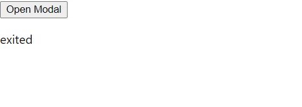

# 선행지식

## Transition vs Animation

- Transition은 CSS 속성을 변경할 때 에니메이션 속도를 조절하는 방법을 제공합니다. 또한 종료 후에도 상태유지가 되지 않습니다.
- 반면 Animation은 keyframe을 설정할 수 있어서 transition보다 세세하게 설정할 수 있습니다. 또한 animation-fill-mode을 이용하면 에니메이션이 종료된 이후에도 원하는 상태를 유지할 수 있습니다.

당연한 말이지만, React 내에서도 Transition과 Animation을 이용하여 에니메이션을 구현할 수 있습니다. 아래 코드는 버튼을 누르면 modal을 띄우는 CSS의 일부입니다.

---

## transition

```css
.Modal {
  position: fixed;
  z-index: 200;
  border: 1px solid #eee;
  box-shadow: 0 2px 2px #ccc;
  background-color: white;
  padding: 10px;
  text-align: center;
  box-sizing: border-box;
  top: 30%;
  left: 25%;
  width: 50%;
  transition: all 0.3s ease-out; /* transition 사용 */
}

.ModalOpen {
  opacity: 1;
  transform: translateY(0);
}

.ModalClosed {
  opacity: 0;
  transform: translateY(-100%);
}

.Backdrop {
  position: fixed;
  z-index: 100;
  top: 0;
  left: 0;
  width: 100%;
  height: 100%;
  background-color: rgba(0, 0, 0, 0.8);
}

.BackdropOpen {
  opacity: 1;
  transform: translateY(0);
}

.BackdropClosed {
  opacity: 0;
  transform: translateY(-100%);
}
```

## animation

```css
.Modal {
  position: fixed;
  z-index: 200;
  border: 1px solid #eee;
  box-shadow: 0 2px 2px #ccc;
  background-color: white;
  padding: 10px;
  text-align: center;
  box-sizing: border-box;
  top: 30%;
  left: 25%;
  width: 50%;
}

.ModalOpen {
  animation: openModal 0.4s ease-out forwards;
}

.ModalClosed {
  animation: closeModal 0.4s ease-out forwards;
}

@keyframes openModal {
  0% {
    opacity: 0;
    transform: translateY(-100%);
  }

  50% {
    opacity: 1;
    transform: translateY(20%);
  }

  100% {
    opacity: 1;
    transform: translateY(0);
  }
}

@keyframes closeModal {
  0% {
    opacity: 1;
    transform: translateY(0);
  }

  50% {
    opacity: 0.8;
    transform: translateY(60%);
  }

  100% {
    opacity: 0;
    transform: translateY(-100%);
  }
}
```

이렇게 별도의 모듈이 없이도 잘 구현되는 것 같은데 왜 React에서 animation을 사용할 때는 모듈이 필요할까요?

---

# React에서 animation 모듈을 사용하는 이유

## 1. 코드가 보이지는 않지만 항상 html에 존재합니다.

animation을 구현할때는 display:none을 사용할 수 없어서 hight의 길이를 조절한다던지, opacity를 조절하는 등 보이지만 않게끔 처리를 한 뒤 에니메이션을 적용합니다. 이렇게 html에 항상 존재할 경우, 속도가 느려질 수 있습니다. 또한 접근성 면에서도 좋지 않고, 무엇보다 `리엑트답지` 않습니다.

## 2. state가 변경되어 재랜더링 시, 에니메이션이 동작하지 않는 경우가 생깁니다.

state가 변하면 에니메이션 유무를 추척하고 계산하여 렌더링 하지 않습니다. 아래와 같은 상황을 봅시다.

```jsx
const [modalIsOpen, setModalIsOpen] = useState(false);

return (
  <>
    {modalIsOpen && <Modal show={modalIsOpen} closed={closeModal} />}
    {modalIsOpen && <Backdrop show={modalIsOpen} />} {/* 여기주목! */}
  </>
);
```

만약 modalIsOpen이 false로 변경되었을 때 Backdrop 컴포넌트는 랜더링되지 않고, 에니메이션이 있어도 보이지 않게 됩니다.

즉, React에서 transition과 animation으로 일정부분을 커버할 수 있지만, 디테일한 에니메이션 기능이나 특정한 경우에 에니메이션이 동작하지 않기 때문에 React 모듈을 사용합니다.

수 많은 에니메이션 관련 Module이 있지만 저는 [React Transition Group](http://reactcommunity.org/react-transition-group/)을 이용하였습니다.

---

# React Transition Group

## Transition

Transition 컴포넌트는 에니메이션의 전환이 일어날 때 4가지 상태로 두어, 해당하는 전환 시점에 따라 컴포넌트를 조작할 수 있도록 도와주는 컴포넌트 입니다. 4가지 상태로는 `entering, entered, exiting, exited`가 있습니다.

```jsx
import Transition from 'react-transition-group/Transition';

function App() {
  const [modalIsOpen, setModalIsOpen] = useState(false);

  return (
    <>
      <button onClick={onClickHandler}>Open Modal</button>
      <Transition in={modalIsOpen} timeout={300}>
        {state => <p>{state}</p>}
      </Transition>
    </>
  );
}
```

결과값

처음에는 exited

한번 클릭하면 entering → entered

다시한번 클릭하면 exiting → exited

---

기존에 state로 감쌌던 컴포넌트를 Transition으로 감싸줍니다. `Transition의 in 속성`을 통해 감싼 부분이 보일지 말지를 결정합니다. (in 속성 값이 true면 표출되고 false면 표출되지 않습니다.)

`Transition의 timeout 속성`은 애니메이션이 재생되는 시간을 결정합니다. entering에서 entered로, eixiting에서 exited로 전환할 때 걸리는 시간입니다.

```jsx
<Transition in={showBlock} timeout={300}>
  <div
    style={{
      backgroundColor: 'red',
      width: 100,
      height: 100,
      margin: 'auto',
    }}
  />
</Transition>;

{
  /* {showBlock ? (
  <div
    style={{
      backgroundColor: "red",
      width: 100,
      height: 100,
      margin: "auto",
    }}
  ></div>
) : null} */
}
```

---

`Transition에는 mountOnEnter, unmountOnExit` 속성이 있습니다. lazy mount를 원하면 mountOnEnter을 작성하면 됩니다. 만약 exiting이 끝나고 난 뒤 mount 하지 않는것을 선호하면 unmountOnExit를 세팅하면 됩니다.

또한 `onEnter, onEntering, onEntered, onExit, onExiting, onExited` 속성도 제공합니다.

```jsx
<Transition
  in={modalIsOpen}
  timeout={300}
  mountOnEnter
  unmountOnExit
  onEnter={() => console.log('onEnter')}
  onEntering={() => console.log('onEntering')}
  onEntered={() => console.log('onEntered')}
  onExit={() => console.log('onExit')}
  onExiting={() => console.log('onExiting')}
  onExited={() => console.log('onExited')}
>
  {state => (
    <>
      <Modal show={modalIsOpen} closed={closeModal} />
      <Backdrop show={modalIsOpen} />
    </>
  )}
</Transition>
```

---

이제 modal에서 Transition을 적용해보겠습니다.

```jsx
// Modal.js
import React from 'react';
import './Modal.css';
import Transition from 'react-transition-group/Transition';

const modal = props => {
  return (
    <Transition in={props.show} timeout={300} mountOnEnter unmountOnExit>
      {state => {
        const cssClasses = [
          'Modal',
          state === 'entering'
            ? 'ModalOpen'
            : state === 'exiting'
            ? 'ModalClosed'
            : null,
        ];

        return (
          <div className={cssClasses.join(' ')}>
            <h1>A Modal</h1>
            <button className="Button" onClick={props.closed}>
              Dismiss
            </button>
          </div>
        );
      }}
    </Transition>
  );
};

export default modal;
```

---

## timeout(entering, exiting) 각각 설정하는 방법

```jsx
const animationTiming = {
  enter: 400,
  exit: 1000,
};

const modal = (props) => {
  return (
    <Transition
      in={props.show}
      timeout={animationTiming}
      mountOnEnter
      unmountOnExit
    >
...
}

// css - 밀리초 설정해주기
.ModalOpen {
  animation: openModal 0.4s ease-out forwards;
}

.ModalClosed {
  animation: closeModal 1s ease-out forwards;
}
```

enter, exit을 key로 갖는 json을 생성한 뒤, Transition의 속성인 timeout에 전달합니다.

---

# CSSTransition

CSSTransition 컴포넌트는 앞서 설명한 Transition의 모든 속성을 상속하며, 컴포넌트의 상태에 따른 CSS 속성을 부여하기 위해 사용됩니다. Transition과 다른 점은 Transition은 상태에만 관심이 있는 반면, CSSTransition은 상태에 따른 `CSS 속성을 조금 더 쉽게 조작`할 수 있습니다.

Transition으로 구현한 모달을 CSSTransition으로 마이그레이션 하였습니다.

```jsx
import CSSTransition from 'react-transition-group/CSSTransition';
import './Modal.css';

const animationTiming = {
  enter: 400,
  exit: 1000,
};

const modal = props => {
  return (
    <CSSTransition
      in={props.show}
      timeout={animationTiming}
      mountOnEnter
      unmountOnExit
      classNames="fade-modal"
    >
      <div className="Modal">
        <h1>A Modal</h1>
        <button className="Button" onClick={props.closed}>
          Dismiss
        </button>
      </div>
    </CSSTransition>
  );
};

export default modal;
```

```css
@keyframes openModal {
  0% {
    opacity: 0;
    transform: translateY(-100%);
  }

  50% {
    opacity: 1;
    transform: translateY(20%);
  }

  100% {
    opacity: 1;
    transform: translateY(0);
  }
}

@keyframes closeModal {
  0% {
    opacity: 1;
    transform: translateY(0);
  }

  50% {
    opacity: 0.8;
    transform: translateY(60%);
  }

  100% {
    opacity: 0;
    transform: translateY(-100%);
  }
}

.fade-modal-enter {
}

.fade-modal-enter-active {
  animation: openModal 0.4s ease-out forwards;
}

.fade-modal-exit {
}

.fade-modal-exit-active {
  animation: closeModal 1s ease-out forwards;
}
```

---

CSSTransition은 class를 사용자가 디테일하게 지정할 수 있습니다.

```jsx
<CSSTransition
      in={props.show}
      timeout={animationTiming}
      mountOnEnter
      unmountOnExit
      classNames={{
        enter: "",
        enterActive: "ModalOpen",
        exit: "",
        exitActive: "ModalClosed",
        appear: "",
        appearActive: "",
      }}
    >

// css
.ModalOpen {
  animation: openModal 0.4s ease-out forwards;
}

.ModalClosed {
  animation: closeModal 1s ease-out forwards;
}

@keyframes openModal {
  0% {
    opacity: 0;
    transform: translateY(-100%);
  }

  50% {
    opacity: 1;
    transform: translateY(20%);
  }

  100% {
    opacity: 1;
    transform: translateY(0);
  }
}

@keyframes closeModal {
  0% {
    opacity: 1;
    transform: translateY(0);
  }

  50% {
    opacity: 0.8;
    transform: translateY(60%);
  }

  100% {
    opacity: 0;
    transform: translateY(-100%);
  }
}
```

---

# TransitionGroup

TransitionGroup 컴포넌트는 Transition이나 CSSTransition의 list를 관리할때 사용합니다. 아래는 list 예시입니다.

```jsx
const listItems = this.state.items.map((item, index) => (
  <CSSTransition key={index} classNames="fade" timeout={300}>
    <li className="ListItem" onClick={() => this.removeItemHandler(index)}>
      {item}
    </li>
  </CSSTransition>
));

return (
  <div>
    <button className="Button" onClick={this.addItemHandler}>
      Add Item
    </button>
    <p>Click Item to Remove.</p>
    {/* <ul className="List">{listItems}</ul> */}
    <TransitionGroup component="ul" className="List">
      {listItems}
    </TransitionGroup>
  </div>
);
```

---

## Reference

[https://www.udemy.com/course/best-react/](https://www.udemy.com/course/best-react/)

[http://reactcommunity.org/react-transition-group/transition#Transition-prop-mountOnEnter](http://reactcommunity.org/react-transition-group/transition#Transition-prop-mountOnEnter)
