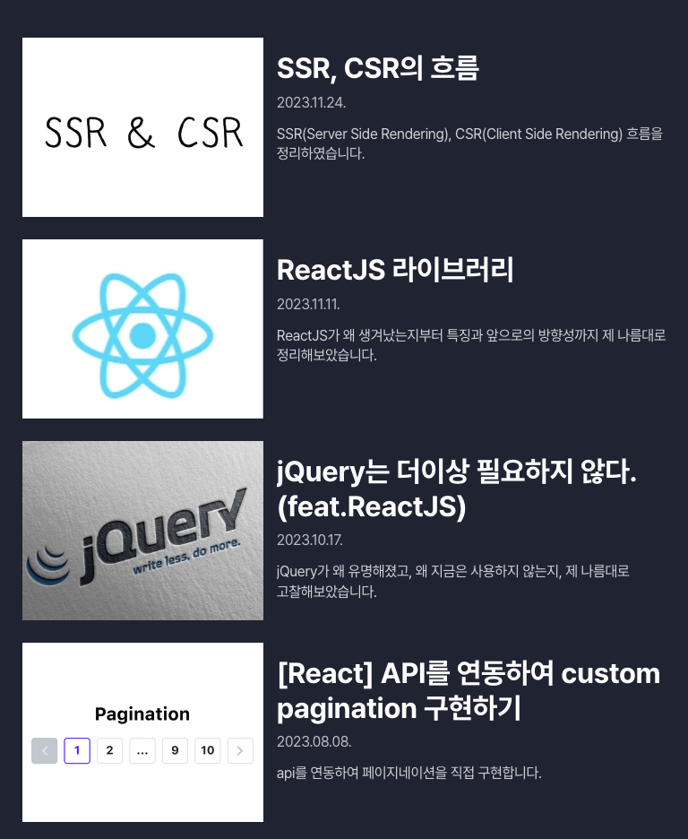

[산돌구름에서 `구독형 웹폰트`](https://vo.la/QUdmY)가 나왔다고 하여 제 블로그에 적용을 해봤습니다.

먼저 웹 폰트란 무엇일까요?

# 웹 폰트

웹 폰트란 사용자가 폰트를 다운로드하지 않아도 온라인의 특정 서버에 위치한 폰트 파일을 다운로드하여 웹 사이트에 표시해주는 웹 전용 폰트입니다.

웹 폰트를 사용하면 좋은 점은 아래와 같습니다.

---

# 웹 폰트의 장점

- 이미지 제작, 수정 없이 빠르게 내용을 변경하고, 트렌드를 반영한 최적화된 검색 결과를 노출 할
  수 있습니다.
- 운영체제와 기종에 구애 없이 동일한 사용자 경험을 제공합니다.
- 웹사이트 번역이 자유로워 글로벌 고객 대상 홍보 용이합니다.

<br/>
웹 폰트가 좋다는 건 알겠는데.. 근데 그냥 아무 웹폰트를 사용하면 되는거 아니야? 라는 생각이 들 수 있습니다. 산돌구름 웹폰트를 사용해야 하는 이유는 아래와 같습니다.

---

# 산돌구름 웹폰트를 사용해야 하는 이유

## 1. 산돌구름이 만든 폰트들

산돌구름은 네이버의 ‘`나눔 고딕`’, `배민의 폰트` 마이크로소프트 사의 ‘`맑은 고딕`’을 만든 대한민국을 대표하는 폰트 회사입니다. 또한 `도로 표지판`까지 산돌구름의 손길이 닿았다고 하네요. 이렇게 한글 폰트를 잘 만드는 회사에서 만든 웹폰트이기 때문입니다.


## 2. 한글 폰트가 가지는 특수성

한글 폰트는 태생적으로 무겁습니다. 100여자 내외로 구성되는 알파벳과 달리 한글의 모든 조합은 `11,172자`입니다. 그래서 큰 폰트 용량으로 인해 렌더링 시간이 지연되어 로딩시간이 길다는 단점이 있습니다.

이러한 단점을 산돌구름 웹폰트에서 특허기술을 개발하여 해결하였습니다. 또한 그 외의 산돌구름 웹폰트만의 특징과 장점을 알아보겠습니다.

---

# 산돌구름 웹폰트 장점

## 1. 다양한 폰트 옵션

오픈 소스의 웹폰트는 종류가 한정적이었던 것에 반해, 산돌구름 웹폰트는 `약 800여 가지`의 산돌 폰트를 지원합니다. 그러므로 디자이너가 원하는 다양한 스타일을 웹사이트에서 구현 할 수 있습니다. [이 링크](https://www.sandollcloud.com/webfont/font)에서 산돌구름의 다양한 웹폰트를 확인해 볼 수 있습니다.

## 2. 검색엔진 최적화(SEO)

프론트앤드 개발자는 어떻게 검색엔진 최적화를 할지 항상 고민합니다. 산돌구름 웹폰트를 사용하면 `검색엔진 최적화`에 용이합니다. 그 이유는 산돌구름 웹폰트 사용하게 되면 메뉴, 소개 문구가 텍스트로 인식되기 때문입니다. 번거롭던 별도의 메타 태그 입력 작업도 생략할 수 있습니다.

즉, 산돌구름으로 작성한 모든 부분을 텍스트화할 수 있기 때문에 `자동번역 기능`과도 쉽게 연동되어 홈페이지의 다국어 지원을 해야할 때 사용하면 좋습니다. 또한 수정도 쉽고 빠르다는 장점이 있습니다.

## 3. 합리적인 비용

산돌구름 웹폰트는 필요한 기간과 트래픽에 따라 원하는 상품을 선택해 월간/연간 자유롭게 구독방식으로 이용이 가능합니다. 아래와 같이 굉장히 디테일한 옵션들로 구성되어 있어 필요한 상품으로 구독하여 사용할 수 있습니다.


상세한 상품별 비용은 [여기](https://www.sandollcloud.com/webfont/use)를 참고해주세요

지금은 `1개월 무료체험`을 진행하고 있어서 한달 트라이얼을 해보고 구매를 진행해도 좋을 것 같습니다.

## 4. 가볍고 빠른 전송

프론트앤드 개발자들은 항상 좋은 사용자 경험을 주기 위해 고민합니다. 그래서 빠르게 렌더링을 하기위해 병목현상을 제거하는데요. 보통 병목이 일어나는 부분은 폰트나 이미지와 같은 용량이 큰 데이터를 로딩할 때 시간이 오래 걸립니다.

산돌구름 웹폰트를 이용하게 되면 11,172자의 모든 한글이 아닌 `웹사이트에 적용된 한글만` 호출해 빠르고 가볍게 폰트 적용이 가능합니다. 데이터에 의하면 2-3배 빠르게 폰트 렌더링이 가능하다고 합니다.

## 5. 안전성

산돌구름 웹폰트 서비스는 클로즈드 베타와 오픈 베타를 통해 글로벌 팬사이트, 게임 프로모션 사이트, 인기 프로모션 이벤트 사이트 등 다양한 환경에서의 사용 테스트를 하며 안정성을 확보하였다고 합니다.

더 자세한 내용은 [여기](https://media.sandollcloud.com/static/SandollCloud/pdf/Sandollcloud_WebfontService.pdf)에 명시되어 있습니다.

---

# 사용해보자

산돌구름의 웹폰트를 사용해보겠습니다. [이 가이드](https://www.youtube.com/watch?v=UBh8zKdRjm0&ab_channel=%EC%82%B0%EB%8F%8C%EA%B5%AC%EB%A6%84)를 보면서 웹폰트를 세팅해보았습니다.

산돌구름에 회원가입과 로그인을 한 뒤 트라이얼로 등록했습니다. 현재 1달 트라이얼 프로모션을 제공해주고 있습니다.

저는 개인적으로 가독성이 높고 동글동글 귀여운 [Sandoll 스터디윗미](https://www.sandollcloud.com/webfont/font/17331.html)라는 폰트가 마음에 들어서 적용해보았습니다.


프로젝트에 제가 배포하고 있는 사이트의 도메인을 입력합니다.

그리고 웹폰트를 선택하고 나면 아래와 같이 html Script tag를 제공해줍니다.


[gatsby에서 Script tag를 적용하는 방법](https://www.gatsbyjs.com/docs/reference/built-in-components/gatsby-script/)을 찾아보았습니다. 아래와 같이 gatsby의 Script를 사용하여 import하면 가능합니다.

<br/>

```jsx
import { Script } from 'gatsby';

const Index = () => return (
    <>
      <Script
        type="module"
        src="https://8fl3k30sy0.execute-api.ap-northeast-2.amazonaws.com/v1/api/fontstream/djs/?sid=..."
        charSet="utf-8"
      />
    </>
  );
```

<br/>

그러고 나서 해당 font를 css로 적용해줍니다.

```css
body {
  font-family: Sandoll Studywithme, 'Pretendard', sans-serif;
}
```

<br/>

## 적용 전



---

## 적용 후


성공적으로 적용이 되었습니다! 동글동글 블로그가 한층 귀여워 졌네요 🎉

---

# 요약

[산돌구름 웹폰트 홈페이지](https://www.sandollcloud.com/webfont)에서 마음에 드는 폰트를 저장하고, script 태그를 적용하는 것만으로 다양한 폰트를 홈페이지에 적용할 수 있다는게 신기하네요.

적용이 쉬울 뿐만 아니라, 검색엔진 최적화를 위해 번거로운 메타태그를 작성하지 않아도 되고, 폰트 용량을 빠르게 가져와 렌더링 성능에도 좋은 영향을 주기에 프론트앤드 개발자나 cafe24와 같은 호스팅 업체를 이용하여 간단한 기능을 변경하는 웹디자이너, 웹퍼블리셔, 마케터에게 큰 도움이 될 것 같습니다.

<br/>

**이 포스팅은 해당 기업으로부터 소정의 원고료를 지원 받았습니다.**
