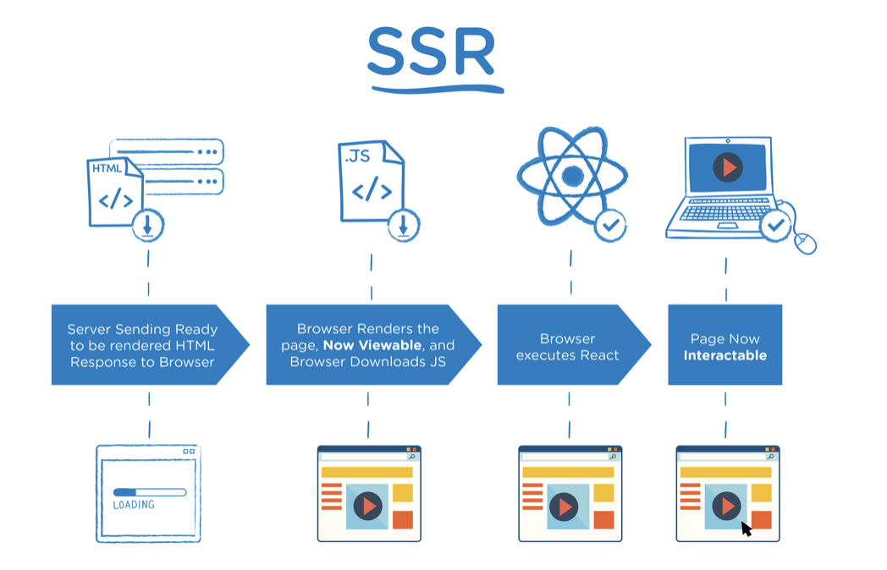

# CSR과 SSR?

CSR(Client Side Rendering)은 `클라이언트에서 렌더링`이 되는 것이고, SSR(Server Side Rendering)은 `서버에서 렌더링`이 되는 방식입니다. 그럼 렌더링이란 뭘 뜻하는 걸까요? 여기서 말하는 렌더링이란 HTML, CSS, Javascript가 브라우저에서 출력되는 과정을 뜻합니다. CSR과 SSR이 어떻게 다른지 렌더링 과정과 더불어 흐름을 살펴봅시다.

---

# SSR의 렌더링 흐름 (일반적인 브라우저 렌더링)

일반적인 브라우저 렌더링은 SSR을 일컫습니다. (혹시 브라우저 렌더링 과정을 잘 모른다면 [이 동영상](https://www.youtube.com/watch?v=FQHNg9gCWpg&t=9s&ab_channel=%EC%95%84%ED%94%84%EB%A6%AC%EC%B9%B4%EB%8F%84%EC%84%9C%EA%B4%80)을 참고해주세요.)

브라우저 렌더링의 큰 흐름은 이렇습니다.

브라우저 주소창에 URL을 입력합니다. 그렇게 되면 웹 브라우저가 서버에게 해당 주소의 데이터를 요청합니다(http request). 요청에 대한 응답으로 서버는 웹 브라우저에게 응답을 합니다 (http response).

<br/>

서버에서 받은 응답을 어떻게 처리하냐에 의해서 CSR과 SSR을 구별지을 수 있습니다.

전통적인 방식인 SSR에서는 response로 아래처럼 생긴 CSS, HTML, JS가 모두 포함된 HTML을 받습니다.

```html
<!DOCTYPE html>
<html>
  <head>
    <title>게시판</title>
    <!-- css parsing -->
    <link rel="stylesheet" href="/css/styles.css" />
  </head>
  <body>
    <h1>게시판</h1>
    <p>Welcome to 게시판</p>
    <div class="content">
      <div class="customer_content">
        <div class="news_table">// ...</div>
      </div>
    </div>
    <!-- js parsing -->
    <script src="script.js"></script>
  </body>
</html>
```

이러한 응답을 받은 브라우저는 위에서부터 읽어나가기 시작하면서 HTML을 파싱하여 DOM 트리를 만들고, CSS를 파싱하여 CSSOM 트리를 만듭니다. HTML, CSS가 모두 파싱되고 나면 화면에 보여집니다. 그러나 body 태그 마지막에 있는 script를 만나기 전까지는 즉, Javascript를 파싱하기 전까지는 아무런 기능이 동작하지 않습니다. script.js를 파싱하고 나면 비로소 동작이 가능한 웹 페이지가 렌더링이 됩니다.

<br/>

아래는 앞서 설명한 과정을 도식화한 그림입니다.

<br/>



이 방식은 화면을 다시 그리기 때문에 `화면 깜빡임`이 있습니다. 또한 `TTV(Time To View) TTI(Time To Interact)간에 간극`이 있습니다. 즉, 버튼이 있어서 클릭했으나 동작하지 않는 구간이 있습니다. 또한 `서버 부하`가 생길 수도 있습니다.

그렇다면 CSR는 어떻게 다를까요? React를 예시로 렌더링 과정을 살펴보겠습니다.

---

# CSR의 렌더링 흐름

브라우저의 주소창에 URL을 검색하고, 브라우저가 요청을 하고 서버에서 응답을 하게 되면 React 라이브러리는 `js 번들과 빈 html`을 응답으로 넘겨줍니다.

리엑트 프로젝트의 public 폴더 안에 index.html을 살펴보면 <body> 태그 안에는 단 한줄이 있습니다.

public/index.html

```html
<div id="root"></div>
```

js 번들은 npm scripts에 의해 [이런 방식](https://medium.com/@pradumnabajoria/how-does-index-js-run-in-a-react-app-fc9ca20001c8)으로 전달된다고 합니다.

<br/>

js 번들을 읽어 나가면서 React는 가상 돔(Virtual DOM)을 만듭니다. 가상 돔이란 실제 브라우저 DOM을 가볍고 효율적으로 추상화 한 것입니다. 이 Virtual DOM이 완성이 되면 화면에 렌더링이 됩니다. 즉, 가상 돔이 만들어지기 전까지는 빈 화면만 보여주다가 가상 돔이 렌더링이 된 이후에 모든 동작이 가능한 화면이 보여지게 됩니다.

아래는 CSR의 흐름입니다.

<br/>


Virtual DOM이 생성되기 전까지 `빈 화면`만 보여주어야 하기 때문에 사용자 경험이 좋지 않고, 초기 로딩 속도가 느리다는 단점이 있습니다. 또한 초기에 가져오는 html에 아무런 정보가 없어서 `SEO`(Search Engine Optimization)에 `좋지 않다`는 단점이 있습니다.

---

# SSR vs CSR 장단점

두가지 렌더링의 장단점을 표로 정리해 보았습니다.

| 　　　　　 | SSR (Server Side Rendering)                                                                                                                             | CSR (Client Side Rendering)                                                                                         |
| ---------- | ------------------------------------------------------------------------------------------------------------------------------------------------------- | ------------------------------------------------------------------------------------------------------------------- |
| 장점       | - 초기 로딩 속도가 빠름<br/>- SEO에 유리                                                                                                                | - 동적으로 빠르게 렌더링이 되기 때문에 좋은 사용자 경험 <br/>- 초기 로딩 이후 구동 속도가 빠름<br/>- 서버 부하 분산 |
| 단점       | - 동적으로 빠르게 렌더링이 되기 때문에 좋은 사용자 경험 <br/>- 매번 페이지를 요청할 때마다 새로고침이 발생하여 화면이 깜빡인다. 나쁜 사용자 경험을 초래 | - 느린 초기 로딩 속도<br/>- SEO의 어려움                                                                            |
| 예시       | https://product.kyobobook.co.kr/KOR                                                                                                                     | https://www.marpple.com/kr/                                                                                         |

---

# Next.js?

React 내에서 CSR의 단점인 느린 초기 로딩 속도와 SEO의 어려움을 해소하기 위해 Next.js라는 프레임워크를 사용합니다. CSR의 단점을 잘 해결할 수 있는 프레임워크이긴 하나 단순히 이 문제만을 해결하고자 Next.js를 라이브러리를 사용하진 않습니다. Next.js는 더 많은 일들을 할 수 있습니다. 예를 들어, Image, Font, Script 최적화, server component의 지원, file system 기반 라우팅 등등이 있습니다. 최근에 Server Component도 Next.js에서 완벽히 지원합니다.

<br/>

리엑트 공식 문서에서도 Nextjs를 사용하는 걸 권장하는데요. 내부적으로 Next.js가 어떻게 동작하는지는 나중에 더 공부하여 업데이트 하겠습니다.
