# 웹 접근성?

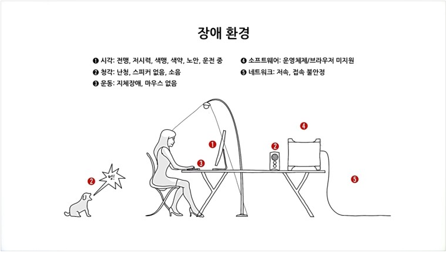

어떠한 사용자(장애인, 노인 등)가 어떠한 기술환경에서도 전문적인 능력 없이 웹 사이트에서 제공하는 모든 정보에 접근할 수 있도록 보장하는 것입니다.

### `모든 사용자가 모든 기기에서 웹에 접근할 수 있도록 하는 것` 입니다.

---

# 접근성을 준수해야 하는 이유?

### 1. 장애인 차별 금지법

법으로 정해져 있기 때문입니다.

### 2. 웹의 필수 요소

The power of the Web is in its universality. Access by everyone regardless of disability is an essential aspect. - Tim Berners-Lee

웹의 힘은 보편성에 있다. 장애애 구애 없이 모든 사람이 접근할 수 있도록 하는 것이 웹의 필수 요소다. - 팀 버너스 리

---

# KWCAG (Korean Web Content Accessibility Guidelines)

한국 웹 접근성 가이드라인의 기준들을 살펴보겠습니다.

## 1. 적절한 대체 텍스트 제공

아래의 태그들에서 제공해주어야 합니다.

```html

<input type="’image’" alt="" />
<input type="’button’" alt="" />
<map alt=""> <area alt="" /></map>
```

### 작성방법

보는것과 듣는 것이 동등하게 대체 텍스트를 제공해야 합니다.

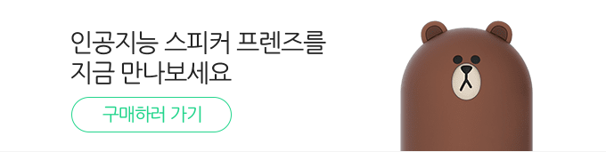

```html

```

---


```html


<!--alt가 너무 길면 p태그로 따로 빼기도 합니다-->


<p class="blind">
  주식수수료 평생무료 비다면계좌개설 신규/온라인/유관기관 제비용 제외 2018년
  12월 31일까지 선물/옵션 1년무료, 신용이자 연 3.5% 60일 우대
</p>
```

---

차트인 경우에는 테이블 마크업으로 표현합니다.

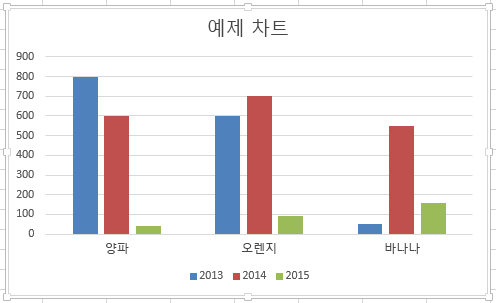

```html


<table class="blind">
  <caption></caption>
  <thead>
    <tr>
      <th scope="col">년도</th>
      <th scope="col">과일종류</th>
      <th scope="col">재배 수</th>
    </tr>
  </thead>
  <tbody>
    <tr>
      <td>2013</td>
      <td>양파</td>
      <td>800</td>
    </tr>
    ...
  </tbody>
</table>
```

---

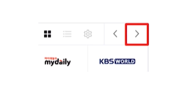

```html
<!-- 첫번째 방법 -->


<!-- 두번째 방법 -->
<a href="#" class="link_next">다음 콘텐츠 보기</a>
<style>
  .link_next {
    background-image: url('./image/icon_next.png');
  }
</style>
```

---

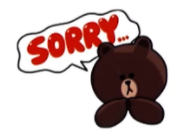

```html

```

---

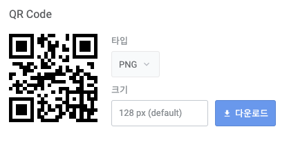

```html
<a href="http://www.naver.com">
  
</a>
```

QR 코드인 경우 링크를 제공해주어야 합니다.

---

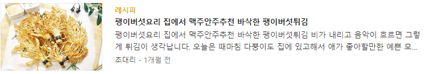

```html
<!-- 잘못된 예 - 스크린 리더에 2번 나오게 됩니다.(alt와 span을 둘다 읽어주기 때문에) -->
<a href="">
	
</a>
<a href="">
	<span>팽이버섯요리 집에서 맥주안주추천 바삭한 팽이버섯튀김<span>
	<span>팽이버섯요리 집에서 맥주안주추천 바삭한 팽이버섯튀김 비가 내리고 음악이 흐르면 그렇게 튀김이 생각납니다. 오늘은...</span>
</a>

<!-- 옳은 예 - a 태그 하나로 묶꼬 alt를 쓰지 말아야 합니다-->
<a href="">
	
	<span>팽이버섯요리 집에서 맥주안주추천 바삭한 팽이버섯튀김<span>
	<span>팽이버섯요리 집에서 맥주안주추천 바삭한 팽이버섯튀김 비가 내리고 음악이 흐르면 그렇게 튀김이 생각납니다. 오늘은...</span>
</a>
```

---

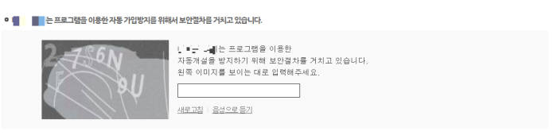

```html
<!-- 캡차 같은 경우, 음성으로 듣기와 같은 청각적 캡차를 동시에 제공하기 때문에 
alt="2F7S6N9U"를 제공하기보다는 음성으로 듣기 버튼으로 안내해야 합니다. -->
```

---

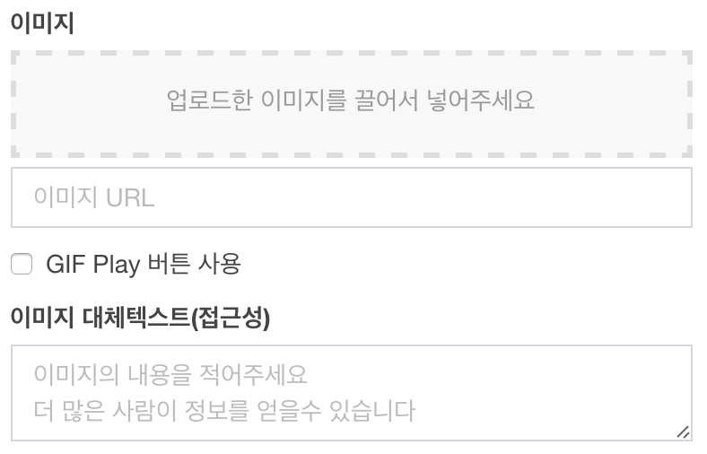

사용자가 이미지를 올리는 경우 대체 텍스트를 입력할 수 있는 툴을 제공해야 합니다.

---

### 주의할 점 - 1. blind 속성

```css
.blind {
  display: none;
}
.blind {
  visibility: hidden;
}
```

display: none, visibility: hidden을 사용하면 스크린리더에서 읽지 않기 때문에 다른방법으로 처리해주어야 합니다.

그래서 어 떤 방 법?!?!?

---

### 주의할 점 - 2. alt 속성 무조건 제공

의미없는 값이라도 alt속성은 무조건 제공해야 합니다.


```html

```

공백조차 있으면 안됩니다.

---

## 2. 자막 제공

멀티미디어에 자막을 제공해야 합니다.

## 3. 색에 무관한 콘텐츠 인식

색뿐만아니라 **모양**이나 **크기**, **테두리,** **굵기** 등으로도 표현

## 4. 명확한 지시사항 제공

지시사항은 모양, 크기, 위치, 방향, 색, 소리 등에 관계없이 인식될 수 있어야 한다.

아래는 잘못된 예 입니다.

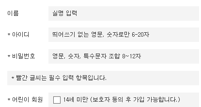

## 5. 텍스트 콘텐츠의 명도 대비

텍스트 콘텐츠와 배경간의 명도 대비는 4.5대 1이상이어야 한다. (확대가 가능한 브라우저에서 최소 `3:1 이상`)

## 6. 자동 재생 금지

자동으로 소리가 재상되지 말아야 한다.

## 7. 콘텐츠 간의 구분

이웃한 콘텐츠는 구별될 수 있어야 한다.

## 8. 키보드 사용 보장

모든 기능은 키보드만으로 사용할 수 있어야 한다. 따라서 초점 자체를 받을 수 없는 요소는 키보드 접근 자체가 불가능하여 오류입니다.

`onclick, onmouseover, onfocus=”this.blur();” 자제하기`

## 9. 초점 이동

키보드에 의한 초점은 논리적으로 이동해야하며, 시각적으로 구별할 수 있어야 합니다. (좌→우, 상→하)

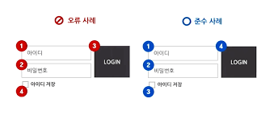
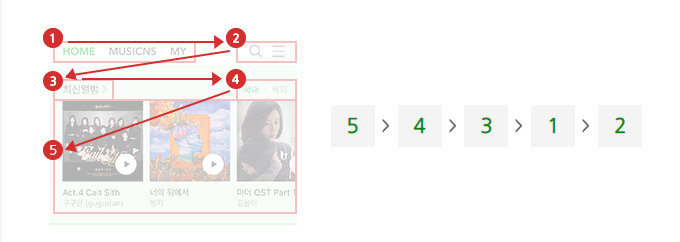

## 10. 조작 가능

사용자 입력 및 컨트롤은 조작 가능하도록 제공해야 합니다.

버튼은 `6mm이상`이어야 하고. `1px 이상`의 여백이 버튼 사이에 있어야 합니다.

## 11. 응답 시간 조절

시간 제한이 있는 콘텐츠는 응답시간을 조절할 수 있어야 합니다.

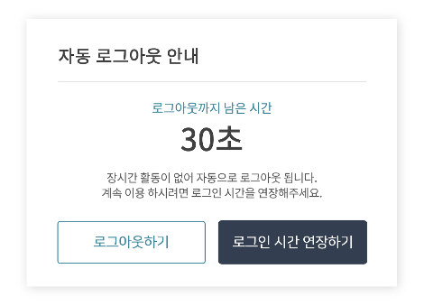

## 12. 정지 기능 제공

자동으로 변경되는 콘텐츠는 움직임을 제어할 수 있어야 합니다.

- 마우스오버 + 키보드 접근시 = 정지기능 제공
- 마우스오버 + 키보드 접근시 = 모든 콘텐츠 노출

## 13. 깜빡임과 번쩍임 사용 제한

초당 3-50회 주기로 깜빡이거나 번쩍이는 콘텐츠를 제공하지 않아야 합니다.

## 14. 반복 영역 건너뛰기

콘텐츠에 반복되는 영역은 건너뛸 수 있어야 합니다.

## 15. 제목 제공

페이지, 프레임, 콘텐츠 블록에는 적절한 제목을 제공해야 합니다. 프레임의 제목이 없으면 `빈 프레임`, 광고면 iframe title=”광고” 라고 제공해야 합니다.

## 16. 적절한 링크 텍스트

링크 텍스트는 용도나 목적을 이해할 수 있도록 제공해야 합니다.

## 17. 기본 언어 표시 - 주로 사용하는 언어를 명시해야 한다

html lang=’ko’

## 18. 사용자 요구에 따른 실행

사용자가 의도하지 않은 기능(새 창, 초점에 의한 맥락 변화 등)은 실행되지 않아야 합니다.

오늘 하루 이 창을 열지 않음 옆에 닫기버튼이 있어야 합니다.

## 19. 콘텐츠의 선형 구조

콘텐츠는 논리적인 순서로 제공해야 합니다.

## 20. 표의 구성

표는 이해하기 쉽게 구성해야 합니다. 요약정보도 제공해야 합니다.

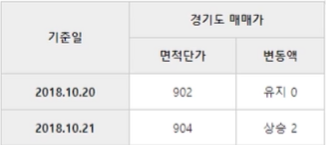

```html
<thead>
  <tr>
    <th rowspan="2" scope="col" id="date">기준일</th>
    <th colspan="2" scope="col" id="gsale">경기도 매매가</th>
  </tr>
  <tr>
    <th scope="col" id="price">면적 단가</th>
    <th scope="col" id="change">변동액</th>
  </tr>
</thead>
<tbody>
  <tr>
    <th scope="row" id="d20181020">2022.10.20</th>
    <td headers="date d20181020 gsale price">902</td>
    <td headers="date d20181020 gsale change">유지 0</td>
  </tr>
  <tr>
    <th scope="row" id="d20181021">2022.10.21</th>
    <td headers="date d20181021 gsale price">904</td>
    <td headers="date d20181021 gsale change">상승 2</td>
  </tr>
</tbody>
```

---

## 21. 레이블 제공

사용자 입력에는 대응하는 레이블을 제공해야 합니다.

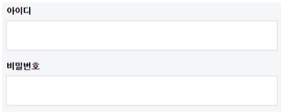

```html
<label for="user_id">아이디</label>
<input type="text" id="user_id" />

<label for="user_pw">비밀번호</label>
<input type="password" id="user_pw" />
```

---

1:N인 경우 title로 제공해야 합니다.

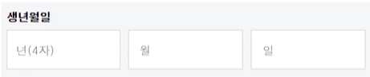

```html
<input type="text" title="생년월일 중 년 4자리 입력" />
<input type="text" title="생년월일 중 월 입력" />
<input type="text" title="생년월일 중 일 입력" />
```

## 22. 오류 정정

입력 오류를 정정할 수 있는 방법을 제공해야 합니다.

## 23. 마크업 오류 방지

마크업 언어의 요소는 열고 닫음, 중첩 관계 및 속성 선언에 오류가 없어야 한다.

## 24. 웹 에플리케이션 접근성 준수

콘텐츠에 포함된 웹 에플리케이션은 접근성이 있어야 합니다. (예를들어 플래시로 이루어진 html 같은 경우 따로 접근성 처리가 되어야 합니다.)

---

# 접근성 진단

[https://validator.w3.org/](https://validator.w3.org/)

[https://chrome.google.com/webstore/detail/kwcag-a11y-inspector/ngcmkfaolkgkjbddhjnhgoekgaamjibo?hl=ko](https://chrome.google.com/webstore/detail/kwcag-a11y-inspector/ngcmkfaolkgkjbddhjnhgoekgaamjibo?hl=ko)

[https://www.tpgi.com/color-contrast-checker/](https://www.tpgi.com/color-contrast-checker/)

---

# 스크린 리더

**윈도우 (설치형)**

- 센스리더 베이직 6.5
- NVDA Version 2018.4

**MAC (시스템 제공)**

- VoiceOver

**Android (시스템 제공)**

- Talkback
- Voice Assistant

**iOS (시스템 제공)**

- VoiceOver

---

## Reference

[https://www.boostcourse.org/web344](https://www.boostcourse.org/web344)
