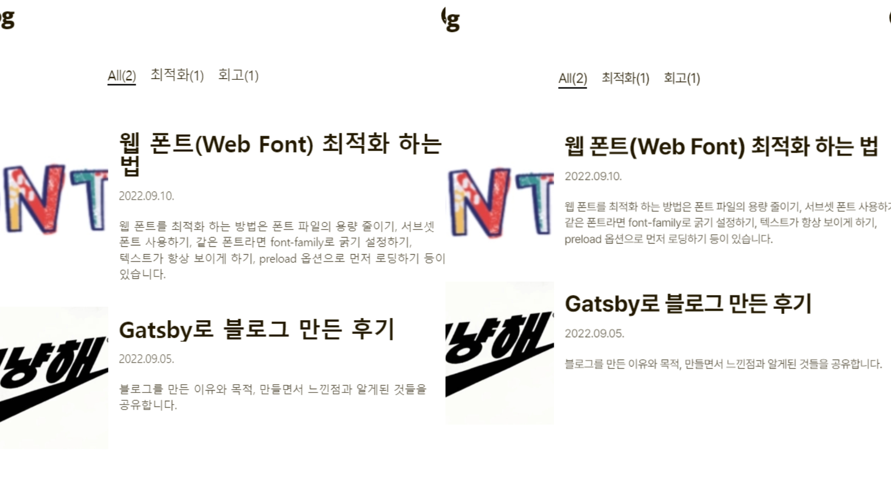
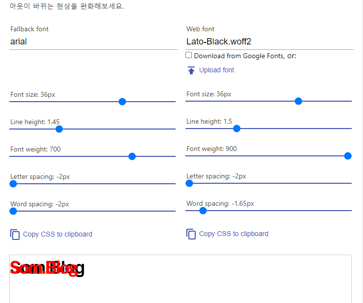

# 웹 폰트란?

로컬의 폰트 설치 상황에 관계없이 항상 원하는 폰트를 사용할 수 있게 하는 기술입니다.

# 기본 사용법


- 폰트 이름은 폰트 파일의 이름과 일치하지 않아도 됩니다.
- format()은 반드시 써야 합니다. 해당 속성을 사용하면 브라우저에서 지원 가능한 파일만 다운로드 받을 수 있습니다. (예를들어, 크롬은 EOT를 지원하지 않는데 format을 명시해두면 알아서 다운 받지 않습니다.)
- 웹 폰트 로딩이 실패하면 다음에 선언된 폰트(fallback font)라 렌더링 됩니다.
- @font-face 규칙은 font-family로 접근할 수 있습니다.

---

# 웹 폰트 최적화 방법

## 1. 폰트 파일의 용량 줄이기

폰트 파일의 형식은 4가지가 있습니다. (EOT, TTF, WOFF, WOFF2) 형식마다 용량이 다르고, 브라우저 지원 상황도 다릅니다. 아래는 pretendard 폰트의 확장자별 용량입니다.

| Name                   | Tag   | Size    |
| ---------------------- | ----- | ------- |
| Pretendard-Black.woff2 | woff2 | 814KB   |
| Pretendard-Black.woff  | woff  | 1,153KB |
| Pretendard-Black.ttf   | ttf   | 2,615KB |
| Pretendard-Black.otf   | otf   | 1,601KB |

WOFF 형식과 WOFF2형식은 압축된 폰트 형식입니다. 따라서 용량이 현저히 작은 것을 알 수 있습니다. 그럼 브라우저별 지원하는 폰트 파일을 볼까요?


보다시피 WOFF와 WOFF2는 거의 모든 브라우저에서 사용할 수 있습니다. 브라우저의 버전에 따라 대응하고 싶은 버전까지 대응하면 됩니다. 즉, Edge의 6.0까지 대응하고 싶다면 EOT 확장자를 font-face에 명시해주면 되겠죠?

WOFF2 형식은 모든 브라우저에서 사용할 수 있고 용량이 가장 작기 때문에 `가급적 WOFF2 형식을 사용`하는 편이 좋습니다.

다음은 WOFF2를 이용해 웹 폰트를 최적화 한 @font-family 규칙의 예 입니다.

```css
@font-face {
	font-family: NanumSquareWeb;
	src: local('Nanum-Gothic'),
	src : url(NanumSquareWeb.woff2) format('woff2'),
	src : url(NanumSquareWeb.woff) format('woff'),
	src : url(NanumSquareWeb.ttf) format('ttf'),
}
```

- `local 문법의 사용을 지향합니다.` 위처럼 local을 사용하게 되면 해당 폰트가 시스템에 설치되어 있다면 리소스를 요청하지 않습니다.
- WOFF2를 가장 앞에 선언 함으로써 브라우저가 WOFF2를 먼저 다운받도록 지시합니다.

## 2. 서브셋 폰트 사용하기

서브셋 폰트(Subset font)란 폰트 파일에서 불필요한 글자들을 제거하고 사용할 글자만 남겨둔 폰트 입니다.


노란색으로 표시된 글자는 실생활에서 거의 사용하지 않는 글자들입니다. 이러한 불필요한 글자를 폰트에서 제거하고 사용할 글자만 남겨둔 폰트가 서브셋 폰트입니다. 보통 서브셋 폰트를 사용하면 용량이 pretendard 기준, `814KB → 273KB`까지 감소합니다.

## 3. 같은 폰트라면 font-family로 굵기 설정하기

```css
@font-face {
  font-family: pretendard;
  src: url(Pretendard-Light.woff) format('woff');
  font-weight: 300;
}
@font-face {
  font-family: pretendard;
  src: url(Pretendard-Regular.woff) format('woff');
  font-weight: 400;
}
@font-face {
  font-family: pretendard;
  src: url(Pretendard-Bold.woff) format('woff');
  font-weight: 700;
}
@font-face {
  font-family: pretendard;
  src: url(Pretendard-ExtraBold.woff) format('woff');
  font-weight: 800;
}
```

font-family명은 pretendard 하나지만 font-weight를 이용하여 사용할 웹 폰트를 다르게 선언하고 있습니다. 이런 경우,

- font-weight가 300일 경우에는 Pretendard-Light.woff
- font-weight가 400일 경우에는 Pretendard-Regular.woff
- font-weight가 700일 경우에는 Pretendard-Bold.woff
- font-weight가 800일 경우에는 Pretendard-ExtraBold.woff 가 적용됩니다.

꼭 필요한 굵기와 스타일의 폰트만 다운받아서 용량을 최적화 합시다.

## 4. 텍스트가 항상 보이게 하기

브라우저별로 폰트를 렌더링할때 다른 방식을 이용합니다. 기본적으로 웹 폰트가 적용될 때는 텍스트의 번쩍임(flash of text)이 일어납니다. 웹 폰트가 적용 되지 않은 폰트에서 적용할 폰트로 바뀌면서 번쩍임이 일어나느냐(FOUT), 텍스트가 보이지 않는 상태에서 적용된 후 번쩍임이 일어나느냐(FOIT)로 처리방식이 나눠집니다.


### FOIT 방식(Flash Of Invisible Text)

- 텍스트가 보이지 않는 상태에서 폰트가 바뀌면서 텍스트 번쩍임이 일어납니다.
- 웹 폰트 로딩이 늦다면 완전히 다른 내용을 표시 할 수도 있기 때문에 (그림 참고) `FOIT방식은 지양해야 합니다.`
- Firefox와 Chrome등의 브라우저가 위 방식을 사용합니다.

### FOUT(Flash Of Unstyled Text)

- 기본 텍스트를 보여주고 난 뒤 웹 폰트가 적용되면서 텍스트 번쩍임이 일어납니다.
- 글꼴의 자간, 높이 등 서식이 달라 웹 폰트 적용 전과 후의 레이아웃이 변경될 수 있습니다.
- 기존의 Internet Explorer는 위 방식을 사용합니다.

따라서, FOIT 방식보다 FOUT을 사용해야 하고, FOUT의 단점인 기본글꼴의 자간, 높이등을 사용할 웹 폰트와 최대한 비슷한 것을 채택하여 최적화를 진행합니다.

### FOUT 사용 - CSS font-display 속성

CSS의 font-display 속성을 이용하면 웹 폰트의 로딩 상태에 따른 동작을 설정할 수 있습니다. font-display 속성은 다음과 같이 auto, block, swap, fallback, optional의 5가지 옵션이 있습니다.

- auto : 브라우저의 기본 동작
- block : FOIT 방식
- swap : FOUT 방식
- fallback : 100ms동안 텍스트가 보이지 않고 그 후 fallback 폰트로 렌더링한다. 특이한 점은 전환 시간이 있다는 것이다. 전환 이후 캐시에 웹 폰트가 적용됩니다.
- optional : fallback과 비슷하나, 네트워크 상태를 파악하여 웹 폰트 전환 여부를 판단합니다.

참고 : [https://developer.mozilla.org/ko/docs/Web/CSS/@font-face/font-display](https://developer.mozilla.org/ko/docs/Web/CSS/@font-face/font-display)

아래는 swap 방식을 적용한 font-face 입니다.

```css
@font-face {
  font-family: ExampleFont;
  src: url(/path/to/fonts/examplefont.woff) format('woff'), url(/path/to/fonts/examplefont.eot)
      format('eot');
  font-weight: 400;
  font-style: normal;
  font-display: swap;
}
```

### FOUT의 단점 해결하기 - **Font Style Matcher로 폰트 간 차이 줄이기**



위와 같이 FOUT의 단점은 글꼴의 자간, 높이 등 서식이 달라 웹 폰트 적용 전과 후의 레이아웃이 변경될 수 있다고 했습니다. 이것은 [Font Face Observer](https://fontfaceobserver.com/), [Font style matcher](https://sangziii.github.io/fontStyleMatcher)를 사용하면 문제를 해결할 수 있습니다.

### font face observer

이 모듈을 사용하는 이유는 용량이 매우 적게 들기 때문입니다. 이것은 웹 폰트의 로딩시점을 사용자에게 알려주어 전과 후의 폰트 스타일링을 할 수 있습니다.

```jsx
import FontFaceObserver from 'fontfaceobserver';

var font = new FontFaceObserver('Pretendard');
font.load(null, 5000).then(() => {
  document.documentElement.classList.add('fonts-loaded');
});
```

js 파일에 Promise 코드를 작성해줍니다.

```css
body {
  font-family: arial, sans-serif;
  font-size: 2rem;
  font-weight: 700;
  letter-spacing: -3.95px;
}

.fonts-loaded body {
  font-family: 'Pretendard', arial;
  letter-spacing: -2px;
}
```

이렇게 웹 폰트의 로드가 끝나면 fonts-loaded class를 추가해주어 스타일을 바꿀 수 있습니다.

### Font style matcher

fallback 폰트는 각 OS 별로 어떤 폰트를 기본으로 내장하고 있는지를 확인한 뒤, 설정합니다.

참고 : [https://granneman.com/webdev/coding/css/fonts-and-formatting/default-fonts](https://granneman.com/webdev/coding/css/fonts-and-formatting/default-fonts)

font style matcher는 시스템 폰트와 웹 폰트의 레이아웃을 맞추기 위해 사용합니다.



allback 폰트와 사용할 웹 폰트를 설정하면 두 가지 폰트가 같은 위치에 겹쳐서 표시됩니다. 이것을 이용하여 적용 전 후 상태를 체크할 수 있습니다.

## 5. **preload 옵션으로 먼저 로딩하기**

`<link rel=””>` 속성으로 preload 옵션을 사용하면 해당 리소스를 다른 리소스보다 빨리 로딩합니다. 주로 폰트 파일, 이미지 파일, 스크립트 파일, 비디오 파일 등 페이지에서 중요도가 높은 자원을 의도적으로 먼저 로딩할때 사용합니다.

```html
<link
  rel="preload"
  href="./nanumGothic.woff2"
  as="font"
  type="font/woff2"
  crossorigin="anonymous"
/>
```

---

### Reference

[https://wit.nts-corp.com/2017/02/13/4258](https://wit.nts-corp.com/2017/02/13/4258)

[https://d2.naver.com/helloworld/4969726](https://d2.naver.com/helloworld/4969726)
